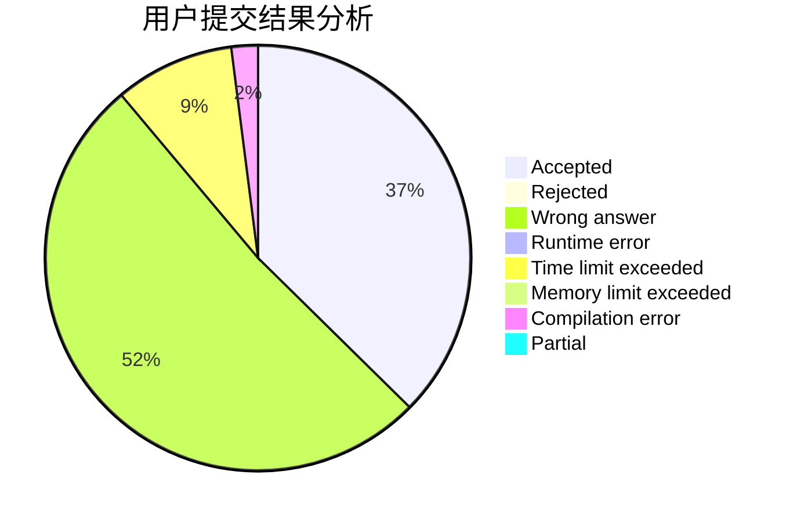
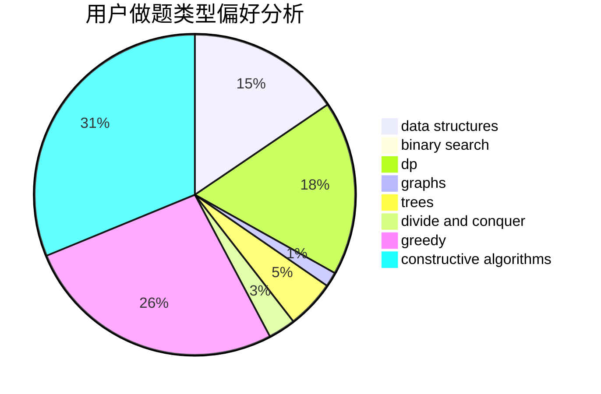
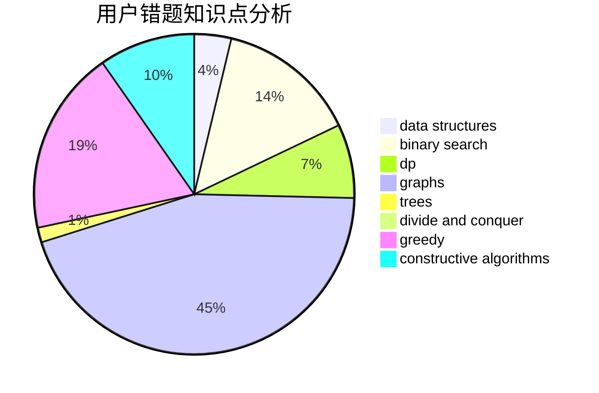

# 6ziv
<!-- tabs:start -->
#### **用户提交结果分析**

#### **用户做题类型偏好分析**

#### **用户错题知识点分析**

<!-- tabs:end -->
# 推荐题目
[Substring Removal Game](http://codeforces.com/problemset/problem/1398/B)		games,
                        greedy,
                        sortings		  
[Yet Another Segments Subset](http://codeforces.com/problemset/problem/1399/F)		data structures,
                        dp,
                        graphs,
                        sortings		  
[Heating](http://codeforces.com/problemset/problem/1260/A)		math		  
[Ugly Pairs](http://codeforces.com/problemset/problem/1156/B)		dfs and similar,
                        greedy,
                        implementation,
                        sortings,
                        strings		  
[Monster Invaders](http://codeforces.com/problemset/problem/1396/C)		dp,
                        greedy,
                        implementation		  
[Sergey's problem](https://codeforces.com/contest/1020/problem/E)		constructive algorithms,
                        graphs		  
[Numbers](http://codeforces.com/problemset/problem/13/A)		implementation,
                        math		  
[Controversial Rounds](http://codeforces.com/problemset/problem/1398/F)		binary search,
                        data structures,
                        dp,
                        greedy,
                        two pointers		  
[Petr and Book](http://codeforces.com/problemset/problem/139/A)		implementation		  
[Distance Matching](http://codeforces.com/problemset/problem/1396/E)		constructive algorithms,
                        dfs and similar,
                        trees		  
<!-- tabs:start -->
#### **data structures**
[Substring Removal Game](http://codeforces.com/problemset/problem/1399/F)		data structures,
                        dp,
                        graphs,
                        sortings		  
[Yet Another Segments Subset](http://codeforces.com/problemset/problem/1398/F)		binary search,
                        data structures,
                        dp,
                        greedy,
                        two pointers		  
[Heating](http://codeforces.com/problemset/problem/1398/E)		binary search,
                        data structures,
                        greedy,
                        implementation,
                        math,
                        sortings		  
[Ugly Pairs](http://codeforces.com/problemset/problem/1396/D)		data structures,
                        sortings,
                        two pointers		  
[Monster Invaders](http://codeforces.com/problemset/problem/1399/E1)		data structures,
                        dfs and similar,
                        greedy,
                        trees		  
[Sergey's problem](http://codeforces.com/problemset/problem/1399/D)		constructive algorithms,
                        data structures,
                        greedy,
                        implementation		  
[Numbers](http://codeforces.com/problemset/problem/1398/C)		data structures,
                        dp,
                        math		  
[Controversial Rounds](http://codeforces.com/problemset/problem/1492/C)		binary search,
                        data structures,
                        dp,
                        greedy,
                        two pointers		  
[Petr and Book](http://codeforces.com/problemset/problem/1490/G)		binary search,
                        data structures,
                        math		  
[Distance Matching](http://codeforces.com/problemset/problem/1479/D)		binary search,
                        bitmasks,
                        brute force,
                        data structures,
                        probabilities,
                        trees		  
#### **binary search**
[Substring Removal Game](http://codeforces.com/problemset/problem/1398/F)		binary search,
                        data structures,
                        dp,
                        greedy,
                        two pointers		  
[Yet Another Segments Subset](http://codeforces.com/problemset/problem/1398/E)		binary search,
                        data structures,
                        greedy,
                        implementation,
                        math,
                        sortings		  
[Heating](http://codeforces.com/problemset/problem/1399/E2)		binary search,
                        dfs and similar,
                        greedy,
                        sortings,
                        trees,
                        two pointers		  
[Ugly Pairs](http://codeforces.com/problemset/problem/1492/C)		binary search,
                        data structures,
                        dp,
                        greedy,
                        two pointers		  
[Monster Invaders](http://codeforces.com/problemset/problem/1463/D)		binary search,
                        constructive algorithms,
                        greedy,
                        two pointers		  
[Sergey's problem](http://codeforces.com/problemset/problem/1490/G)		binary search,
                        data structures,
                        math		  
[Numbers](http://codeforces.com/problemset/problem/1479/D)		binary search,
                        bitmasks,
                        brute force,
                        data structures,
                        probabilities,
                        trees		  
[Controversial Rounds](http://codeforces.com/problemset/problem/1436/E)		binary search,
                        data structures,
                        two pointers		  
[Petr and Book](http://codeforces.com/problemset/problem/1461/D)		binary search,
                        brute force,
                        data structures,
                        divide and conquer,
                        implementation,
                        sortings		  
[Distance Matching](http://codeforces.com/problemset/problem/1493/C)		binary search,
                        brute force,
                        constructive algorithms,
                        greedy,
                        strings		  
#### **dp**
[Substring Removal Game](http://codeforces.com/problemset/problem/1399/F)		data structures,
                        dp,
                        graphs,
                        sortings		  
[Yet Another Segments Subset](http://codeforces.com/problemset/problem/1396/C)		dp,
                        greedy,
                        implementation		  
[Heating](http://codeforces.com/problemset/problem/1398/F)		binary search,
                        data structures,
                        dp,
                        greedy,
                        two pointers		  
[Ugly Pairs](http://codeforces.com/problemset/problem/1398/D)		dp,
                        greedy,
                        sortings		  
[Monster Invaders](https://codeforces.com/contest/1397/problem/E)		dp,
                        greedy,
                        implementation		  
[Sergey's problem](http://codeforces.com/problemset/problem/1339/A)		brute force,
                        dp,
                        implementation,
                        math		  
[Numbers](http://codeforces.com/problemset/problem/1355/B)		dp,
                        greedy,
                        sortings		  
[Controversial Rounds](http://codeforces.com/problemset/problem/1096/D)		dp		  
[Petr and Book](http://codeforces.com/problemset/problem/1398/C)		data structures,
                        dp,
                        math		  
[Distance Matching](http://codeforces.com/problemset/problem/1492/C)		binary search,
                        data structures,
                        dp,
                        greedy,
                        two pointers		  
#### **graph**
[Substring Removal Game](http://codeforces.com/problemset/problem/1399/F)		data structures,
                        dp,
                        graphs,
                        sortings		  
[Yet Another Segments Subset](https://codeforces.com/contest/1020/problem/E)		constructive algorithms,
                        graphs		  
[Heating](http://codeforces.com/problemset/problem/1487/C)		brute force,
                        constructive algorithms,
                        dfs and similar,
                        graphs,
                        greedy,
                        implementation,
                        math		  
[Ugly Pairs](http://codeforces.com/problemset/problem/1437/C)		dp,
                        flows,
                        graph matchings,
                        greedy,
                        math,
                        sortings		  
[Monster Invaders](http://codeforces.com/problemset/problem/1470/D)		constructive algorithms,
                        dfs and similar,
                        graph matchings,
                        graphs,
                        greedy		  
[Sergey's problem](http://codeforces.com/problemset/problem/1476/C)		dp,
                        graphs,
                        greedy		  
[Numbers](http://codeforces.com/problemset/problem/1304/D)		constructive algorithms,
                        graphs,
                        greedy,
                        two pointers		  
[Controversial Rounds](http://codeforces.com/problemset/problem/1475/C)		combinatorics,
                        graphs,
                        math		  
[Petr and Book](http://codeforces.com/problemset/problem/553/E)		dp,
                        fft,
                        graphs,
                        math,
                        probabilities		  
[Distance Matching](http://codeforces.com/problemset/problem/1495/C)		constructive algorithms,
                        graphs		  
#### **trees**
[Substring Removal Game](http://codeforces.com/problemset/problem/1396/E)		constructive algorithms,
                        dfs and similar,
                        trees		  
[Yet Another Segments Subset](http://codeforces.com/problemset/problem/1399/E1)		data structures,
                        dfs and similar,
                        greedy,
                        trees		  
[Heating](http://codeforces.com/problemset/problem/1399/E2)		binary search,
                        dfs and similar,
                        greedy,
                        sortings,
                        trees,
                        two pointers		  
[Ugly Pairs](http://codeforces.com/problemset/problem/1479/D)		binary search,
                        bitmasks,
                        brute force,
                        data structures,
                        probabilities,
                        trees		  
[Monster Invaders](http://codeforces.com/problemset/problem/1511/C)		brute force,
                        data structures,
                        implementation,
                        trees		  
[Sergey's problem](http://codeforces.com/problemset/problem/1499/F)		combinatorics,
                        dfs and similar,
                        dp,
                        trees		  
[Numbers](http://codeforces.com/problemset/problem/1491/E)		brute force,
                        dfs and similar,
                        divide and conquer,
                        number theory,
                        trees		  
[Controversial Rounds](http://codeforces.com/problemset/problem/1466/D)		data structures,
                        greedy,
                        sortings,
                        trees		  
[Petr and Book](http://codeforces.com/problemset/problem/1495/D)		combinatorics,
                        dfs and similar,
                        graphs,
                        math,
                        shortest paths,
                        trees		  
[Distance Matching](http://codeforces.com/problemset/problem/1303/G)		data structures,
                        divide and conquer,
                        geometry,
                        trees		  
#### **divide and conquer**
[Substring Removal Game](http://codeforces.com/problemset/problem/1167/B)		brute force,
                        divide and conquer,
                        interactive,
                        math		  
[Yet Another Segments Subset](http://codeforces.com/problemset/problem/1461/D)		binary search,
                        brute force,
                        data structures,
                        divide and conquer,
                        implementation,
                        sortings		  
[Heating](http://codeforces.com/problemset/problem/1466/G)		combinatorics,
                        divide and conquer,
                        hashing,
                        math,
                        string suffix structures,
                        strings		  
[Ugly Pairs](http://codeforces.com/problemset/problem/1490/D)		dfs and similar,
                        divide and conquer,
                        implementation		  
[Monster Invaders](https://codeforces.com/contest/1483/problem/C)		data structures,
                        divide and conquer,
                        dp		  
[Sergey's problem](http://codeforces.com/problemset/problem/1491/E)		brute force,
                        dfs and similar,
                        divide and conquer,
                        number theory,
                        trees		  
[Numbers](http://codeforces.com/problemset/problem/1303/G)		data structures,
                        divide and conquer,
                        geometry,
                        trees		  
[Controversial Rounds](http://codeforces.com/problemset/problem/1494/D)		constructive algorithms,
                        data structures,
                        dfs and similar,
                        divide and conquer,
                        dsu,
                        greedy,
                        sortings,
                        trees		  
[Petr and Book](http://codeforces.com/problemset/problem/1482/E)		data structures,
                        divide and conquer,
                        dp		  
[Distance Matching](http://codeforces.com/problemset/problem/566/C)		dfs and similar,
                        divide and conquer,
                        trees		  
#### **greedy**
[Substring Removal Game](http://codeforces.com/problemset/problem/1398/B)		games,
                        greedy,
                        sortings		  
[Yet Another Segments Subset](http://codeforces.com/problemset/problem/1156/B)		dfs and similar,
                        greedy,
                        implementation,
                        sortings,
                        strings		  
[Heating](http://codeforces.com/problemset/problem/1396/C)		dp,
                        greedy,
                        implementation		  
[Ugly Pairs](http://codeforces.com/problemset/problem/1398/F)		binary search,
                        data structures,
                        dp,
                        greedy,
                        two pointers		  
[Monster Invaders](http://codeforces.com/problemset/problem/1398/D)		dp,
                        greedy,
                        sortings		  
[Sergey's problem](https://codeforces.com/contest/1397/problem/E)		dp,
                        greedy,
                        implementation		  
[Numbers](http://codeforces.com/problemset/problem/1399/C)		brute force,
                        greedy,
                        two pointers		  
[Controversial Rounds](http://codeforces.com/problemset/problem/1398/E)		binary search,
                        data structures,
                        greedy,
                        implementation,
                        math,
                        sortings		  
[Petr and Book](http://codeforces.com/problemset/problem/1399/E1)		data structures,
                        dfs and similar,
                        greedy,
                        trees		  
[Distance Matching](http://codeforces.com/problemset/problem/1399/E2)		binary search,
                        dfs and similar,
                        greedy,
                        sortings,
                        trees,
                        two pointers		  
#### **constructive algorithms**
[Substring Removal Game](https://codeforces.com/contest/1020/problem/E)		constructive algorithms,
                        graphs		  
[Yet Another Segments Subset](http://codeforces.com/problemset/problem/1396/E)		constructive algorithms,
                        dfs and similar,
                        trees		  
[Heating](http://codeforces.com/problemset/problem/1166/B)		constructive algorithms,
                        math,
                        number theory		  
[Ugly Pairs](http://codeforces.com/problemset/problem/1399/D)		constructive algorithms,
                        data structures,
                        greedy,
                        implementation		  
[Monster Invaders](http://codeforces.com/problemset/problem/1396/B)		brute force,
                        constructive algorithms,
                        games,
                        greedy		  
[Sergey's problem](https://codeforces.com/contest/1397/problem/C)		constructive algorithms,
                        greedy,
                        number theory		  
[Numbers](https://codeforces.com/contest/1397/problem/D)		brute force,
                        constructive algorithms,
                        games,
                        greedy		  
[Controversial Rounds](http://codeforces.com/problemset/problem/1493/A)		constructive algorithms,
                        greedy		  
[Petr and Book](http://codeforces.com/problemset/problem/1463/D)		binary search,
                        constructive algorithms,
                        greedy,
                        two pointers		  
[Distance Matching](https://codeforces.com/contest/1456/problem/B)		bitmasks,
                        brute force,
                        constructive algorithms		  
#### **sortings**
[Substring Removal Game](http://codeforces.com/problemset/problem/1398/B)		games,
                        greedy,
                        sortings		  
[Yet Another Segments Subset](http://codeforces.com/problemset/problem/1399/F)		data structures,
                        dp,
                        graphs,
                        sortings		  
[Heating](http://codeforces.com/problemset/problem/1156/B)		dfs and similar,
                        greedy,
                        implementation,
                        sortings,
                        strings		  
[Ugly Pairs](http://codeforces.com/problemset/problem/1398/D)		dp,
                        greedy,
                        sortings		  
[Monster Invaders](http://codeforces.com/problemset/problem/1398/E)		binary search,
                        data structures,
                        greedy,
                        implementation,
                        math,
                        sortings		  
[Sergey's problem](http://codeforces.com/problemset/problem/1396/D)		data structures,
                        sortings,
                        two pointers		  
[Numbers](http://codeforces.com/problemset/problem/1399/E2)		binary search,
                        dfs and similar,
                        greedy,
                        sortings,
                        trees,
                        two pointers		  
[Controversial Rounds](http://codeforces.com/problemset/problem/1399/A)		greedy,
                        sortings		  
[Petr and Book](http://codeforces.com/problemset/problem/1355/B)		dp,
                        greedy,
                        sortings		  
[Distance Matching](http://codeforces.com/problemset/problem/1397/B)		brute force,
                        math,
                        number theory,
                        sortings		  
<!-- tabs:end -->
