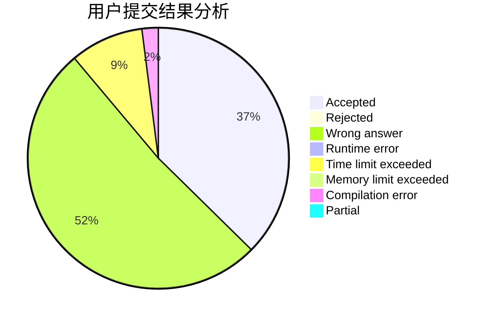
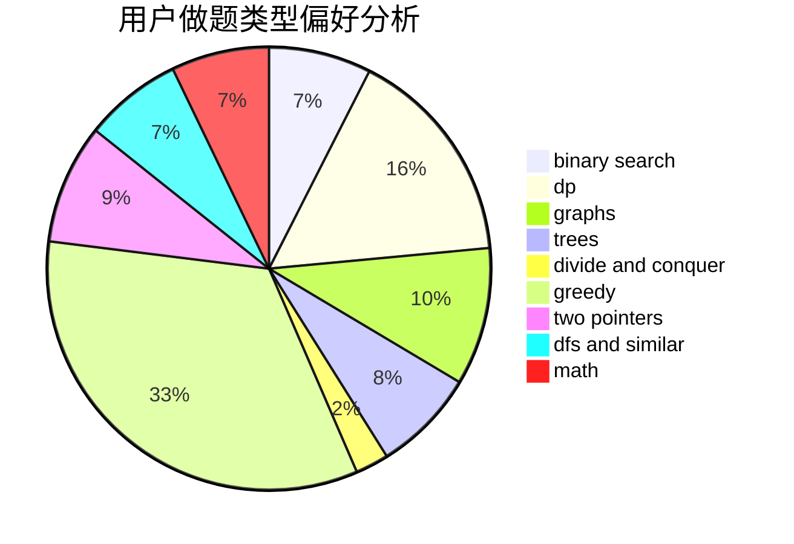

# 6ziv

<!-- tabs:start -->

#### **用户提交结果分析**

#### **用户做题类型偏好分析**

<!-- tabs:end -->
# 推荐题目
[1408E](https://codeforces.com/contest/1408/problem/E)
[1407E](https://codeforces.com/contest/1407/problem/E)
[1405B](https://codeforces.com/contest/1405/problem/B)
[1408D](https://codeforces.com/contest/1408/problem/D)
[1346A](https://codeforces.com/contest/1346/problem/A)
[1023C](https://codeforces.com/contest/1023/problem/C)
[1157G](https://codeforces.com/contest/1157/problem/G)
[1408H](https://codeforces.com/contest/1408/problem/H)
[1406E](https://codeforces.com/contest/1406/problem/E)
[1409A](https://codeforces.com/contest/1409/problem/A)
