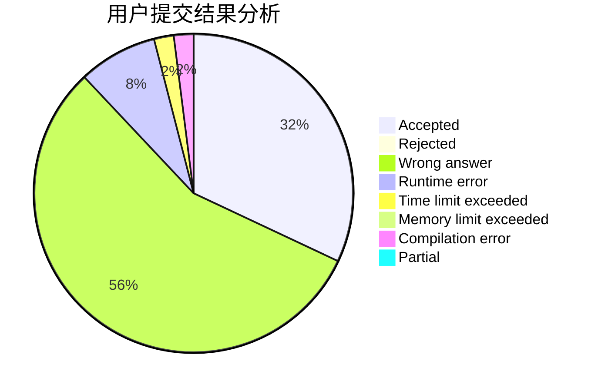
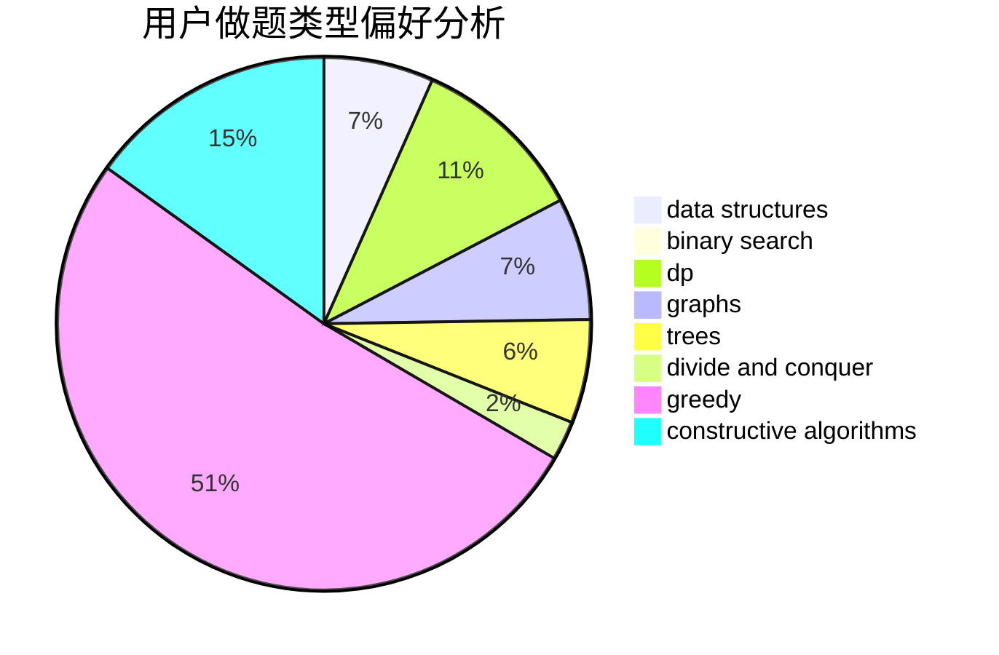

# Lgq_3de5
<!-- tabs:start -->
#### **用户提交结果分析**

#### **用户做题类型偏好分析**

#### **用户错题知识点分析**

<!-- tabs:end -->
# 推荐题目
[Let's Go Hiking](http://codeforces.com/problemset/problem/1495/B)		games,
                        greedy		  
[Number of Components](http://codeforces.com/problemset/problem/1303/F)		dsu,
                        implementation		  
[Ugly Pairs](http://codeforces.com/problemset/problem/1156/B)		dfs and similar,
                        greedy,
                        implementation,
                        sortings,
                        strings		  
[Hard problem](http://codeforces.com/problemset/problem/706/C)		dp,
                        strings		  
[Passwords](http://codeforces.com/problemset/problem/721/B)		implementation,
                        math,
                        sortings,
                        strings		  
[Even Substrings](http://codeforces.com/problemset/problem/1139/A)		implementation,
                        strings		  
[Dima and Hares](http://codeforces.com/problemset/problem/358/D)		dp,
                        greedy		  
[Renting Bikes](http://codeforces.com/problemset/problem/363/D)		binary search,
                        greedy		  
[Counting Kangaroos is Fun](http://codeforces.com/problemset/problem/372/A)		binary search,
                        greedy,
                        sortings,
                        two pointers		  
[Tourism](https://codeforces.com/contest/1314/problem/D)		dp,
                        graphs,
                        probabilities		  
<!-- tabs:start -->
#### **data structures**
[Let's Go Hiking](https://codeforces.com/contest/674/problem/G)		data structures		  
[Number of Components](http://codeforces.com/problemset/problem/1400/E)		data structures,
                        divide and conquer,
                        dp,
                        greedy		  
[Ugly Pairs](http://codeforces.com/problemset/problem/1209/H)		data structures,
                        greedy,
                        math		  
[Hard problem](http://codeforces.com/problemset/problem/1320/D)		data structures,
                        hashing,
                        strings		  
[Passwords](http://codeforces.com/problemset/problem/1492/C)		binary search,
                        data structures,
                        dp,
                        greedy,
                        two pointers		  
[Even Substrings](http://codeforces.com/problemset/problem/1490/G)		binary search,
                        data structures,
                        math		  
[Dima and Hares](http://codeforces.com/problemset/problem/1479/D)		binary search,
                        bitmasks,
                        brute force,
                        data structures,
                        probabilities,
                        trees		  
[Renting Bikes](http://codeforces.com/problemset/problem/1497/A)		brute force,
                        data structures,
                        greedy,
                        sortings		  
[Counting Kangaroos is Fun](http://codeforces.com/problemset/problem/1491/C)		brute force,
                        data structures,
                        dp,
                        greedy,
                        implementation		  
[Tourism](http://codeforces.com/problemset/problem/1492/B)		data structures,
                        greedy,
                        math		  
#### **binary search**
[Let's Go Hiking](http://codeforces.com/problemset/problem/363/D)		binary search,
                        greedy		  
[Number of Components](http://codeforces.com/problemset/problem/372/A)		binary search,
                        greedy,
                        sortings,
                        two pointers		  
[Ugly Pairs](http://codeforces.com/problemset/problem/1408/C)		binary search,
                        dp,
                        implementation,
                        math,
                        two pointers		  
[Hard problem](http://codeforces.com/problemset/problem/468/C)		binary search,
                        constructive algorithms,
                        math		  
[Passwords](http://codeforces.com/problemset/problem/1492/C)		binary search,
                        data structures,
                        dp,
                        greedy,
                        two pointers		  
[Even Substrings](http://codeforces.com/problemset/problem/1463/D)		binary search,
                        constructive algorithms,
                        greedy,
                        two pointers		  
[Dima and Hares](http://codeforces.com/problemset/problem/1490/G)		binary search,
                        data structures,
                        math		  
[Renting Bikes](http://codeforces.com/problemset/problem/1479/D)		binary search,
                        bitmasks,
                        brute force,
                        data structures,
                        probabilities,
                        trees		  
[Counting Kangaroos is Fun](http://codeforces.com/problemset/problem/1436/E)		binary search,
                        data structures,
                        two pointers		  
[Tourism](http://codeforces.com/problemset/problem/1461/D)		binary search,
                        brute force,
                        data structures,
                        divide and conquer,
                        implementation,
                        sortings		  
#### **dp**
[Let's Go Hiking](http://codeforces.com/problemset/problem/706/C)		dp,
                        strings		  
[Number of Components](http://codeforces.com/problemset/problem/358/D)		dp,
                        greedy		  
[Ugly Pairs](https://codeforces.com/contest/1314/problem/D)		dp,
                        graphs,
                        probabilities		  
[Hard problem](http://codeforces.com/problemset/problem/936/B)		dfs and similar,
                        dp,
                        games,
                        graphs		  
[Passwords](http://codeforces.com/problemset/problem/235/E)		combinatorics,
                        dp,
                        implementation,
                        math,
                        number theory		  
[Even Substrings](http://codeforces.com/problemset/problem/1178/F1)		combinatorics,
                        dfs and similar,
                        dp		  
[Dima and Hares](http://codeforces.com/problemset/problem/1400/E)		data structures,
                        divide and conquer,
                        dp,
                        greedy		  
[Renting Bikes](http://codeforces.com/problemset/problem/1393/E1)		dp,
                        hashing,
                        implementation,
                        string suffix structures,
                        strings		  
[Counting Kangaroos is Fun](http://codeforces.com/problemset/problem/1408/C)		binary search,
                        dp,
                        implementation,
                        math,
                        two pointers		  
[Tourism](http://codeforces.com/problemset/problem/1369/D)		dp,
                        graphs,
                        greedy,
                        math,
                        trees		  
#### **graph**
[Let's Go Hiking](https://codeforces.com/contest/1314/problem/D)		dp,
                        graphs,
                        probabilities		  
[Number of Components](http://codeforces.com/problemset/problem/1266/F)		dfs and similar,
                        graphs		  
[Ugly Pairs](http://codeforces.com/problemset/problem/936/B)		dfs and similar,
                        dp,
                        games,
                        graphs		  
[Hard problem](http://codeforces.com/problemset/problem/1369/D)		dp,
                        graphs,
                        greedy,
                        math,
                        trees		  
[Passwords](http://codeforces.com/problemset/problem/1498/D)		dfs and similar,
                        dp,
                        graphs,
                        implementation		  
[Even Substrings](http://codeforces.com/problemset/problem/1487/C)		brute force,
                        constructive algorithms,
                        dfs and similar,
                        graphs,
                        greedy,
                        implementation,
                        math		  
[Dima and Hares](http://codeforces.com/problemset/problem/1437/C)		dp,
                        flows,
                        graph matchings,
                        greedy,
                        math,
                        sortings		  
[Renting Bikes](http://codeforces.com/problemset/problem/1470/D)		constructive algorithms,
                        dfs and similar,
                        graph matchings,
                        graphs,
                        greedy		  
[Counting Kangaroos is Fun](http://codeforces.com/problemset/problem/1476/C)		dp,
                        graphs,
                        greedy		  
[Tourism](http://codeforces.com/problemset/problem/1304/D)		constructive algorithms,
                        graphs,
                        greedy,
                        two pointers		  
#### **trees**
[Let's Go Hiking](http://codeforces.com/problemset/problem/1369/D)		dp,
                        graphs,
                        greedy,
                        math,
                        trees		  
[Number of Components](http://codeforces.com/problemset/problem/1479/D)		binary search,
                        bitmasks,
                        brute force,
                        data structures,
                        probabilities,
                        trees		  
[Ugly Pairs](http://codeforces.com/problemset/problem/1511/C)		brute force,
                        data structures,
                        implementation,
                        trees		  
[Hard problem](http://codeforces.com/problemset/problem/1499/F)		combinatorics,
                        dfs and similar,
                        dp,
                        trees		  
[Passwords](http://codeforces.com/problemset/problem/1491/E)		brute force,
                        dfs and similar,
                        divide and conquer,
                        number theory,
                        trees		  
[Even Substrings](http://codeforces.com/problemset/problem/1466/D)		data structures,
                        greedy,
                        sortings,
                        trees		  
[Dima and Hares](http://codeforces.com/problemset/problem/1495/D)		combinatorics,
                        dfs and similar,
                        graphs,
                        math,
                        shortest paths,
                        trees		  
[Renting Bikes](http://codeforces.com/problemset/problem/1303/G)		data structures,
                        divide and conquer,
                        geometry,
                        trees		  
[Counting Kangaroos is Fun](http://codeforces.com/problemset/problem/1454/E)		combinatorics,
                        dfs and similar,
                        graphs,
                        trees		  
[Tourism](http://codeforces.com/problemset/problem/1494/D)		constructive algorithms,
                        data structures,
                        dfs and similar,
                        divide and conquer,
                        dsu,
                        greedy,
                        sortings,
                        trees		  
#### **divide and conquer**
[Let's Go Hiking](http://codeforces.com/problemset/problem/1400/E)		data structures,
                        divide and conquer,
                        dp,
                        greedy		  
[Number of Components](http://codeforces.com/problemset/problem/1461/D)		binary search,
                        brute force,
                        data structures,
                        divide and conquer,
                        implementation,
                        sortings		  
[Ugly Pairs](http://codeforces.com/problemset/problem/1466/G)		combinatorics,
                        divide and conquer,
                        hashing,
                        math,
                        string suffix structures,
                        strings		  
[Hard problem](http://codeforces.com/problemset/problem/1490/D)		dfs and similar,
                        divide and conquer,
                        implementation		  
[Passwords](https://codeforces.com/contest/1483/problem/C)		data structures,
                        divide and conquer,
                        dp		  
[Even Substrings](http://codeforces.com/problemset/problem/1491/E)		brute force,
                        dfs and similar,
                        divide and conquer,
                        number theory,
                        trees		  
[Dima and Hares](http://codeforces.com/problemset/problem/1303/G)		data structures,
                        divide and conquer,
                        geometry,
                        trees		  
[Renting Bikes](http://codeforces.com/problemset/problem/1494/D)		constructive algorithms,
                        data structures,
                        dfs and similar,
                        divide and conquer,
                        dsu,
                        greedy,
                        sortings,
                        trees		  
[Counting Kangaroos is Fun](http://codeforces.com/problemset/problem/1482/E)		data structures,
                        divide and conquer,
                        dp		  
[Tourism](http://codeforces.com/problemset/problem/566/C)		dfs and similar,
                        divide and conquer,
                        trees		  
#### **greedy**
[Let's Go Hiking](http://codeforces.com/problemset/problem/1495/B)		games,
                        greedy		  
[Number of Components](http://codeforces.com/problemset/problem/1156/B)		dfs and similar,
                        greedy,
                        implementation,
                        sortings,
                        strings		  
[Ugly Pairs](http://codeforces.com/problemset/problem/358/D)		dp,
                        greedy		  
[Hard problem](http://codeforces.com/problemset/problem/363/D)		binary search,
                        greedy		  
[Passwords](http://codeforces.com/problemset/problem/372/A)		binary search,
                        greedy,
                        sortings,
                        two pointers		  
[Even Substrings](http://codeforces.com/problemset/problem/762/B)		greedy,
                        implementation,
                        sortings,
                        two pointers		  
[Dima and Hares](http://codeforces.com/problemset/problem/955/A)		greedy,
                        math		  
[Renting Bikes](http://codeforces.com/problemset/problem/193/C)		constructive algorithms,
                        greedy,
                        math,
                        matrices		  
[Counting Kangaroos is Fun](http://codeforces.com/problemset/problem/1400/E)		data structures,
                        divide and conquer,
                        dp,
                        greedy		  
[Tourism](http://codeforces.com/problemset/problem/1209/H)		data structures,
                        greedy,
                        math		  
#### **constructive algorithms**
[Let's Go Hiking](http://codeforces.com/problemset/problem/551/B)		brute force,
                        constructive algorithms,
                        implementation,
                        strings		  
[Number of Components](http://codeforces.com/problemset/problem/1335/B)		constructive algorithms		  
[Ugly Pairs](https://codeforces.com/contest/907/problem/D)		brute force,
                        constructive algorithms,
                        math		  
[Hard problem](http://codeforces.com/problemset/problem/193/C)		constructive algorithms,
                        greedy,
                        math,
                        matrices		  
[Passwords](http://codeforces.com/problemset/problem/1025/E)		constructive algorithms,
                        implementation,
                        matrices		  
[Even Substrings](http://codeforces.com/problemset/problem/468/C)		binary search,
                        constructive algorithms,
                        math		  
[Dima and Hares](http://codeforces.com/problemset/problem/1395/B)		constructive algorithms		  
[Renting Bikes](http://codeforces.com/problemset/problem/1493/A)		constructive algorithms,
                        greedy		  
[Counting Kangaroos is Fun](http://codeforces.com/problemset/problem/1463/D)		binary search,
                        constructive algorithms,
                        greedy,
                        two pointers		  
[Tourism](https://codeforces.com/contest/1456/problem/B)		bitmasks,
                        brute force,
                        constructive algorithms		  
#### **sortings**
[Let's Go Hiking](http://codeforces.com/problemset/problem/1156/B)		dfs and similar,
                        greedy,
                        implementation,
                        sortings,
                        strings		  
[Number of Components](http://codeforces.com/problemset/problem/721/B)		implementation,
                        math,
                        sortings,
                        strings		  
[Ugly Pairs](http://codeforces.com/problemset/problem/372/A)		binary search,
                        greedy,
                        sortings,
                        two pointers		  
[Hard problem](http://codeforces.com/problemset/problem/762/B)		greedy,
                        implementation,
                        sortings,
                        two pointers		  
[Passwords](https://codeforces.com/contest/1496/problem/C)		geometry,
                        greedy,
                        math,
                        sortings		  
[Even Substrings](http://codeforces.com/problemset/problem/1495/A)		geometry,
                        greedy,
                        math,
                        sortings		  
[Dima and Hares](http://codeforces.com/problemset/problem/1497/A)		brute force,
                        data structures,
                        greedy,
                        sortings		  
[Renting Bikes](http://codeforces.com/problemset/problem/1427/A)		math,
                        sortings		  
[Counting Kangaroos is Fun](http://codeforces.com/problemset/problem/1461/D)		binary search,
                        brute force,
                        data structures,
                        divide and conquer,
                        implementation,
                        sortings		  
[Tourism](http://codeforces.com/problemset/problem/1437/C)		dp,
                        flows,
                        graph matchings,
                        greedy,
                        math,
                        sortings		  
<!-- tabs:end -->
