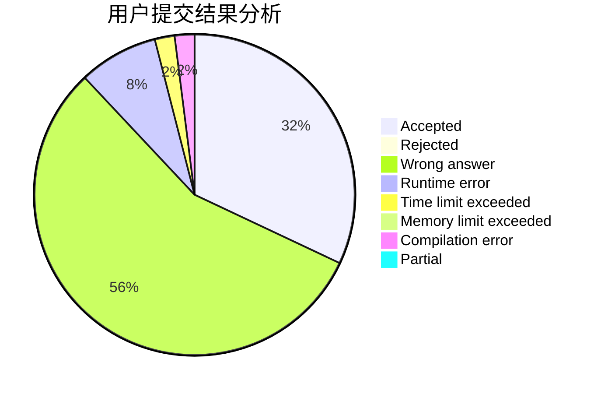
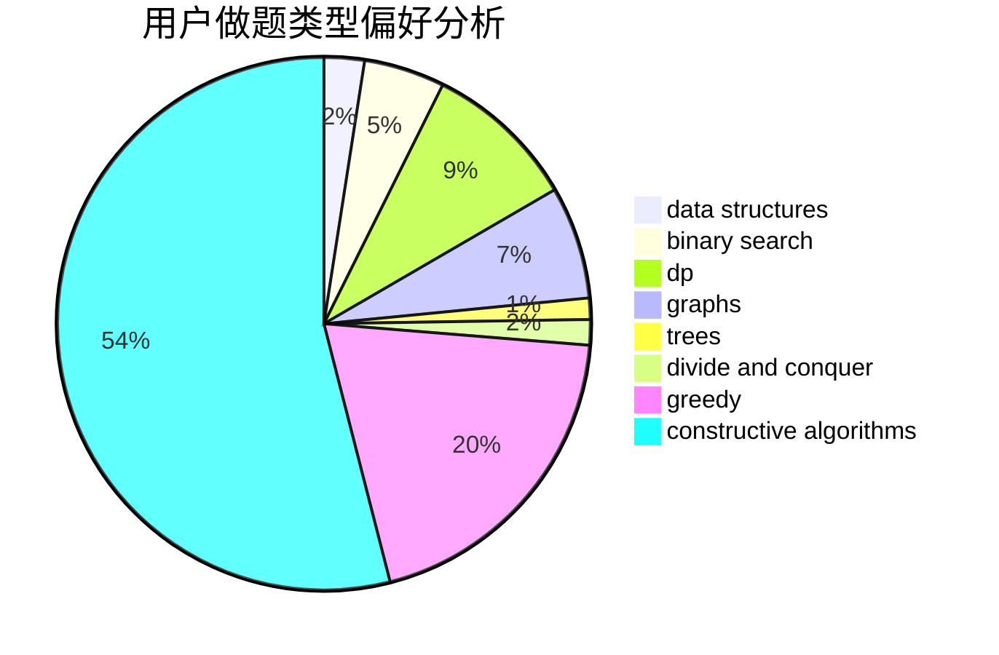

# Lgq_3de5

<!-- tabs:start -->

#### **用户提交结果分析**

#### **用户做题类型偏好分析**

#### **用户错题知识点分析**

<!-- tabs:end -->
# 推荐题目
[1504B](https://codeforces.com/contest/1504/problem/B)		constructive algorithms,
                        greedy,
                        implementation,
                        math		  
[809B](https://codeforces.com/contest/809/problem/B)		binary search,
                        interactive		  
[1272A](https://codeforces.com/contest/1272/problem/A)		brute force,
                        greedy,
                        math,
                        sortings		  
[402A](https://codeforces.com/contest/402/problem/A)		greedy,
                        math		  
[1157G](https://codeforces.com/contest/1157/problem/G)		brute force,
                        constructive algorithms		  
[383E](https://codeforces.com/contest/383/problem/E)		combinatorics,
                        divide and conquer,
                        dp		  
[38C](https://codeforces.com/contest/38/problem/C)		brute force		  
[576C](https://codeforces.com/contest/576/problem/C)		constructive algorithms,
                        divide and conquer,
                        geometry,
                        greedy,
                        sortings		  
[977A](https://codeforces.com/contest/977/problem/A)		implementation		  
[738D](https://codeforces.com/contest/738/problem/D)		dsu,graphs,sortings,trees		  
