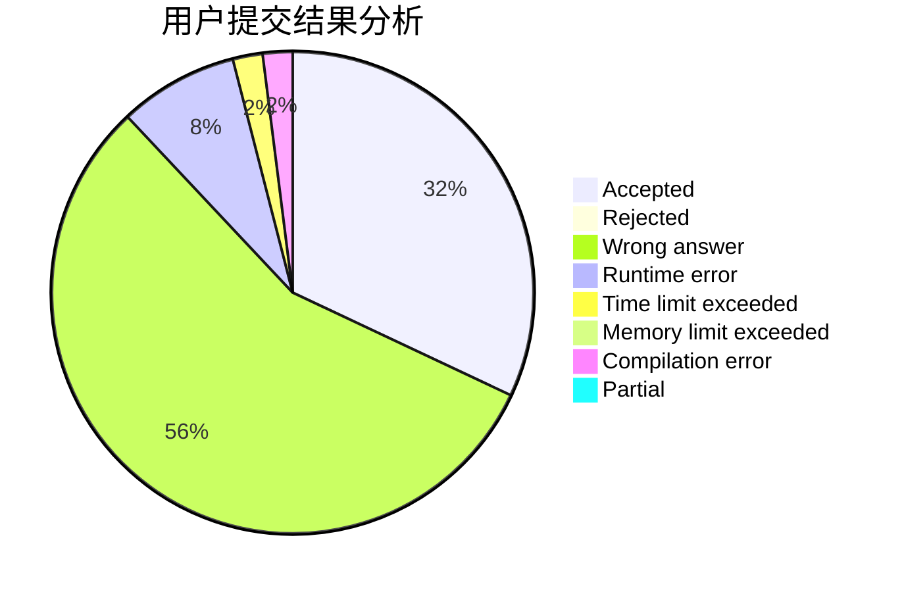
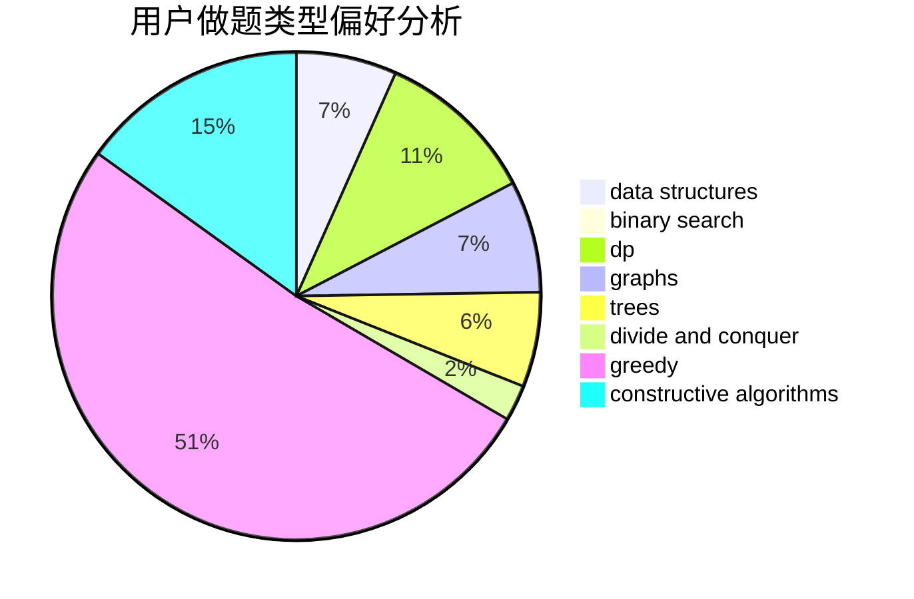

# Lgq_3de5

<!-- tabs:start -->

#### **用户提交结果分析**

#### **用户做题类型偏好分析**

#### **用户错题知识点分析**

<!-- tabs:end -->
# 推荐题目
[1495B](https://codeforces.com/contest/1495/problem/B)		games,
                        greedy		  
[794A](https://codeforces.com/contest/794/problem/A)		brute force,
                        implementation		  
[1266F](https://codeforces.com/contest/1266/problem/F)		dfs and similar,
                        graphs		  
[372A](https://codeforces.com/contest/372/problem/A)		binary search,
                        greedy,
                        sortings,
                        two pointers		  
[1156B](https://codeforces.com/contest/1156/problem/B)		dfs and similar,
                        greedy,
                        implementation,
                        sortings,
                        strings		  
[358D](https://codeforces.com/contest/358/problem/D)		dp,
                        greedy		  
[363D](https://codeforces.com/contest/363/problem/D)		binary search,
                        greedy		  
[551B](https://codeforces.com/contest/551/problem/B)		brute force,
                        constructive algorithms,
                        implementation,
                        strings		  
[955A](https://codeforces.com/contest/955/problem/A)		greedy,
                        math		  
[721B](https://codeforces.com/contest/721/problem/B)		implementation,
                        math,
                        sortings,
                        strings		  
