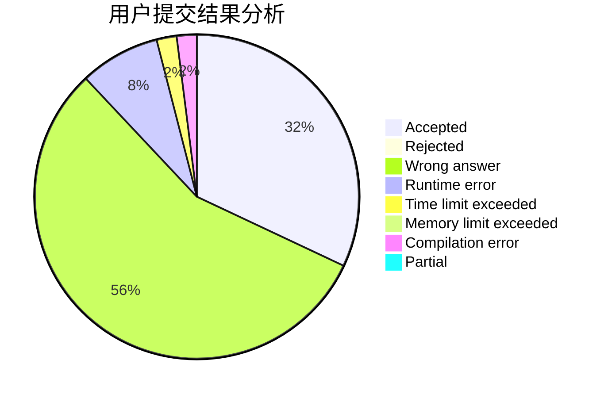
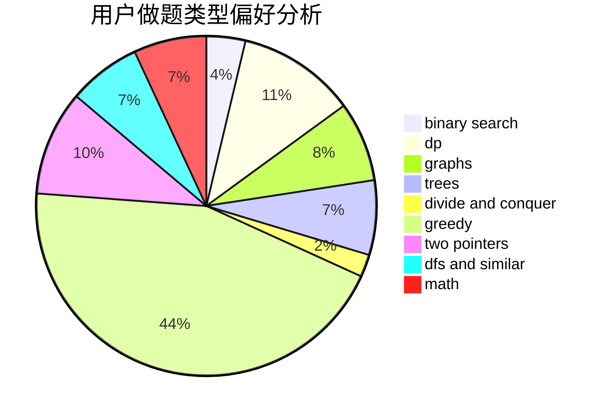

# Lgq_3de5

<!-- tabs:start -->

#### **用户提交结果分析**

#### **用户做题类型偏好分析**

<!-- tabs:end -->
# 推荐题目
[1504B](https://codeforces.com/contest/1504/problem/B)
[809B](https://codeforces.com/contest/809/problem/B)
[1272A](https://codeforces.com/contest/1272/problem/A)
[402A](https://codeforces.com/contest/402/problem/A)
[1157G](https://codeforces.com/contest/1157/problem/G)
[383E](https://codeforces.com/contest/383/problem/E)
[38C](https://codeforces.com/contest/38/problem/C)
[576C](https://codeforces.com/contest/576/problem/C)
[977A](https://codeforces.com/contest/977/problem/A)
[738D](https://codeforces.com/contest/738/problem/D)
