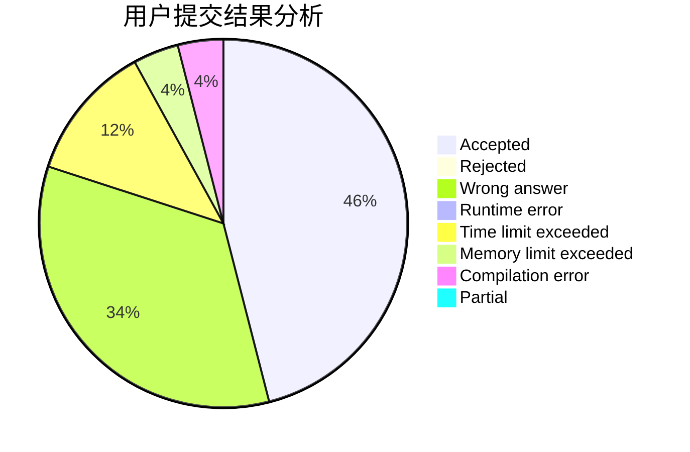
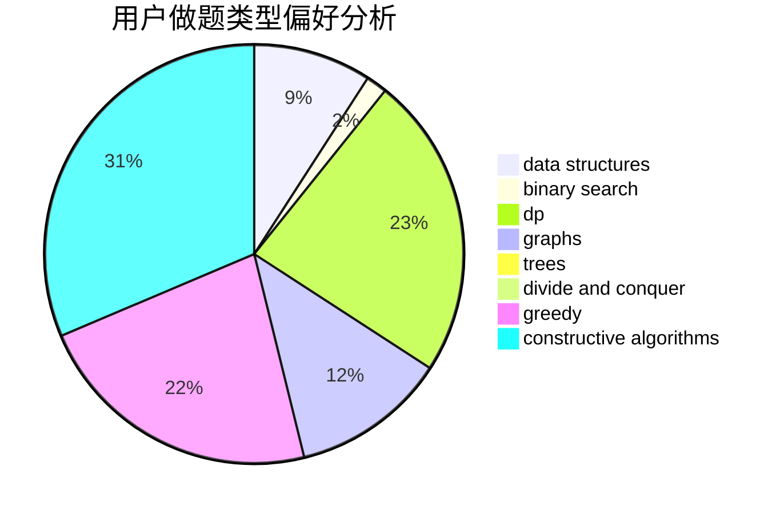
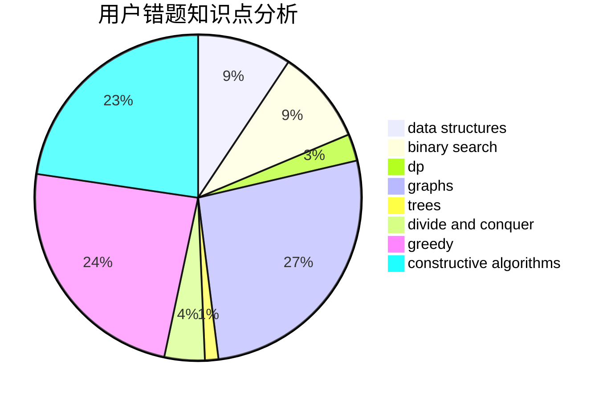

# LiHY

<!-- tabs:start -->

#### **用户提交结果分析**

#### **用户做题类型偏好分析**

#### **用户错题知识点分析**

<!-- tabs:end -->
# 推荐题目
[240F](https://codeforces.com/contest/240/problem/F)		data structures		  
[757F](https://codeforces.com/contest/757/problem/F)		data structures,
                        graphs,
                        shortest paths		  
[1311B](https://codeforces.com/contest/1311/problem/B)		dfs and similar,
                        sortings		  
[1285A](https://codeforces.com/contest/1285/problem/A)		math		  
[912E](https://codeforces.com/contest/912/problem/E)		binary search,
                        dfs and similar,
                        math,
                        meet-in-the-middle,
                        number theory,
                        two pointers		  
[52C](https://codeforces.com/contest/52/problem/C)		data structures		  
[872A](https://codeforces.com/contest/872/problem/A)		dsu,graphs,sortings,trees		  
[285A](https://codeforces.com/contest/285/problem/A)		greedy,
                        implementation		  
[659E](https://codeforces.com/contest/659/problem/E)		data structures,
                        dfs and similar,
                        dsu,
                        graphs,
                        greedy		  
[893E](https://codeforces.com/contest/893/problem/E)		combinatorics,
                        dp,
                        math,
                        number theory		  
