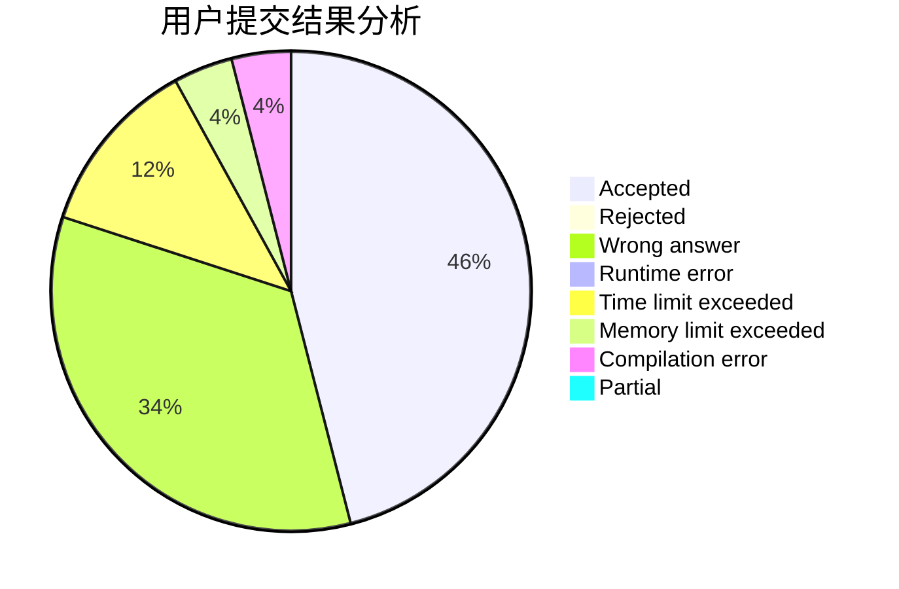
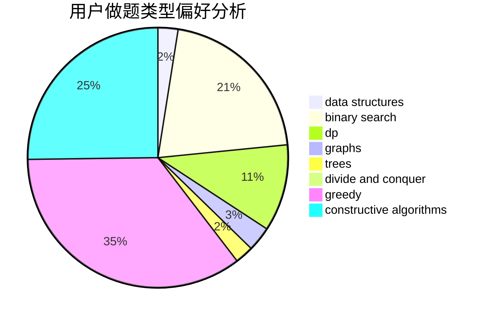
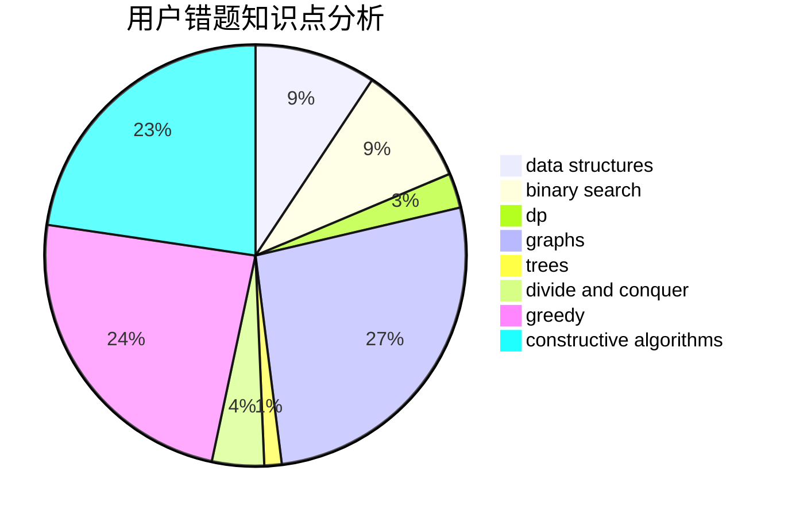

# LiHY
<!-- tabs:start -->
#### **用户提交结果分析**

#### **用户做题类型偏好分析**

#### **用户错题知识点分析**

<!-- tabs:end -->
# 推荐题目
[Cards](http://codeforces.com/problemset/problem/1278/F)		combinatorics,
                        dp,
                        math,
                        number theory,
                        probabilities		  
[Nastya and Scoreboard](http://codeforces.com/problemset/problem/1340/B)		bitmasks,
                        dp,
                        graphs,
                        greedy		  
[Silent Classroom](http://codeforces.com/problemset/problem/1166/A)		combinatorics,
                        greedy		  
[XK Segments](http://codeforces.com/problemset/problem/895/B)		binary search,
                        math,
                        sortings,
                        two pointers		  
[A pile of stones](http://codeforces.com/problemset/problem/1159/A)		implementation,
                        math		  
[Michael and Charging Stations](http://codeforces.com/problemset/problem/853/D)		binary search,
                        dp,
                        greedy		  
[Wizards and Huge Prize](http://codeforces.com/problemset/problem/167/B)		dp,
                        math,
                        probabilities		  
[Maximum splitting](https://codeforces.com/contest/872/problem/C)		dp,
                        greedy,
                        math,
                        number theory		  
[Guess The Maximums](http://codeforces.com/problemset/problem/1363/D)		binary search,
                        implementation,
                        interactive,
                        math		  
[Anya and Ghosts](http://codeforces.com/problemset/problem/508/C)		constructive algorithms,
                        greedy		  
<!-- tabs:start -->
#### **data structures**
[Cards](http://codeforces.com/problemset/problem/622/C)		data structures,
                        implementation		  
[Nastya and Scoreboard](http://codeforces.com/problemset/problem/629/E)		combinatorics,
                        data structures,
                        dfs and similar,
                        dp,
                        probabilities,
                        trees		  
[Silent Classroom](http://codeforces.com/problemset/problem/280/B)		data structures,
                        implementation,
                        two pointers		  
[XK Segments](http://codeforces.com/problemset/problem/1340/A)		brute force,
                        data structures,
                        greedy,
                        implementation		  
[A pile of stones](http://codeforces.com/problemset/problem/631/D)		data structures,
                        hashing,
                        implementation,
                        string suffix structures,
                        strings		  
[Michael and Charging Stations](http://codeforces.com/problemset/problem/605/D)		data structures,
                        dfs and similar		  
[Wizards and Huge Prize](http://codeforces.com/problemset/problem/1301/E)		binary search,
                        data structures,
                        dp,
                        implementation		  
[Maximum splitting](http://codeforces.com/problemset/problem/1513/F)		brute force,
                        constructive algorithms,
                        data structures,
                        sortings		  
[Guess The Maximums](http://codeforces.com/problemset/problem/938/G)		bitmasks,
                        data structures,
                        dsu,
                        graphs		  
[Anya and Ghosts](http://codeforces.com/problemset/problem/1413/D)		data structures,
                        greedy,
                        implementation		  
#### **binary search**
[Cards](http://codeforces.com/problemset/problem/895/B)		binary search,
                        math,
                        sortings,
                        two pointers		  
[Nastya and Scoreboard](http://codeforces.com/problemset/problem/853/D)		binary search,
                        dp,
                        greedy		  
[Silent Classroom](http://codeforces.com/problemset/problem/1363/D)		binary search,
                        implementation,
                        interactive,
                        math		  
[XK Segments](http://codeforces.com/problemset/problem/1301/E)		binary search,
                        data structures,
                        dp,
                        implementation		  
[A pile of stones](http://codeforces.com/problemset/problem/1492/C)		binary search,
                        data structures,
                        dp,
                        greedy,
                        two pointers		  
[Michael and Charging Stations](http://codeforces.com/problemset/problem/1463/D)		binary search,
                        constructive algorithms,
                        greedy,
                        two pointers		  
[Wizards and Huge Prize](http://codeforces.com/problemset/problem/1490/G)		binary search,
                        data structures,
                        math		  
[Maximum splitting](http://codeforces.com/problemset/problem/1479/D)		binary search,
                        bitmasks,
                        brute force,
                        data structures,
                        probabilities,
                        trees		  
[Guess The Maximums](http://codeforces.com/problemset/problem/1436/E)		binary search,
                        data structures,
                        two pointers		  
[Anya and Ghosts](http://codeforces.com/problemset/problem/1461/D)		binary search,
                        brute force,
                        data structures,
                        divide and conquer,
                        implementation,
                        sortings		  
#### **dp**
[Cards](http://codeforces.com/problemset/problem/1278/F)		combinatorics,
                        dp,
                        math,
                        number theory,
                        probabilities		  
[Nastya and Scoreboard](http://codeforces.com/problemset/problem/1340/B)		bitmasks,
                        dp,
                        graphs,
                        greedy		  
[Silent Classroom](http://codeforces.com/problemset/problem/853/D)		binary search,
                        dp,
                        greedy		  
[XK Segments](http://codeforces.com/problemset/problem/167/B)		dp,
                        math,
                        probabilities		  
[A pile of stones](https://codeforces.com/contest/872/problem/C)		dp,
                        greedy,
                        math,
                        number theory		  
[Michael and Charging Stations](http://codeforces.com/problemset/problem/629/E)		combinatorics,
                        data structures,
                        dfs and similar,
                        dp,
                        probabilities,
                        trees		  
[Wizards and Huge Prize](http://codeforces.com/problemset/problem/1393/E2)		dp,
                        hashing,
                        implementation,
                        string suffix structures,
                        strings,
                        two pointers		  
[Maximum splitting](http://codeforces.com/problemset/problem/1301/E)		binary search,
                        data structures,
                        dp,
                        implementation		  
[Guess The Maximums](http://codeforces.com/problemset/problem/682/C)		dfs and similar,
                        dp,
                        graphs,
                        trees		  
[Anya and Ghosts](http://codeforces.com/problemset/problem/730/I)		dp,
                        flows,
                        graphs,
                        greedy		  
#### **graph**
[Cards](http://codeforces.com/problemset/problem/1340/B)		bitmasks,
                        dp,
                        graphs,
                        greedy		  
[Nastya and Scoreboard](http://codeforces.com/problemset/problem/269/C)		constructive algorithms,
                        flows,
                        graphs,
                        greedy		  
[Silent Classroom](http://codeforces.com/problemset/problem/1327/B)		brute force,
                        graphs,
                        greedy		  
[XK Segments](http://codeforces.com/problemset/problem/682/C)		dfs and similar,
                        dp,
                        graphs,
                        trees		  
[A pile of stones](http://codeforces.com/problemset/problem/938/G)		bitmasks,
                        data structures,
                        dsu,
                        graphs		  
[Michael and Charging Stations](http://codeforces.com/problemset/problem/730/I)		dp,
                        flows,
                        graphs,
                        greedy		  
[Wizards and Huge Prize](http://codeforces.com/problemset/problem/1487/C)		brute force,
                        constructive algorithms,
                        dfs and similar,
                        graphs,
                        greedy,
                        implementation,
                        math		  
[Maximum splitting](http://codeforces.com/problemset/problem/1437/C)		dp,
                        flows,
                        graph matchings,
                        greedy,
                        math,
                        sortings		  
[Guess The Maximums](http://codeforces.com/problemset/problem/1470/D)		constructive algorithms,
                        dfs and similar,
                        graph matchings,
                        graphs,
                        greedy		  
[Anya and Ghosts](http://codeforces.com/problemset/problem/1476/C)		dp,
                        graphs,
                        greedy		  
#### **trees**
[Cards](http://codeforces.com/problemset/problem/629/E)		combinatorics,
                        data structures,
                        dfs and similar,
                        dp,
                        probabilities,
                        trees		  
[Nastya and Scoreboard](http://codeforces.com/problemset/problem/1085/D)		constructive algorithms,
                        implementation,
                        trees		  
[Silent Classroom](http://codeforces.com/problemset/problem/682/C)		dfs and similar,
                        dp,
                        graphs,
                        trees		  
[XK Segments](http://codeforces.com/problemset/problem/1479/D)		binary search,
                        bitmasks,
                        brute force,
                        data structures,
                        probabilities,
                        trees		  
[A pile of stones](http://codeforces.com/problemset/problem/1511/C)		brute force,
                        data structures,
                        implementation,
                        trees		  
[Michael and Charging Stations](http://codeforces.com/problemset/problem/1499/F)		combinatorics,
                        dfs and similar,
                        dp,
                        trees		  
[Wizards and Huge Prize](http://codeforces.com/problemset/problem/1491/E)		brute force,
                        dfs and similar,
                        divide and conquer,
                        number theory,
                        trees		  
[Maximum splitting](http://codeforces.com/problemset/problem/1466/D)		data structures,
                        greedy,
                        sortings,
                        trees		  
[Guess The Maximums](http://codeforces.com/problemset/problem/1495/D)		combinatorics,
                        dfs and similar,
                        graphs,
                        math,
                        shortest paths,
                        trees		  
[Anya and Ghosts](http://codeforces.com/problemset/problem/1303/G)		data structures,
                        divide and conquer,
                        geometry,
                        trees		  
#### **divide and conquer**
[Cards](http://codeforces.com/problemset/problem/438/E)		combinatorics,
                        divide and conquer,
                        fft,
                        number theory		  
[Nastya and Scoreboard](http://codeforces.com/problemset/problem/1461/D)		binary search,
                        brute force,
                        data structures,
                        divide and conquer,
                        implementation,
                        sortings		  
[Silent Classroom](http://codeforces.com/problemset/problem/1466/G)		combinatorics,
                        divide and conquer,
                        hashing,
                        math,
                        string suffix structures,
                        strings		  
[XK Segments](http://codeforces.com/problemset/problem/1490/D)		dfs and similar,
                        divide and conquer,
                        implementation		  
[A pile of stones](https://codeforces.com/contest/1483/problem/C)		data structures,
                        divide and conquer,
                        dp		  
[Michael and Charging Stations](http://codeforces.com/problemset/problem/1491/E)		brute force,
                        dfs and similar,
                        divide and conquer,
                        number theory,
                        trees		  
[Wizards and Huge Prize](http://codeforces.com/problemset/problem/1303/G)		data structures,
                        divide and conquer,
                        geometry,
                        trees		  
[Maximum splitting](http://codeforces.com/problemset/problem/1494/D)		constructive algorithms,
                        data structures,
                        dfs and similar,
                        divide and conquer,
                        dsu,
                        greedy,
                        sortings,
                        trees		  
[Guess The Maximums](http://codeforces.com/problemset/problem/1482/E)		data structures,
                        divide and conquer,
                        dp		  
[Anya and Ghosts](http://codeforces.com/problemset/problem/566/C)		dfs and similar,
                        divide and conquer,
                        trees		  
#### **greedy**
[Cards](http://codeforces.com/problemset/problem/1340/B)		bitmasks,
                        dp,
                        graphs,
                        greedy		  
[Nastya and Scoreboard](http://codeforces.com/problemset/problem/1166/A)		combinatorics,
                        greedy		  
[Silent Classroom](http://codeforces.com/problemset/problem/853/D)		binary search,
                        dp,
                        greedy		  
[XK Segments](https://codeforces.com/contest/872/problem/C)		dp,
                        greedy,
                        math,
                        number theory		  
[A pile of stones](http://codeforces.com/problemset/problem/508/C)		constructive algorithms,
                        greedy		  
[Michael and Charging Stations](http://codeforces.com/problemset/problem/1294/C)		greedy,
                        math,
                        number theory		  
[Wizards and Huge Prize](https://codeforces.com/contest/736/problem/A)		combinatorics,
                        constructive algorithms,
                        greedy,
                        math		  
[Maximum splitting](http://codeforces.com/problemset/problem/269/C)		constructive algorithms,
                        flows,
                        graphs,
                        greedy		  
[Guess The Maximums](http://codeforces.com/problemset/problem/1340/A)		brute force,
                        data structures,
                        greedy,
                        implementation		  
[Anya and Ghosts](http://codeforces.com/problemset/problem/1327/B)		brute force,
                        graphs,
                        greedy		  
#### **constructive algorithms**
[Cards](http://codeforces.com/problemset/problem/508/C)		constructive algorithms,
                        greedy		  
[Nastya and Scoreboard](http://codeforces.com/problemset/problem/544/B)		constructive algorithms,
                        implementation		  
[Silent Classroom](https://codeforces.com/contest/736/problem/A)		combinatorics,
                        constructive algorithms,
                        greedy,
                        math		  
[XK Segments](https://codeforces.com/contest/1262/problem/C)		constructive algorithms		  
[A pile of stones](http://codeforces.com/problemset/problem/269/C)		constructive algorithms,
                        flows,
                        graphs,
                        greedy		  
[Michael and Charging Stations](http://codeforces.com/problemset/problem/509/D)		constructive algorithms,
                        math		  
[Wizards and Huge Prize](https://codeforces.com/contest/1457/problem/D)		bitmasks,
                        brute force,
                        constructive algorithms		  
[Maximum splitting](http://codeforces.com/problemset/problem/1085/D)		constructive algorithms,
                        implementation,
                        trees		  
[Guess The Maximums](http://codeforces.com/problemset/problem/538/G)		constructive algorithms,
                        math,
                        sortings		  
[Anya and Ghosts](http://codeforces.com/problemset/problem/1196/B)		constructive algorithms,
                        math		  
#### **sortings**
[Cards](http://codeforces.com/problemset/problem/895/B)		binary search,
                        math,
                        sortings,
                        two pointers		  
[Nastya and Scoreboard](http://codeforces.com/problemset/problem/538/G)		constructive algorithms,
                        math,
                        sortings		  
[Silent Classroom](http://codeforces.com/problemset/problem/1513/F)		brute force,
                        constructive algorithms,
                        data structures,
                        sortings		  
[XK Segments](http://codeforces.com/problemset/problem/1253/E)		data structures,
                        dp,
                        greedy,
                        sortings		  
[A pile of stones](https://codeforces.com/contest/1496/problem/C)		geometry,
                        greedy,
                        math,
                        sortings		  
[Michael and Charging Stations](http://codeforces.com/problemset/problem/1495/A)		geometry,
                        greedy,
                        math,
                        sortings		  
[Wizards and Huge Prize](http://codeforces.com/problemset/problem/1497/A)		brute force,
                        data structures,
                        greedy,
                        sortings		  
[Maximum splitting](http://codeforces.com/problemset/problem/1427/A)		math,
                        sortings		  
[Guess The Maximums](http://codeforces.com/problemset/problem/1461/D)		binary search,
                        brute force,
                        data structures,
                        divide and conquer,
                        implementation,
                        sortings		  
[Anya and Ghosts](http://codeforces.com/problemset/problem/1437/C)		dp,
                        flows,
                        graph matchings,
                        greedy,
                        math,
                        sortings		  
<!-- tabs:end -->
