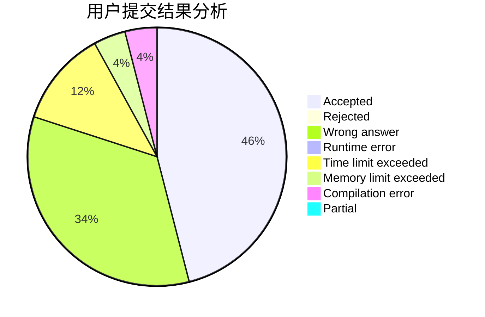
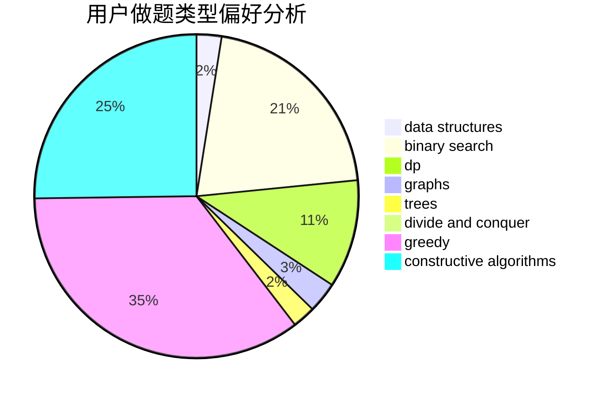
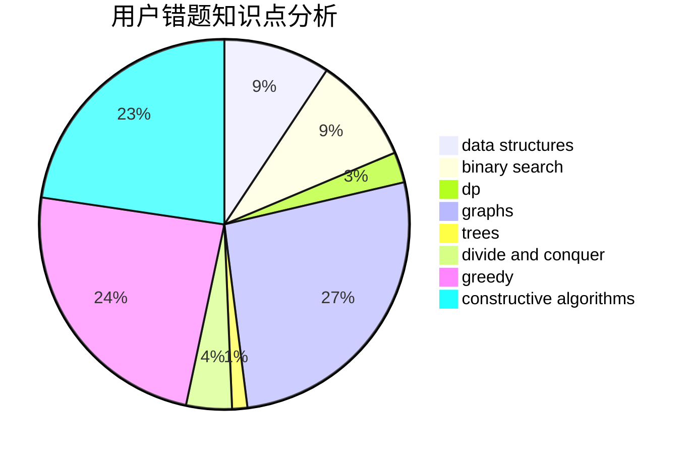

# LiHY

<!-- tabs:start -->

#### **用户提交结果分析**

#### **用户做题类型偏好分析**

#### **用户错题知识点分析**

<!-- tabs:end -->
# 推荐题目
[221B](https://codeforces.com/contest/221/problem/B)		implementation		  
[736A](https://codeforces.com/contest/736/problem/A)		dsu,graphs,sortings,trees		  
[1301E](https://codeforces.com/contest/1301/problem/E)		binary search,
                        data structures,
                        dp,
                        implementation		  
[1278F](https://codeforces.com/contest/1278/problem/F)		combinatorics,
                        dp,
                        math,
                        number theory,
                        probabilities		  
[895B](https://codeforces.com/contest/895/problem/B)		binary search,
                        math,
                        sortings,
                        two pointers		  
[509D](https://codeforces.com/contest/509/problem/D)		constructive algorithms,
                        math		  
[853D](https://codeforces.com/contest/853/problem/D)		binary search,
                        dp,
                        greedy		  
[269C](https://codeforces.com/contest/269/problem/C)		constructive algorithms,
                        flows,
                        graphs,
                        greedy		  
[629E](https://codeforces.com/contest/629/problem/E)		combinatorics,
                        data structures,
                        dfs and similar,
                        dp,
                        probabilities,
                        trees		  
[872C](https://codeforces.com/contest/872/problem/C)		dsu,graphs,sortings,trees		  
