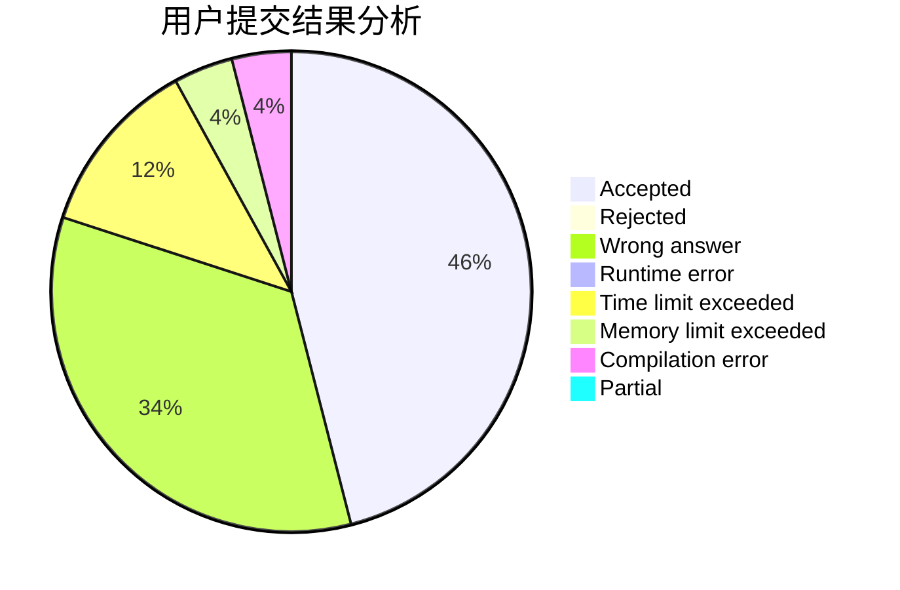
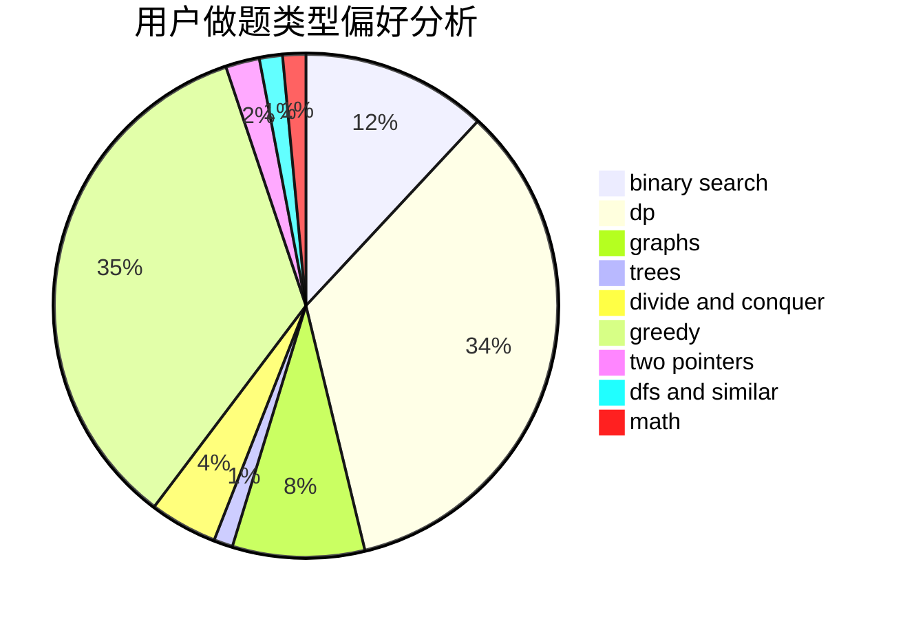

# LiHY

<!-- tabs:start -->

#### **用户提交结果分析**

#### **用户做题类型偏好分析**

<!-- tabs:end -->
# 推荐题目
[240F](https://codeforces.com/contest/240/problem/F)
[757F](https://codeforces.com/contest/757/problem/F)
[1311B](https://codeforces.com/contest/1311/problem/B)
[1285A](https://codeforces.com/contest/1285/problem/A)
[912E](https://codeforces.com/contest/912/problem/E)
[52C](https://codeforces.com/contest/52/problem/C)
[872A](https://codeforces.com/contest/872/problem/A)
[285A](https://codeforces.com/contest/285/problem/A)
[659E](https://codeforces.com/contest/659/problem/E)
[893E](https://codeforces.com/contest/893/problem/E)
