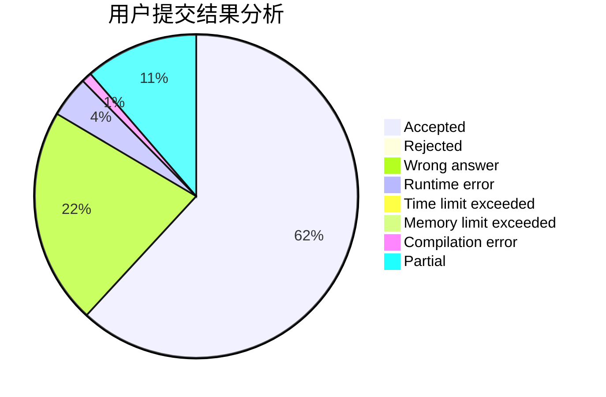
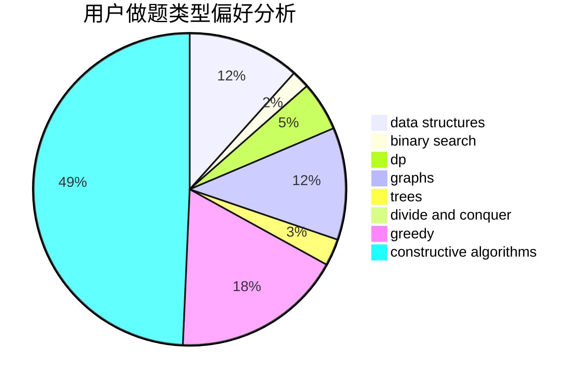
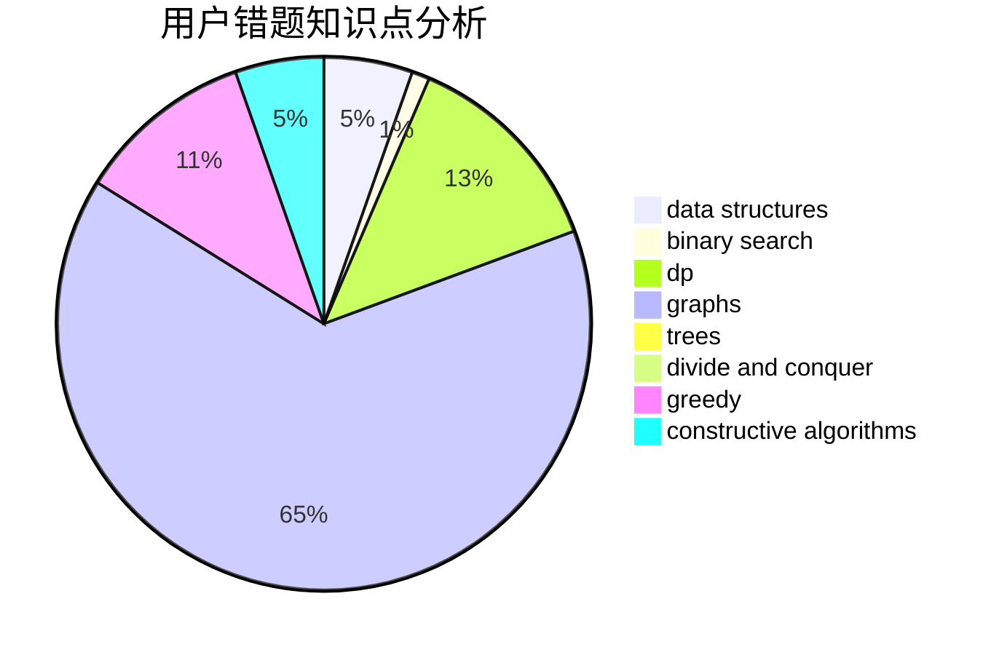

# LiM_256

<!-- tabs:start -->

#### **用户提交结果分析**

#### **用户做题类型偏好分析**

#### **用户错题知识点分析**

<!-- tabs:end -->
# 推荐题目
[1425E](https://codeforces.com/contest/1425/problem/E)		greedy,
                        implementation		  
[1391B](https://codeforces.com/contest/1391/problem/B)		brute force,
                        greedy,
                        implementation		  
[367D](https://codeforces.com/contest/367/problem/D)		bitmasks,
                        dfs and similar		  
[343B](https://codeforces.com/contest/343/problem/B)		data structures,
                        greedy,
                        implementation		  
[625E](https://codeforces.com/contest/625/problem/E)		data structures,
                        greedy		  
[761A](https://codeforces.com/contest/761/problem/A)		brute force,
                        constructive algorithms,
                        implementation,
                        math		  
[309C](https://codeforces.com/contest/309/problem/C)		binary search,
                        bitmasks,
                        greedy		  
[244C](https://codeforces.com/contest/244/problem/C)		dsu,graphs,sortings,trees		  
[727F](https://codeforces.com/contest/727/problem/F)		binary search,
                        dp,
                        greedy		  
[32A](https://codeforces.com/contest/32/problem/A)		brute force		  
