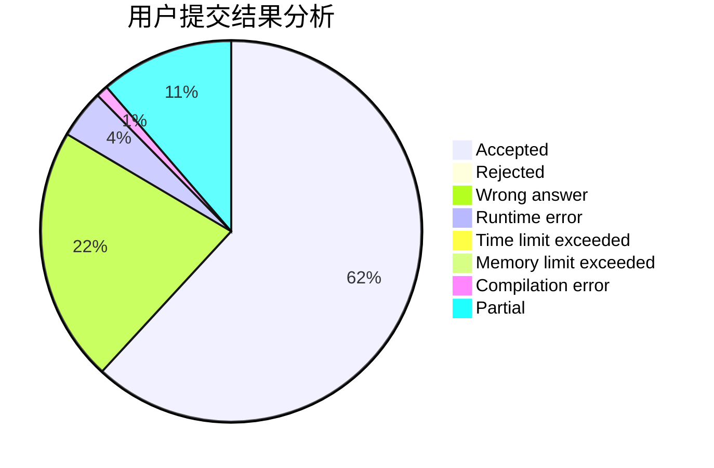
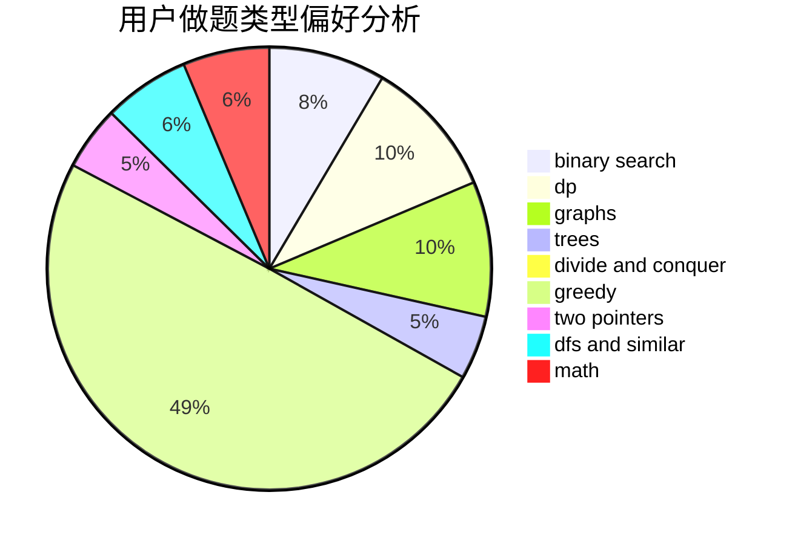

# LiM_256

<!-- tabs:start -->

#### **用户提交结果分析**

#### **用户做题类型偏好分析**

<!-- tabs:end -->
# 推荐题目
[1433G](https://codeforces.com/contest/1433/problem/G)
[1399F](https://codeforces.com/contest/1399/problem/F)
[398C](https://codeforces.com/contest/398/problem/C)
[36C](https://codeforces.com/contest/36/problem/C)
[652D](https://codeforces.com/contest/652/problem/D)
[780B](https://codeforces.com/contest/780/problem/B)
[32B](https://codeforces.com/contest/32/problem/B)
[265D](https://codeforces.com/contest/265/problem/D)
[745C](https://codeforces.com/contest/745/problem/C)
[358B](https://codeforces.com/contest/358/problem/B)
