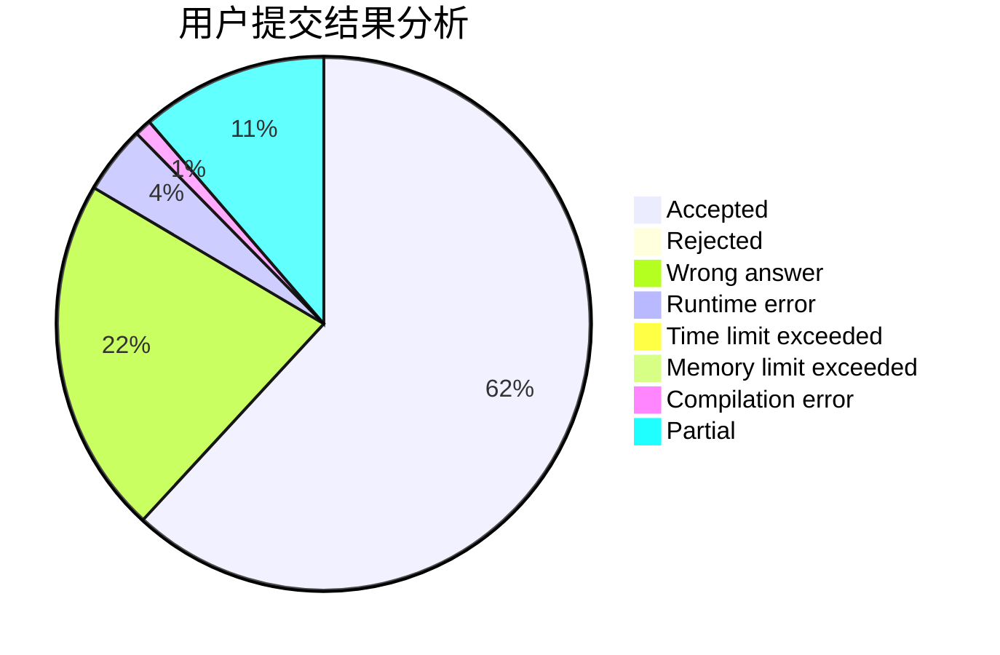
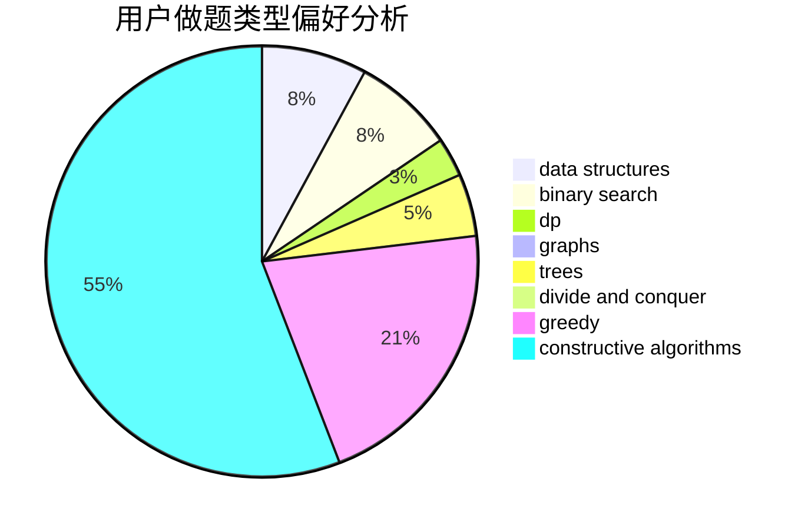
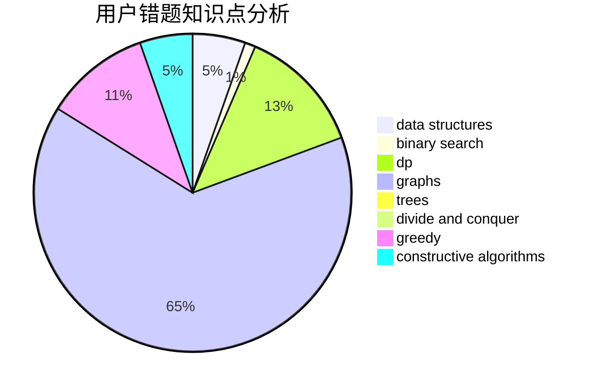

# LiM_256

<!-- tabs:start -->

#### **用户提交结果分析**

#### **用户做题类型偏好分析**

#### **用户错题知识点分析**

<!-- tabs:end -->
# 推荐题目
[1433G](https://codeforces.com/contest/1433/problem/G)		brute force,
                        graphs,
                        shortest paths		  
[1399F](https://codeforces.com/contest/1399/problem/F)		data structures,
                        dp,
                        graphs,
                        sortings		  
[398C](https://codeforces.com/contest/398/problem/C)		constructive algorithms		  
[36C](https://codeforces.com/contest/36/problem/C)		geometry,
                        implementation		  
[652D](https://codeforces.com/contest/652/problem/D)		data structures,
                        sortings		  
[780B](https://codeforces.com/contest/780/problem/B)		binary search		  
[32B](https://codeforces.com/contest/32/problem/B)		expression parsing,
                        implementation		  
[265D](https://codeforces.com/contest/265/problem/D)		dsu,graphs,sortings,trees		  
[745C](https://codeforces.com/contest/745/problem/C)		dsu,graphs,sortings,trees		  
[358B](https://codeforces.com/contest/358/problem/B)		brute force,
                        strings		  
