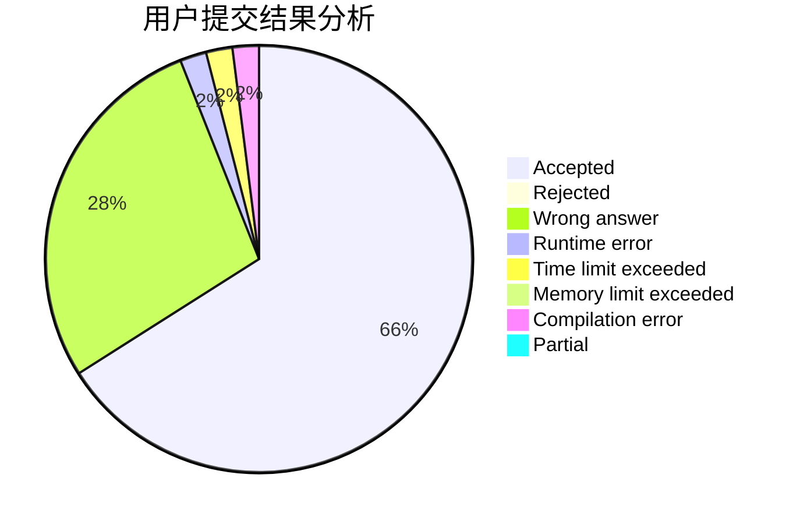
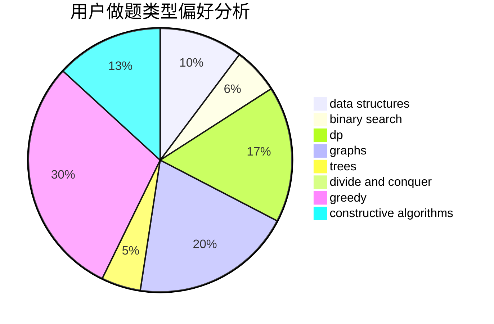

# LiZnB

<!-- tabs:start -->

#### **用户提交结果分析**

#### **用户做题类型偏好分析**

#### **用户错题知识点分析**

<!-- tabs:end -->
# 推荐题目
[1503B](https://codeforces.com/contest/1503/problem/B)		constructive algorithms,
                        games,
                        interactive		  
[896D](https://codeforces.com/contest/896/problem/D)		chinese remainder theorem,
                        combinatorics,
                        math,
                        number theory		  
[788B](https://codeforces.com/contest/788/problem/B)		combinatorics,
                        constructive algorithms,
                        dfs and similar,
                        dsu,
                        graphs		  
[1107C](https://codeforces.com/contest/1107/problem/C)		greedy,
                        sortings,
                        two pointers		  
[580C](https://codeforces.com/contest/580/problem/C)		dfs and similar,
                        graphs,
                        trees		  
[957D](https://codeforces.com/contest/957/problem/D)		dsu,graphs,sortings,trees		  
[1142C](https://codeforces.com/contest/1142/problem/C)		geometry		  
[731B](https://codeforces.com/contest/731/problem/B)		constructive algorithms,
                        greedy		  
[1136D](https://codeforces.com/contest/1136/problem/D)		greedy		  
[898C](https://codeforces.com/contest/898/problem/C)		implementation,
                        strings		  
