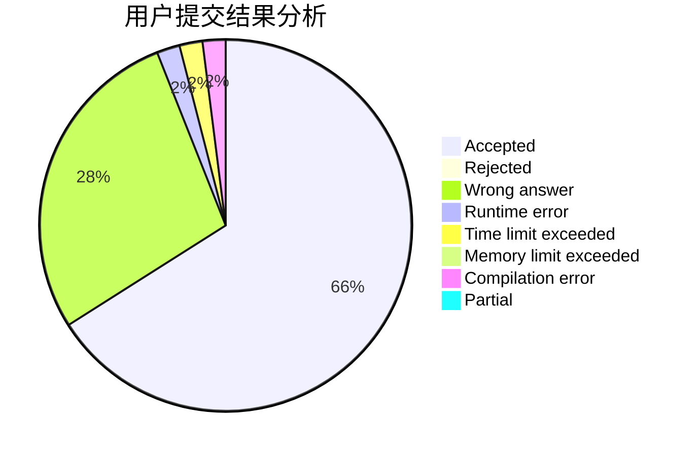
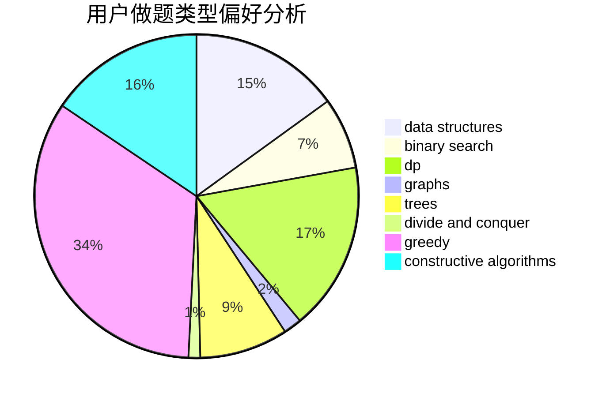

# LiZnB
<!-- tabs:start -->
#### **用户提交结果分析**

#### **用户做题类型偏好分析**

#### **用户错题知识点分析**

<!-- tabs:end -->
# 推荐题目
[Berland Crossword](http://codeforces.com/problemset/problem/1494/B)		bitmasks,
                        brute force,
                        greedy,
                        implementation		  
[Ball in Berland](http://codeforces.com/problemset/problem/1475/C)		combinatorics,
                        graphs,
                        math		  
[Annoying Present](http://codeforces.com/problemset/problem/1009/C)		greedy,
                        math		  
[Chris and Magic Square](http://codeforces.com/problemset/problem/711/B)		constructive algorithms,
                        implementation		  
[Classroom Watch](https://codeforces.com/contest/876/problem/C)		brute force,
                        math		  
[Lunar New Year and a Recursive Sequence](http://codeforces.com/problemset/problem/1106/F)		math,
                        matrices,
                        number theory		  
[Pasha and Tea](http://codeforces.com/problemset/problem/557/B)		constructive algorithms,
                        implementation,
                        math,
                        sortings		  
[Happy Cactus](http://codeforces.com/problemset/problem/1268/E)		dp		  
[Knapsack](http://codeforces.com/problemset/problem/1132/E)		dfs and similar,
                        dp,
                        greedy		  
[Array Restoration](http://codeforces.com/problemset/problem/1023/D)		constructive algorithms,
                        data structures		  
<!-- tabs:start -->
#### **data structures**
[Berland Crossword](http://codeforces.com/problemset/problem/1023/D)		constructive algorithms,
                        data structures		  
[Ball in Berland](http://codeforces.com/problemset/problem/877/D)		data structures,
                        dfs and similar,
                        graphs,
                        shortest paths		  
[Annoying Present](https://codeforces.com/contest/697/problem/C)		brute force,
                        data structures,
                        implementation,
                        trees		  
[Chris and Magic Square](https://codeforces.com/contest/1008/problem/C)		combinatorics,
                        data structures,
                        math,
                        sortings,
                        two pointers		  
[Classroom Watch](https://codeforces.com/contest/1248/problem/E)		data structures,
                        greedy,
                        implementation		  
[Lunar New Year and a Recursive Sequence](https://codeforces.com/contest/1483/problem/F)		data structures,
                        string suffix structures,
                        trees		  
[Pasha and Tea](http://codeforces.com/problemset/problem/1492/C)		binary search,
                        data structures,
                        dp,
                        greedy,
                        two pointers		  
[Happy Cactus](http://codeforces.com/problemset/problem/1490/G)		binary search,
                        data structures,
                        math		  
[Knapsack](http://codeforces.com/problemset/problem/1479/D)		binary search,
                        bitmasks,
                        brute force,
                        data structures,
                        probabilities,
                        trees		  
[Array Restoration](http://codeforces.com/problemset/problem/1497/A)		brute force,
                        data structures,
                        greedy,
                        sortings		  
#### **binary search**
[Berland Crossword](http://codeforces.com/problemset/problem/620/D)		binary search,
                        two pointers		  
[Ball in Berland](http://codeforces.com/problemset/problem/1237/C2)		binary search,
                        constructive algorithms,
                        divide and conquer,
                        greedy,
                        implementation,
                        sortings		  
[Annoying Present](http://codeforces.com/problemset/problem/1203/D2)		binary search,
                        greedy,
                        implementation,
                        two pointers		  
[Chris and Magic Square](http://codeforces.com/problemset/problem/1492/C)		binary search,
                        data structures,
                        dp,
                        greedy,
                        two pointers		  
[Classroom Watch](http://codeforces.com/problemset/problem/1463/D)		binary search,
                        constructive algorithms,
                        greedy,
                        two pointers		  
[Lunar New Year and a Recursive Sequence](http://codeforces.com/problemset/problem/1490/G)		binary search,
                        data structures,
                        math		  
[Pasha and Tea](http://codeforces.com/problemset/problem/1479/D)		binary search,
                        bitmasks,
                        brute force,
                        data structures,
                        probabilities,
                        trees		  
[Happy Cactus](http://codeforces.com/problemset/problem/1436/E)		binary search,
                        data structures,
                        two pointers		  
[Knapsack](http://codeforces.com/problemset/problem/1461/D)		binary search,
                        brute force,
                        data structures,
                        divide and conquer,
                        implementation,
                        sortings		  
[Array Restoration](http://codeforces.com/problemset/problem/1493/C)		binary search,
                        brute force,
                        constructive algorithms,
                        greedy,
                        strings		  
#### **dp**
[Berland Crossword](http://codeforces.com/problemset/problem/1268/E)		dp		  
[Ball in Berland](http://codeforces.com/problemset/problem/1132/E)		dfs and similar,
                        dp,
                        greedy		  
[Annoying Present](http://codeforces.com/problemset/problem/768/C)		brute force,
                        dp,
                        implementation,
                        sortings		  
[Chris and Magic Square](http://codeforces.com/problemset/problem/1140/E)		combinatorics,
                        divide and conquer,
                        dp		  
[Classroom Watch](http://codeforces.com/problemset/problem/856/C)		combinatorics,
                        dp,
                        math		  
[Lunar New Year and a Recursive Sequence](http://codeforces.com/problemset/problem/935/E)		dfs and similar,
                        dp,
                        trees		  
[Pasha and Tea](https://codeforces.com/contest/1243/problem/E)		bitmasks,
                        dfs and similar,
                        dp,
                        graphs		  
[Happy Cactus](http://codeforces.com/problemset/problem/855/G)		dfs and similar,
                        dp,
                        graphs,
                        trees		  
[Knapsack](http://codeforces.com/problemset/problem/152/E)		bitmasks,
                        dp,
                        graphs,
                        trees		  
[Array Restoration](http://codeforces.com/problemset/problem/1400/G)		bitmasks,
                        brute force,
                        combinatorics,
                        dp,
                        dsu,
                        math,
                        two pointers		  
#### **graph**
[Berland Crossword](http://codeforces.com/problemset/problem/1475/C)		combinatorics,
                        graphs,
                        math		  
[Ball in Berland](http://codeforces.com/problemset/problem/877/D)		data structures,
                        dfs and similar,
                        graphs,
                        shortest paths		  
[Annoying Present](https://codeforces.com/contest/1243/problem/E)		bitmasks,
                        dfs and similar,
                        dp,
                        graphs		  
[Chris and Magic Square](http://codeforces.com/problemset/problem/855/G)		dfs and similar,
                        dp,
                        graphs,
                        trees		  
[Classroom Watch](http://codeforces.com/problemset/problem/152/E)		bitmasks,
                        dp,
                        graphs,
                        trees		  
[Lunar New Year and a Recursive Sequence](https://codeforces.com/contest/1484/problem/F)		graphs,
                        shortest paths		  
[Pasha and Tea](http://codeforces.com/problemset/problem/117/C)		dfs and similar,
                        graphs		  
[Happy Cactus](http://codeforces.com/problemset/problem/1487/C)		brute force,
                        constructive algorithms,
                        dfs and similar,
                        graphs,
                        greedy,
                        implementation,
                        math		  
[Knapsack](http://codeforces.com/problemset/problem/1437/C)		dp,
                        flows,
                        graph matchings,
                        greedy,
                        math,
                        sortings		  
[Array Restoration](http://codeforces.com/problemset/problem/1470/D)		constructive algorithms,
                        dfs and similar,
                        graph matchings,
                        graphs,
                        greedy		  
#### **trees**
[Berland Crossword](http://codeforces.com/problemset/problem/935/E)		dfs and similar,
                        dp,
                        trees		  
[Ball in Berland](https://codeforces.com/contest/697/problem/C)		brute force,
                        data structures,
                        implementation,
                        trees		  
[Annoying Present](http://codeforces.com/problemset/problem/1210/C)		math,
                        number theory,
                        trees		  
[Chris and Magic Square](http://codeforces.com/problemset/problem/855/G)		dfs and similar,
                        dp,
                        graphs,
                        trees		  
[Classroom Watch](http://codeforces.com/problemset/problem/152/E)		bitmasks,
                        dp,
                        graphs,
                        trees		  
[Lunar New Year and a Recursive Sequence](https://codeforces.com/contest/1483/problem/F)		data structures,
                        string suffix structures,
                        trees		  
[Pasha and Tea](http://codeforces.com/problemset/problem/1479/D)		binary search,
                        bitmasks,
                        brute force,
                        data structures,
                        probabilities,
                        trees		  
[Happy Cactus](http://codeforces.com/problemset/problem/1511/C)		brute force,
                        data structures,
                        implementation,
                        trees		  
[Knapsack](http://codeforces.com/problemset/problem/1499/F)		combinatorics,
                        dfs and similar,
                        dp,
                        trees		  
[Array Restoration](http://codeforces.com/problemset/problem/1491/E)		brute force,
                        dfs and similar,
                        divide and conquer,
                        number theory,
                        trees		  
#### **divide and conquer**
[Berland Crossword](http://codeforces.com/problemset/problem/1140/E)		combinatorics,
                        divide and conquer,
                        dp		  
[Ball in Berland](http://codeforces.com/problemset/problem/1237/C2)		binary search,
                        constructive algorithms,
                        divide and conquer,
                        greedy,
                        implementation,
                        sortings		  
[Annoying Present](http://codeforces.com/problemset/problem/1461/D)		binary search,
                        brute force,
                        data structures,
                        divide and conquer,
                        implementation,
                        sortings		  
[Chris and Magic Square](http://codeforces.com/problemset/problem/1466/G)		combinatorics,
                        divide and conquer,
                        hashing,
                        math,
                        string suffix structures,
                        strings		  
[Classroom Watch](http://codeforces.com/problemset/problem/1490/D)		dfs and similar,
                        divide and conquer,
                        implementation		  
[Lunar New Year and a Recursive Sequence](https://codeforces.com/contest/1483/problem/C)		data structures,
                        divide and conquer,
                        dp		  
[Pasha and Tea](http://codeforces.com/problemset/problem/1491/E)		brute force,
                        dfs and similar,
                        divide and conquer,
                        number theory,
                        trees		  
[Happy Cactus](http://codeforces.com/problemset/problem/1303/G)		data structures,
                        divide and conquer,
                        geometry,
                        trees		  
[Knapsack](http://codeforces.com/problemset/problem/1494/D)		constructive algorithms,
                        data structures,
                        dfs and similar,
                        divide and conquer,
                        dsu,
                        greedy,
                        sortings,
                        trees		  
[Array Restoration](http://codeforces.com/problemset/problem/1482/E)		data structures,
                        divide and conquer,
                        dp		  
#### **greedy**
[Berland Crossword](http://codeforces.com/problemset/problem/1494/B)		bitmasks,
                        brute force,
                        greedy,
                        implementation		  
[Ball in Berland](http://codeforces.com/problemset/problem/1009/C)		greedy,
                        math		  
[Annoying Present](http://codeforces.com/problemset/problem/1132/E)		dfs and similar,
                        dp,
                        greedy		  
[Chris and Magic Square](http://codeforces.com/problemset/problem/754/A)		constructive algorithms,
                        greedy,
                        implementation		  
[Classroom Watch](http://codeforces.com/problemset/problem/226/B)		greedy		  
[Lunar New Year and a Recursive Sequence](https://codeforces.com/contest/1248/problem/E)		data structures,
                        greedy,
                        implementation		  
[Pasha and Tea](http://codeforces.com/problemset/problem/58/B)		greedy		  
[Happy Cactus](http://codeforces.com/problemset/problem/1385/B)		greedy		  
[Knapsack](http://codeforces.com/problemset/problem/1237/C2)		binary search,
                        constructive algorithms,
                        divide and conquer,
                        greedy,
                        implementation,
                        sortings		  
[Array Restoration](http://codeforces.com/problemset/problem/1203/D2)		binary search,
                        greedy,
                        implementation,
                        two pointers		  
#### **constructive algorithms**
[Berland Crossword](http://codeforces.com/problemset/problem/711/B)		constructive algorithms,
                        implementation		  
[Ball in Berland](http://codeforces.com/problemset/problem/557/B)		constructive algorithms,
                        implementation,
                        math,
                        sortings		  
[Annoying Present](http://codeforces.com/problemset/problem/1023/D)		constructive algorithms,
                        data structures		  
[Chris and Magic Square](http://codeforces.com/problemset/problem/509/D)		constructive algorithms,
                        math		  
[Classroom Watch](http://codeforces.com/problemset/problem/754/A)		constructive algorithms,
                        greedy,
                        implementation		  
[Lunar New Year and a Recursive Sequence](http://codeforces.com/problemset/problem/1110/E)		constructive algorithms,
                        math,
                        sortings		  
[Pasha and Tea](http://codeforces.com/problemset/problem/1237/C2)		binary search,
                        constructive algorithms,
                        divide and conquer,
                        greedy,
                        implementation,
                        sortings		  
[Happy Cactus](http://codeforces.com/problemset/problem/1421/B)		constructive algorithms,
                        implementation		  
[Knapsack](http://codeforces.com/problemset/problem/1404/D)		constructive algorithms,
                        dfs and similar,
                        interactive,
                        math,
                        number theory		  
[Array Restoration](http://codeforces.com/problemset/problem/1493/A)		constructive algorithms,
                        greedy		  
#### **sortings**
[Berland Crossword](http://codeforces.com/problemset/problem/557/B)		constructive algorithms,
                        implementation,
                        math,
                        sortings		  
[Ball in Berland](http://codeforces.com/problemset/problem/768/C)		brute force,
                        dp,
                        implementation,
                        sortings		  
[Annoying Present](https://codeforces.com/contest/1008/problem/C)		combinatorics,
                        data structures,
                        math,
                        sortings,
                        two pointers		  
[Chris and Magic Square](http://codeforces.com/problemset/problem/1110/E)		constructive algorithms,
                        math,
                        sortings		  
[Classroom Watch](http://codeforces.com/problemset/problem/1237/C2)		binary search,
                        constructive algorithms,
                        divide and conquer,
                        greedy,
                        implementation,
                        sortings		  
[Lunar New Year and a Recursive Sequence](https://codeforces.com/contest/1496/problem/C)		geometry,
                        greedy,
                        math,
                        sortings		  
[Pasha and Tea](http://codeforces.com/problemset/problem/1495/A)		geometry,
                        greedy,
                        math,
                        sortings		  
[Happy Cactus](http://codeforces.com/problemset/problem/1497/A)		brute force,
                        data structures,
                        greedy,
                        sortings		  
[Knapsack](http://codeforces.com/problemset/problem/1427/A)		math,
                        sortings		  
[Array Restoration](http://codeforces.com/problemset/problem/1461/D)		binary search,
                        brute force,
                        data structures,
                        divide and conquer,
                        implementation,
                        sortings		  
<!-- tabs:end -->
