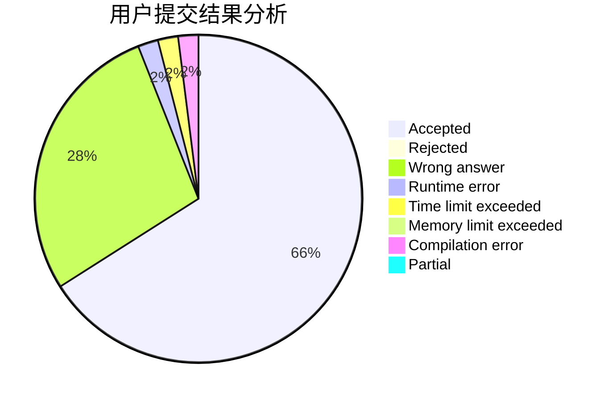
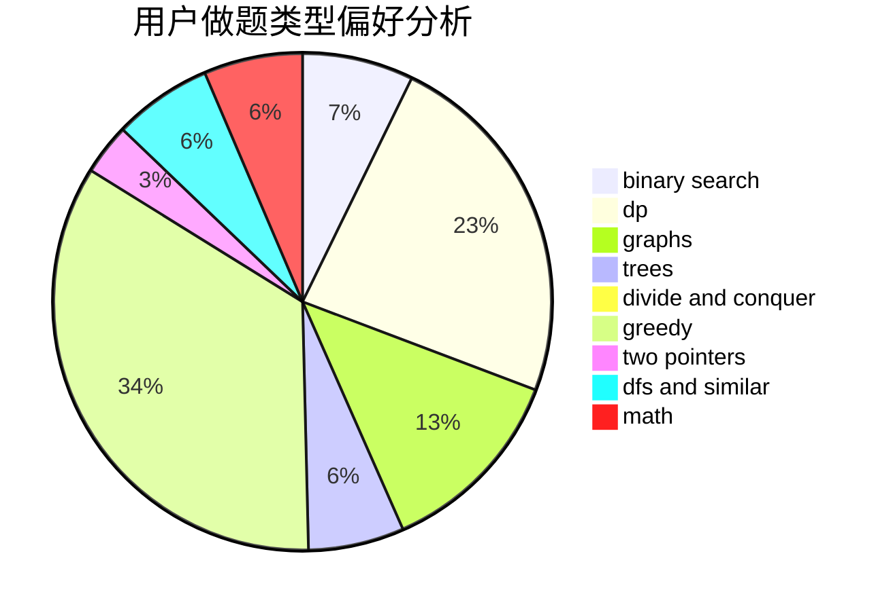

# LiZnB

<!-- tabs:start -->

#### **用户提交结果分析**

#### **用户做题类型偏好分析**

<!-- tabs:end -->
# 推荐题目
[1503B](https://codeforces.com/contest/1503/problem/B)
[896D](https://codeforces.com/contest/896/problem/D)
[788B](https://codeforces.com/contest/788/problem/B)
[1107C](https://codeforces.com/contest/1107/problem/C)
[580C](https://codeforces.com/contest/580/problem/C)
[957D](https://codeforces.com/contest/957/problem/D)
[1142C](https://codeforces.com/contest/1142/problem/C)
[731B](https://codeforces.com/contest/731/problem/B)
[1136D](https://codeforces.com/contest/1136/problem/D)
[898C](https://codeforces.com/contest/898/problem/C)
