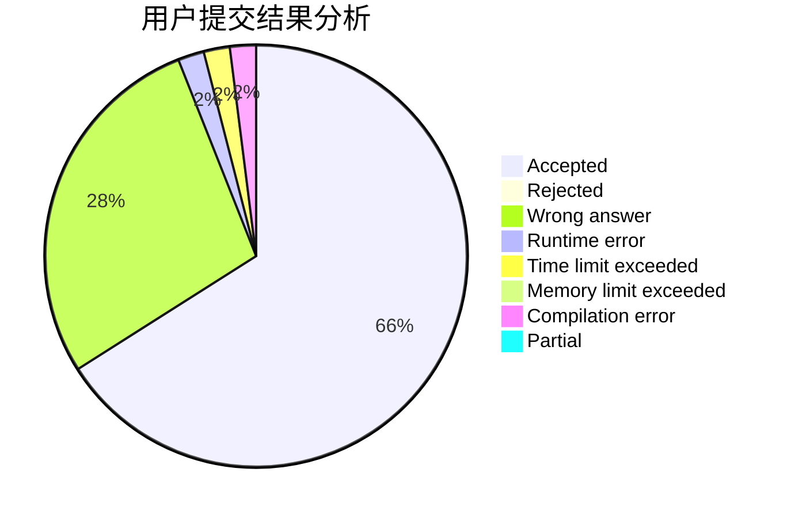
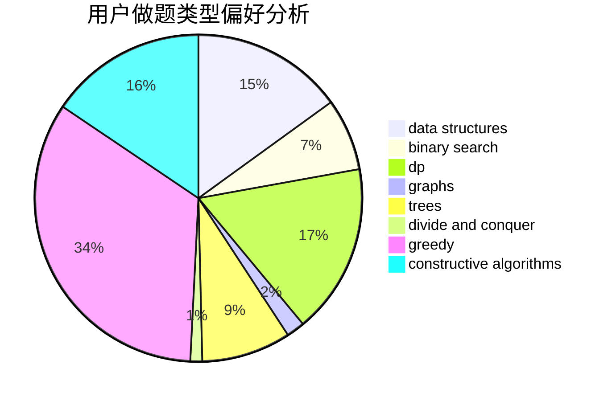

# LiZnB

<!-- tabs:start -->

#### **用户提交结果分析**

#### **用户做题类型偏好分析**

#### **用户错题知识点分析**

<!-- tabs:end -->
# 推荐题目
[1494B](https://codeforces.com/contest/1494/problem/B)		bitmasks,
                        brute force,
                        greedy,
                        implementation		  
[876C](https://codeforces.com/contest/876/problem/C)		dsu,graphs,sortings,trees		  
[768C](https://codeforces.com/contest/768/problem/C)		brute force,
                        dp,
                        implementation,
                        sortings		  
[1106F](https://codeforces.com/contest/1106/problem/F)		math,
                        matrices,
                        number theory		  
[557B](https://codeforces.com/contest/557/problem/B)		constructive algorithms,
                        implementation,
                        math,
                        sortings		  
[935E](https://codeforces.com/contest/935/problem/E)		dfs and similar,
                        dp,
                        trees		  
[1140E](https://codeforces.com/contest/1140/problem/E)		combinatorics,
                        divide and conquer,
                        dp		  
[711B](https://codeforces.com/contest/711/problem/B)		constructive algorithms,
                        implementation		  
[1132E](https://codeforces.com/contest/1132/problem/E)		dfs and similar,
                        dp,
                        greedy		  
[877D](https://codeforces.com/contest/877/problem/D)		data structures,
                        dfs and similar,
                        graphs,
                        shortest paths		  
