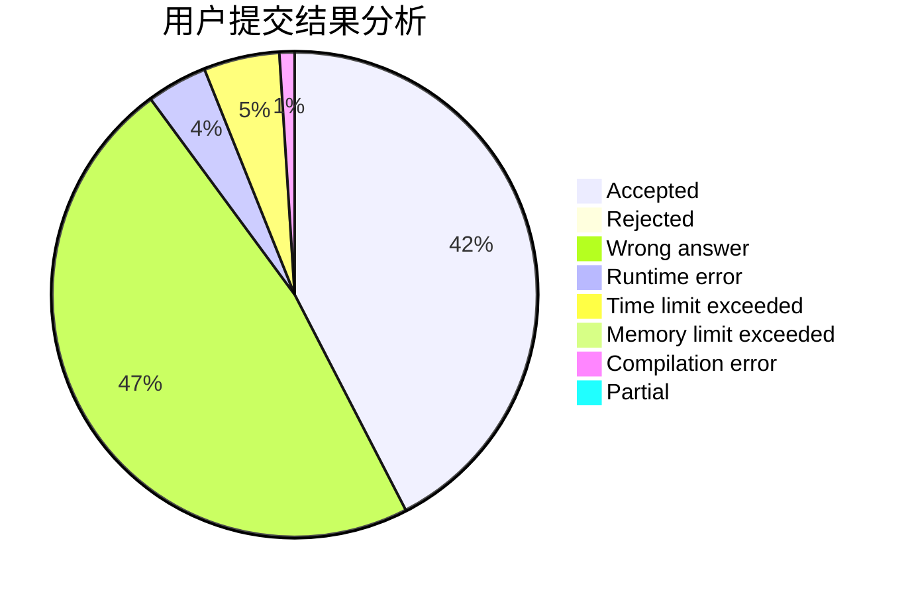
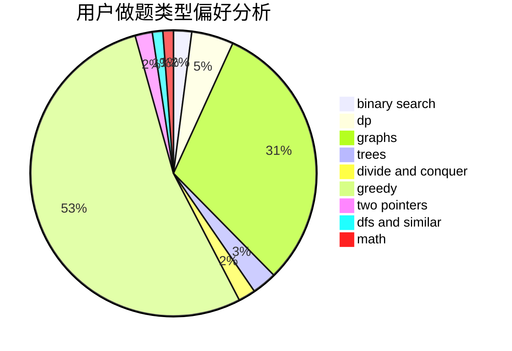

# Liberals

<!-- tabs:start -->

#### **用户提交结果分析**

#### **用户做题类型偏好分析**

<!-- tabs:end -->
# 推荐题目
[208A](https://codeforces.com/contest/208/problem/A)
[1153C](https://codeforces.com/contest/1153/problem/C)
[540A](https://codeforces.com/contest/540/problem/A)
[1033A](https://codeforces.com/contest/1033/problem/A)
[567C](https://codeforces.com/contest/567/problem/C)
[676C](https://codeforces.com/contest/676/problem/C)
[114E](https://codeforces.com/contest/114/problem/E)
[1199E](https://codeforces.com/contest/1199/problem/E)
[138D](https://codeforces.com/contest/138/problem/D)
[678D](https://codeforces.com/contest/678/problem/D)
