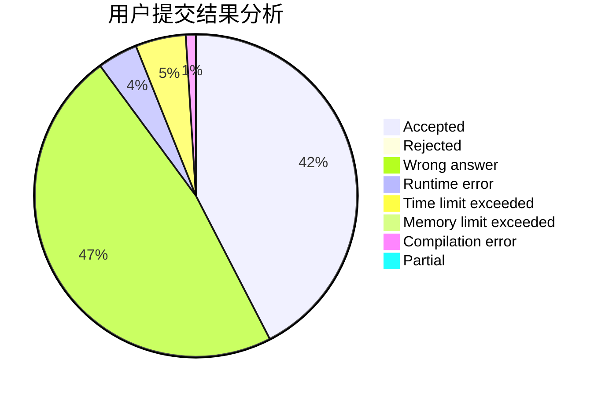
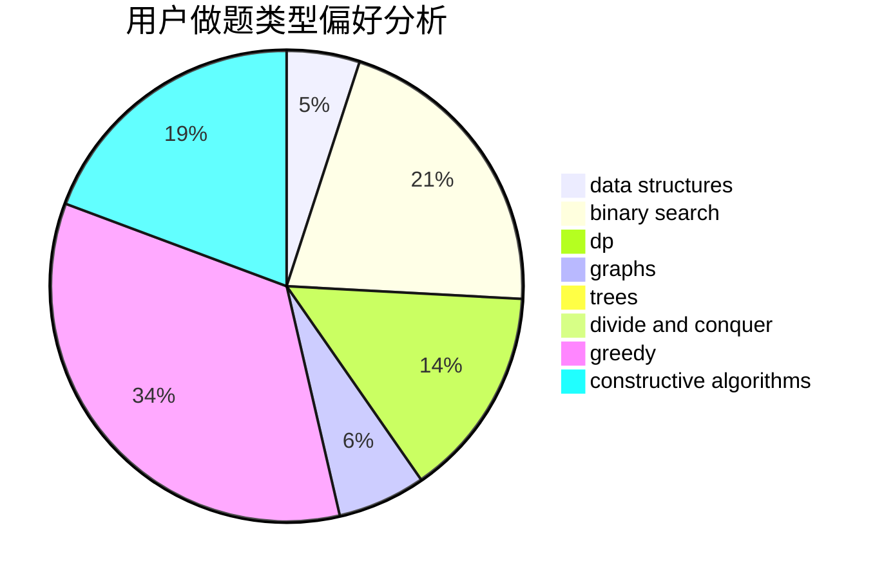

# Liberals

<!-- tabs:start -->

#### **用户提交结果分析**

#### **用户做题类型偏好分析**

#### **用户错题知识点分析**

<!-- tabs:end -->
# 推荐题目
[180D](https://codeforces.com/contest/180/problem/D)		greedy,
                        strings		  
[1151C](https://codeforces.com/contest/1151/problem/C)		constructive algorithms,
                        math		  
[514C](https://codeforces.com/contest/514/problem/C)		binary search,
                        data structures,
                        hashing,
                        string suffix structures,
                        strings		  
[1032D](https://codeforces.com/contest/1032/problem/D)		geometry,
                        implementation		  
[543A](https://codeforces.com/contest/543/problem/A)		dp		  
[652D](https://codeforces.com/contest/652/problem/D)		data structures,
                        sortings		  
[1148E](https://codeforces.com/contest/1148/problem/E)		constructive algorithms,
                        greedy,
                        math,
                        sortings,
                        two pointers		  
[1195C](https://codeforces.com/contest/1195/problem/C)		dp		  
[1380F](https://codeforces.com/contest/1380/problem/F)		data structures,
                        dp,
                        matrices		  
[656D](https://codeforces.com/contest/656/problem/D)		*special problem		  
