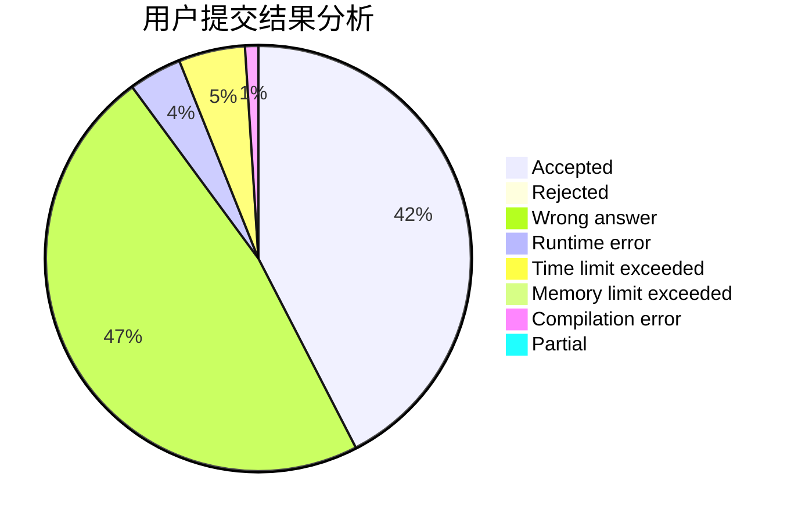
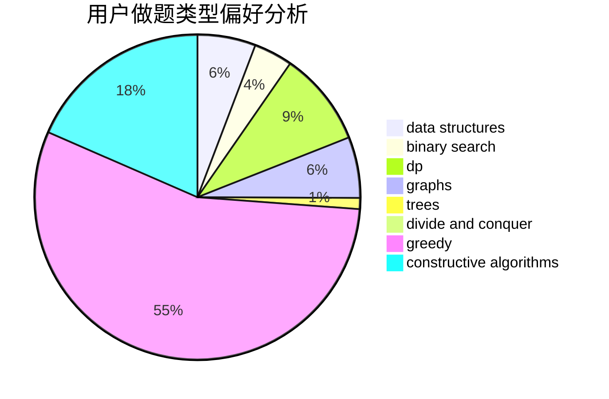
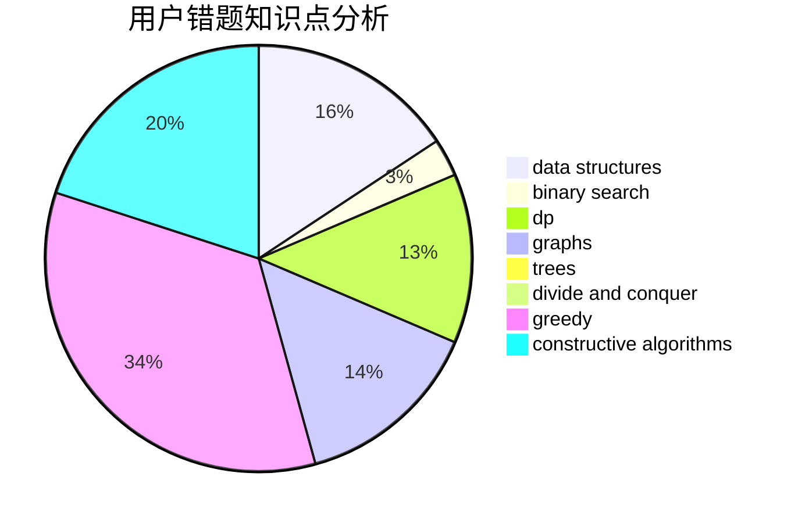

# Liberals

<!-- tabs:start -->

#### **用户提交结果分析**

#### **用户做题类型偏好分析**

#### **用户错题知识点分析**

<!-- tabs:end -->
# 推荐题目
[208A](https://codeforces.com/contest/208/problem/A)		strings		  
[1153C](https://codeforces.com/contest/1153/problem/C)		greedy,
                        strings		  
[540A](https://codeforces.com/contest/540/problem/A)		implementation		  
[1033A](https://codeforces.com/contest/1033/problem/A)		dfs and similar,
                        graphs,
                        implementation		  
[567C](https://codeforces.com/contest/567/problem/C)		binary search,
                        data structures,
                        dp		  
[676C](https://codeforces.com/contest/676/problem/C)		binary search,
                        dp,
                        strings,
                        two pointers		  
[114E](https://codeforces.com/contest/114/problem/E)		dsu,graphs,sortings,trees		  
[1199E](https://codeforces.com/contest/1199/problem/E)		dsu,graphs,sortings,trees		  
[138D](https://codeforces.com/contest/138/problem/D)		dp,
                        games		  
[678D](https://codeforces.com/contest/678/problem/D)		math,
                        number theory		  
