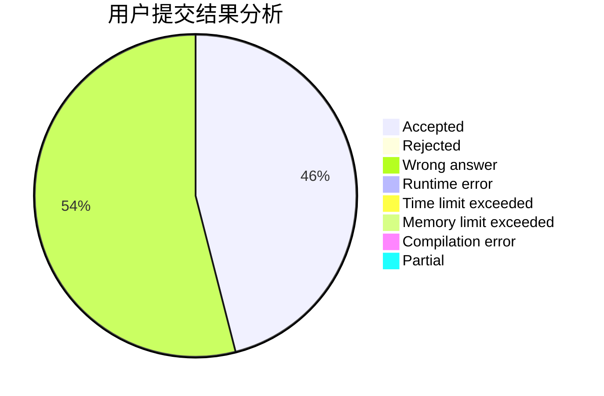
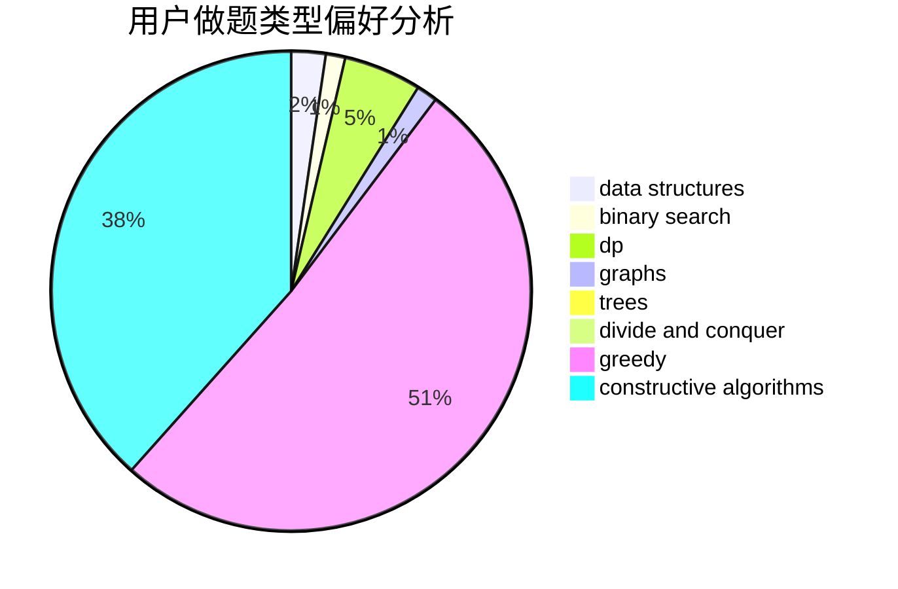

# Liberation

<!-- tabs:start -->

#### **用户提交结果分析**

#### **用户做题类型偏好分析**

#### **用户错题知识点分析**

<!-- tabs:end -->
# 推荐题目
[1131A](https://codeforces.com/contest/1131/problem/A)		math		  
[1413D](https://codeforces.com/contest/1413/problem/D)		data structures,
                        greedy,
                        implementation		  
[115B](https://codeforces.com/contest/115/problem/B)		greedy,
                        sortings		  
[1301C](https://codeforces.com/contest/1301/problem/C)		binary search,
                        combinatorics,
                        greedy,
                        math,
                        strings		  
[61E](https://codeforces.com/contest/61/problem/E)		data structures,
                        trees		  
[750F](https://codeforces.com/contest/750/problem/F)		constructive algorithms,
                        implementation,
                        interactive,
                        trees		  
[1380D](https://codeforces.com/contest/1380/problem/D)		constructive algorithms,
                        greedy,
                        implementation,
                        math,
                        two pointers		  
[623B](https://codeforces.com/contest/623/problem/B)		dp,
                        greedy,
                        number theory		  
[272E](https://codeforces.com/contest/272/problem/E)		combinatorics,
                        constructive algorithms,
                        graphs		  
[977C](https://codeforces.com/contest/977/problem/C)		sortings		  
