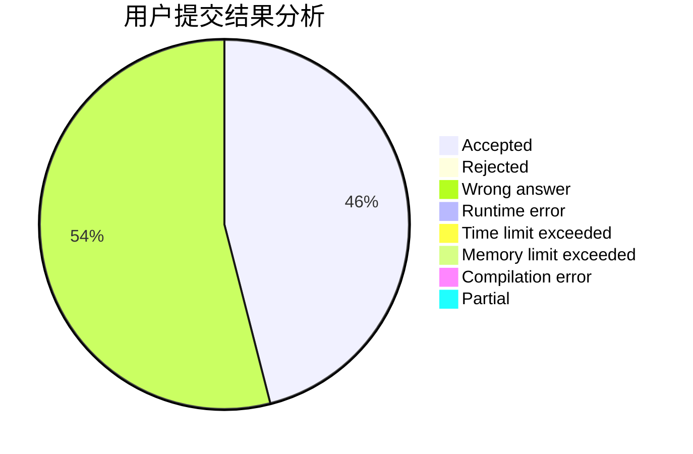
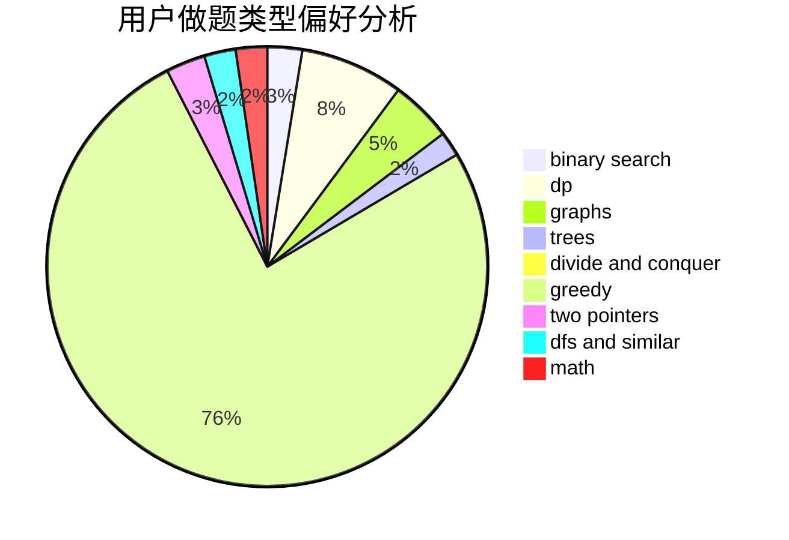

# Liberation

<!-- tabs:start -->

#### **用户提交结果分析**

#### **用户做题类型偏好分析**

<!-- tabs:end -->
# 推荐题目
[1131A](https://codeforces.com/contest/1131/problem/A)
[1413D](https://codeforces.com/contest/1413/problem/D)
[115B](https://codeforces.com/contest/115/problem/B)
[1301C](https://codeforces.com/contest/1301/problem/C)
[61E](https://codeforces.com/contest/61/problem/E)
[750F](https://codeforces.com/contest/750/problem/F)
[1380D](https://codeforces.com/contest/1380/problem/D)
[623B](https://codeforces.com/contest/623/problem/B)
[272E](https://codeforces.com/contest/272/problem/E)
[977C](https://codeforces.com/contest/977/problem/C)
