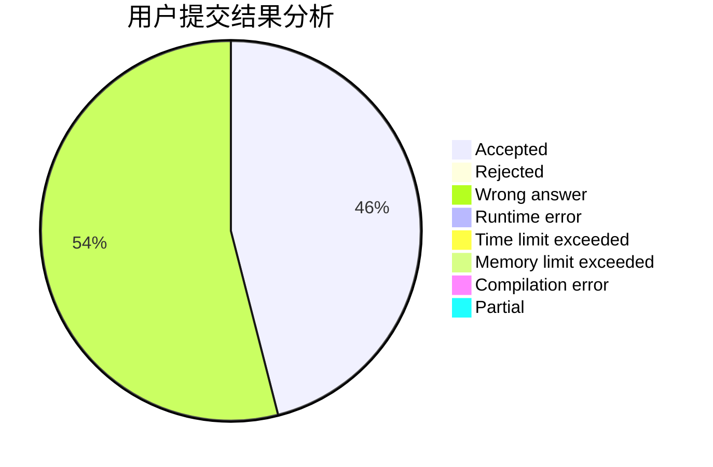
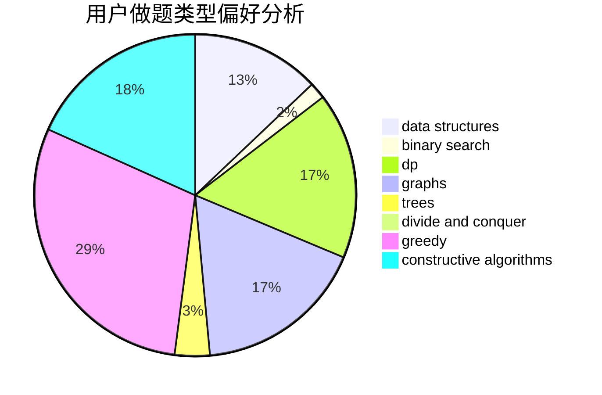

# Liberation
<!-- tabs:start -->
#### **用户提交结果分析**

#### **用户做题类型偏好分析**

#### **用户错题知识点分析**

<!-- tabs:end -->
# 推荐题目
[Petya and Array](http://codeforces.com/problemset/problem/1042/D)		data structures,
                        divide and conquer,
                        two pointers		  
[Emotes](http://codeforces.com/problemset/problem/1117/B)		greedy,
                        math,
                        sortings		  
[Number Of Permutations](http://codeforces.com/problemset/problem/1207/D)		combinatorics		  
[Maximum Balanced Circle](http://codeforces.com/problemset/problem/1157/F)		constructive algorithms,
                        dp,
                        greedy,
                        two pointers		  
[Toy Train](http://codeforces.com/problemset/problem/1129/A2)		brute force,
                        greedy		  
[Grasshopper And the String](http://codeforces.com/problemset/problem/733/A)		implementation		  
[Good Numbers (hard version)](http://codeforces.com/problemset/problem/1249/C2)		binary search,
                        greedy,
                        math,
                        meet-in-the-middle		  
[Pigeon d'Or](http://codeforces.com/problemset/problem/1145/D)		implementation		  
[Sea and Islands](http://codeforces.com/problemset/problem/544/B)		constructive algorithms,
                        implementation		  
[Roads](http://codeforces.com/problemset/problem/1402/B)		*special problem,
                        geometry,
                        sortings		  
<!-- tabs:start -->
#### **data structures**
[Petya and Array](http://codeforces.com/problemset/problem/1042/D)		data structures,
                        divide and conquer,
                        two pointers		  
[Emotes](http://codeforces.com/problemset/problem/515/E)		data structures		  
[Number Of Permutations](http://codeforces.com/problemset/problem/605/B)		constructive algorithms,
                        data structures,
                        graphs		  
[Maximum Balanced Circle](http://codeforces.com/problemset/problem/840/B)		constructive algorithms,
                        data structures,
                        dfs and similar,
                        dp,
                        graphs		  
[Toy Train](http://codeforces.com/problemset/problem/1265/B)		data structures,
                        implementation,
                        math,
                        two pointers		  
[Grasshopper And the String](http://codeforces.com/problemset/problem/1386/C)		*special problem,
                        bitmasks,
                        data structures,
                        divide and conquer,
                        dsu		  
[Good Numbers (hard version)](http://codeforces.com/problemset/problem/232/D)		binary search,
                        data structures,
                        string suffix structures		  
[Pigeon d'Or](http://codeforces.com/problemset/problem/1497/E2)		data structures,
                        dp,
                        greedy,
                        math,
                        number theory,
                        two pointers		  
[Sea and Islands](http://codeforces.com/problemset/problem/1492/C)		binary search,
                        data structures,
                        dp,
                        greedy,
                        two pointers		  
[Roads](http://codeforces.com/problemset/problem/1490/G)		binary search,
                        data structures,
                        math		  
#### **binary search**
[Petya and Array](http://codeforces.com/problemset/problem/1249/C2)		binary search,
                        greedy,
                        math,
                        meet-in-the-middle		  
[Emotes](http://codeforces.com/problemset/problem/1371/E2)		binary search,
                        combinatorics,
                        dp,
                        math,
                        number theory,
                        sortings		  
[Number Of Permutations](http://codeforces.com/problemset/problem/181/B)		binary search,
                        brute force		  
[Maximum Balanced Circle](http://codeforces.com/problemset/problem/955/C)		binary search,
                        math,
                        number theory		  
[Toy Train](http://codeforces.com/problemset/problem/1423/B)		binary search,
                        flows,
                        graph matchings,
                        graphs		  
[Grasshopper And the String](http://codeforces.com/problemset/problem/1010/B)		binary search,
                        interactive		  
[Good Numbers (hard version)](http://codeforces.com/problemset/problem/232/D)		binary search,
                        data structures,
                        string suffix structures		  
[Pigeon d'Or](http://codeforces.com/problemset/problem/1492/C)		binary search,
                        data structures,
                        dp,
                        greedy,
                        two pointers		  
[Sea and Islands](http://codeforces.com/problemset/problem/1463/D)		binary search,
                        constructive algorithms,
                        greedy,
                        two pointers		  
[Roads](http://codeforces.com/problemset/problem/1490/G)		binary search,
                        data structures,
                        math		  
#### **dp**
[Petya and Array](http://codeforces.com/problemset/problem/1157/F)		constructive algorithms,
                        dp,
                        greedy,
                        two pointers		  
[Emotes](http://codeforces.com/problemset/problem/1371/E2)		binary search,
                        combinatorics,
                        dp,
                        math,
                        number theory,
                        sortings		  
[Number Of Permutations](http://codeforces.com/problemset/problem/1294/F)		dfs and similar,
                        dp,
                        greedy,
                        trees		  
[Maximum Balanced Circle](http://codeforces.com/problemset/problem/840/B)		constructive algorithms,
                        data structures,
                        dfs and similar,
                        dp,
                        graphs		  
[Toy Train](http://codeforces.com/problemset/problem/1497/E2)		data structures,
                        dp,
                        greedy,
                        math,
                        number theory,
                        two pointers		  
[Grasshopper And the String](http://codeforces.com/problemset/problem/1492/C)		binary search,
                        data structures,
                        dp,
                        greedy,
                        two pointers		  
[Good Numbers (hard version)](https://codeforces.com/contest/1457/problem/C)		brute force,
                        dp,
                        implementation		  
[Pigeon d'Or](http://codeforces.com/problemset/problem/1491/C)		brute force,
                        data structures,
                        dp,
                        greedy,
                        implementation		  
[Sea and Islands](http://codeforces.com/problemset/problem/1437/C)		dp,
                        flows,
                        graph matchings,
                        greedy,
                        math,
                        sortings		  
[Roads](http://codeforces.com/problemset/problem/1499/B)		brute force,
                        dp,
                        greedy,
                        implementation		  
#### **graph**
[Petya and Array](https://codeforces.com/contest/1011/problem/F)		dfs and similar,
                        graphs,
                        implementation,
                        trees		  
[Emotes](http://codeforces.com/problemset/problem/605/B)		constructive algorithms,
                        data structures,
                        graphs		  
[Number Of Permutations](http://codeforces.com/problemset/problem/840/B)		constructive algorithms,
                        data structures,
                        dfs and similar,
                        dp,
                        graphs		  
[Maximum Balanced Circle](http://codeforces.com/problemset/problem/1423/B)		binary search,
                        flows,
                        graph matchings,
                        graphs		  
[Toy Train](http://codeforces.com/problemset/problem/1487/C)		brute force,
                        constructive algorithms,
                        dfs and similar,
                        graphs,
                        greedy,
                        implementation,
                        math		  
[Grasshopper And the String](http://codeforces.com/problemset/problem/1437/C)		dp,
                        flows,
                        graph matchings,
                        greedy,
                        math,
                        sortings		  
[Good Numbers (hard version)](http://codeforces.com/problemset/problem/1470/D)		constructive algorithms,
                        dfs and similar,
                        graph matchings,
                        graphs,
                        greedy		  
[Pigeon d'Or](http://codeforces.com/problemset/problem/1476/C)		dp,
                        graphs,
                        greedy		  
[Sea and Islands](http://codeforces.com/problemset/problem/1304/D)		constructive algorithms,
                        graphs,
                        greedy,
                        two pointers		  
[Roads](http://codeforces.com/problemset/problem/1475/C)		combinatorics,
                        graphs,
                        math		  
#### **trees**
[Petya and Array](http://codeforces.com/problemset/problem/1294/F)		dfs and similar,
                        dp,
                        greedy,
                        trees		  
[Emotes](https://codeforces.com/contest/1011/problem/F)		dfs and similar,
                        graphs,
                        implementation,
                        trees		  
[Number Of Permutations](http://codeforces.com/problemset/problem/1479/D)		binary search,
                        bitmasks,
                        brute force,
                        data structures,
                        probabilities,
                        trees		  
[Maximum Balanced Circle](http://codeforces.com/problemset/problem/1511/C)		brute force,
                        data structures,
                        implementation,
                        trees		  
[Toy Train](http://codeforces.com/problemset/problem/1499/F)		combinatorics,
                        dfs and similar,
                        dp,
                        trees		  
[Grasshopper And the String](http://codeforces.com/problemset/problem/1491/E)		brute force,
                        dfs and similar,
                        divide and conquer,
                        number theory,
                        trees		  
[Good Numbers (hard version)](http://codeforces.com/problemset/problem/1466/D)		data structures,
                        greedy,
                        sortings,
                        trees		  
[Pigeon d'Or](http://codeforces.com/problemset/problem/1495/D)		combinatorics,
                        dfs and similar,
                        graphs,
                        math,
                        shortest paths,
                        trees		  
[Sea and Islands](http://codeforces.com/problemset/problem/1303/G)		data structures,
                        divide and conquer,
                        geometry,
                        trees		  
[Roads](http://codeforces.com/problemset/problem/1454/E)		combinatorics,
                        dfs and similar,
                        graphs,
                        trees		  
#### **divide and conquer**
[Petya and Array](http://codeforces.com/problemset/problem/1042/D)		data structures,
                        divide and conquer,
                        two pointers		  
[Emotes](http://codeforces.com/problemset/problem/1386/C)		*special problem,
                        bitmasks,
                        data structures,
                        divide and conquer,
                        dsu		  
[Number Of Permutations](http://codeforces.com/problemset/problem/1461/D)		binary search,
                        brute force,
                        data structures,
                        divide and conquer,
                        implementation,
                        sortings		  
[Maximum Balanced Circle](http://codeforces.com/problemset/problem/1466/G)		combinatorics,
                        divide and conquer,
                        hashing,
                        math,
                        string suffix structures,
                        strings		  
[Toy Train](http://codeforces.com/problemset/problem/1490/D)		dfs and similar,
                        divide and conquer,
                        implementation		  
[Grasshopper And the String](https://codeforces.com/contest/1483/problem/C)		data structures,
                        divide and conquer,
                        dp		  
[Good Numbers (hard version)](http://codeforces.com/problemset/problem/1491/E)		brute force,
                        dfs and similar,
                        divide and conquer,
                        number theory,
                        trees		  
[Pigeon d'Or](http://codeforces.com/problemset/problem/1303/G)		data structures,
                        divide and conquer,
                        geometry,
                        trees		  
[Sea and Islands](http://codeforces.com/problemset/problem/1494/D)		constructive algorithms,
                        data structures,
                        dfs and similar,
                        divide and conquer,
                        dsu,
                        greedy,
                        sortings,
                        trees		  
[Roads](http://codeforces.com/problemset/problem/1482/E)		data structures,
                        divide and conquer,
                        dp		  
#### **greedy**
[Petya and Array](http://codeforces.com/problemset/problem/1117/B)		greedy,
                        math,
                        sortings		  
[Emotes](http://codeforces.com/problemset/problem/1157/F)		constructive algorithms,
                        dp,
                        greedy,
                        two pointers		  
[Number Of Permutations](http://codeforces.com/problemset/problem/1129/A2)		brute force,
                        greedy		  
[Maximum Balanced Circle](http://codeforces.com/problemset/problem/1249/C2)		binary search,
                        greedy,
                        math,
                        meet-in-the-middle		  
[Toy Train](http://codeforces.com/problemset/problem/254/C)		greedy,
                        strings		  
[Grasshopper And the String](http://codeforces.com/problemset/problem/1294/F)		dfs and similar,
                        dp,
                        greedy,
                        trees		  
[Good Numbers (hard version)](http://codeforces.com/problemset/problem/1197/B)		greedy,
                        implementation		  
[Pigeon d'Or](http://codeforces.com/problemset/problem/708/B)		constructive algorithms,
                        greedy,
                        implementation,
                        math		  
[Sea and Islands](http://codeforces.com/problemset/problem/734/B)		brute force,
                        greedy,
                        implementation,
                        math		  
[Roads](http://codeforces.com/problemset/problem/1368/B)		brute force,
                        constructive algorithms,
                        greedy,
                        math,
                        strings		  
#### **constructive algorithms**
[Petya and Array](http://codeforces.com/problemset/problem/1157/F)		constructive algorithms,
                        dp,
                        greedy,
                        two pointers		  
[Emotes](http://codeforces.com/problemset/problem/544/B)		constructive algorithms,
                        implementation		  
[Number Of Permutations](http://codeforces.com/problemset/problem/708/B)		constructive algorithms,
                        greedy,
                        implementation,
                        math		  
[Maximum Balanced Circle](http://codeforces.com/problemset/problem/605/B)		constructive algorithms,
                        data structures,
                        graphs		  
[Toy Train](http://codeforces.com/problemset/problem/840/B)		constructive algorithms,
                        data structures,
                        dfs and similar,
                        dp,
                        graphs		  
[Grasshopper And the String](http://codeforces.com/problemset/problem/1368/B)		brute force,
                        constructive algorithms,
                        greedy,
                        math,
                        strings		  
[Good Numbers (hard version)](http://codeforces.com/problemset/problem/1493/A)		constructive algorithms,
                        greedy		  
[Pigeon d'Or](http://codeforces.com/problemset/problem/1463/D)		binary search,
                        constructive algorithms,
                        greedy,
                        two pointers		  
[Sea and Islands](https://codeforces.com/contest/1456/problem/B)		bitmasks,
                        brute force,
                        constructive algorithms		  
[Roads](http://codeforces.com/problemset/problem/1492/D)		bitmasks,
                        constructive algorithms,
                        greedy,
                        math		  
#### **sortings**
[Petya and Array](http://codeforces.com/problemset/problem/1117/B)		greedy,
                        math,
                        sortings		  
[Emotes](http://codeforces.com/problemset/problem/1402/B)		*special problem,
                        geometry,
                        sortings		  
[Number Of Permutations](http://codeforces.com/problemset/problem/1371/E2)		binary search,
                        combinatorics,
                        dp,
                        math,
                        number theory,
                        sortings		  
[Maximum Balanced Circle](http://codeforces.com/problemset/problem/632/C)		sortings,
                        strings		  
[Toy Train](https://codeforces.com/contest/1496/problem/C)		geometry,
                        greedy,
                        math,
                        sortings		  
[Grasshopper And the String](http://codeforces.com/problemset/problem/1495/A)		geometry,
                        greedy,
                        math,
                        sortings		  
[Good Numbers (hard version)](http://codeforces.com/problemset/problem/1497/A)		brute force,
                        data structures,
                        greedy,
                        sortings		  
[Pigeon d'Or](http://codeforces.com/problemset/problem/1427/A)		math,
                        sortings		  
[Sea and Islands](http://codeforces.com/problemset/problem/1461/D)		binary search,
                        brute force,
                        data structures,
                        divide and conquer,
                        implementation,
                        sortings		  
[Roads](http://codeforces.com/problemset/problem/1437/C)		dp,
                        flows,
                        graph matchings,
                        greedy,
                        math,
                        sortings		  
<!-- tabs:end -->
