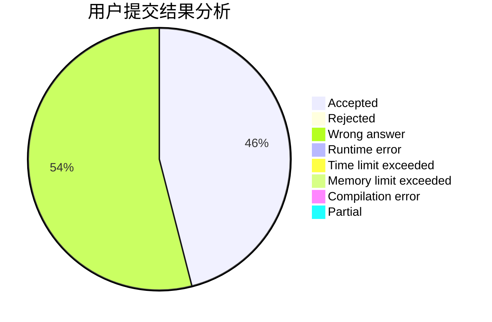
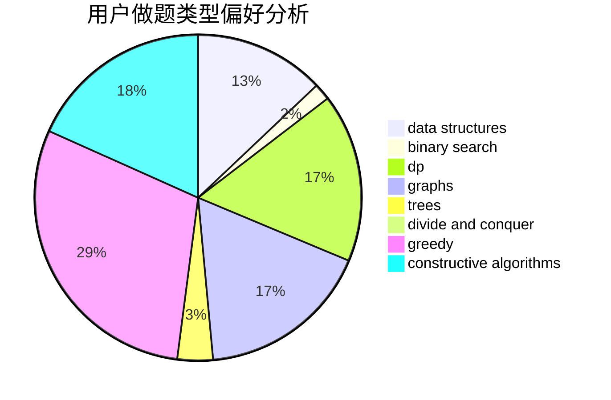

# Liberation

<!-- tabs:start -->

#### **用户提交结果分析**

#### **用户做题类型偏好分析**

#### **用户错题知识点分析**

<!-- tabs:end -->
# 推荐题目
[1129A2](https://codeforces.com/contest/1129A/problem/2)		brute force,
                        greedy		  
[1402B](https://codeforces.com/contest/1402/problem/B)		*special problem,
                        geometry,
                        sortings		  
[1157F](https://codeforces.com/contest/1157/problem/F)		constructive algorithms,
                        dp,
                        greedy,
                        two pointers		  
[1294F](https://codeforces.com/contest/1294/problem/F)		dfs and similar,
                        dp,
                        greedy,
                        trees		  
[600D](https://codeforces.com/contest/600/problem/D)		geometry		  
[733A](https://codeforces.com/contest/733/problem/A)		implementation		  
[1371E2](https://codeforces.com/contest/1371E/problem/2)		binary search,
                        combinatorics,
                        dp,
                        math,
                        number theory,
                        sortings		  
[605B](https://codeforces.com/contest/605/problem/B)		constructive algorithms,
                        data structures,
                        graphs		  
[254C](https://codeforces.com/contest/254/problem/C)		greedy,
                        strings		  
[955C](https://codeforces.com/contest/955/problem/C)		binary search,
                        math,
                        number theory		  
