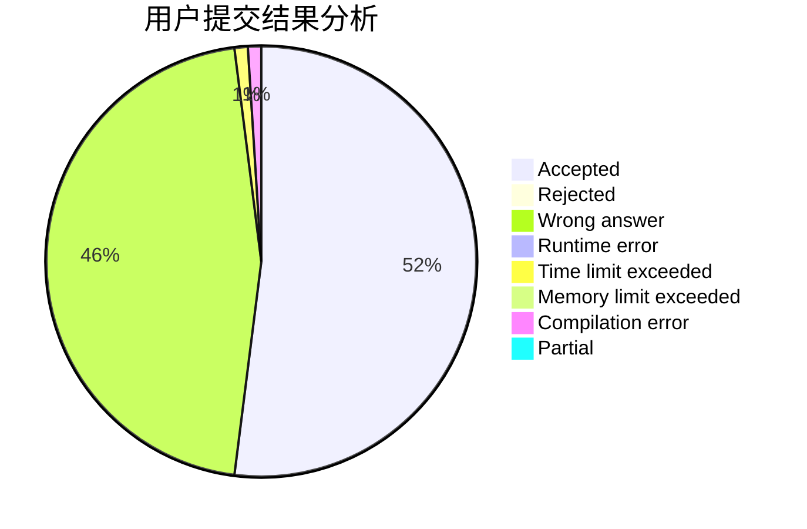
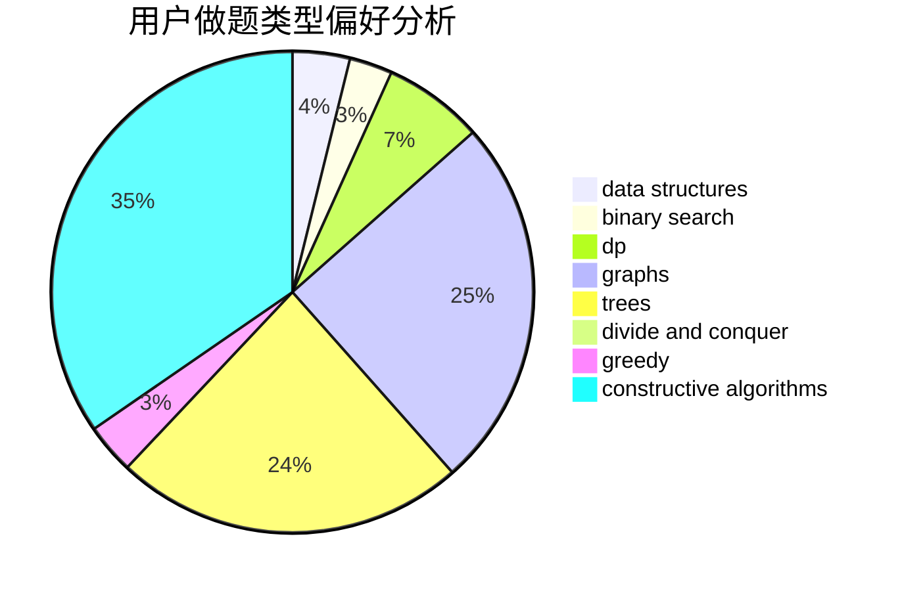
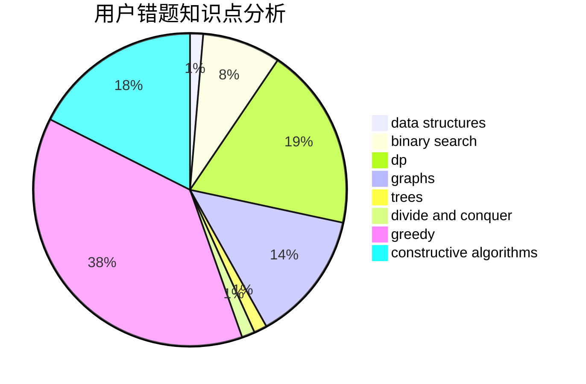

# LightAc

<!-- tabs:start -->

#### **用户提交结果分析**

#### **用户做题类型偏好分析**

#### **用户错题知识点分析**

<!-- tabs:end -->
# 推荐题目
[1489D](https://codeforces.com/contest/1489/problem/D)		dsu,graphs,sortings,trees		  
[1250F](https://codeforces.com/contest/1250/problem/F)		brute force,
                        implementation		  
[573E](https://codeforces.com/contest/573/problem/E)		data structures,
                        greedy		  
[1313B](https://codeforces.com/contest/1313/problem/B)		constructive algorithms,
                        greedy,
                        implementation,
                        math		  
[607E](https://codeforces.com/contest/607/problem/E)		binary search,
                        geometry		  
[1109A](https://codeforces.com/contest/1109/problem/A)		dp,
                        implementation		  
[81C](https://codeforces.com/contest/81/problem/C)		greedy,
                        math,
                        sortings		  
[573B](https://codeforces.com/contest/573/problem/B)		binary search,
                        data structures,
                        dp,
                        math		  
[276E](https://codeforces.com/contest/276/problem/E)		data structures,
                        graphs,
                        trees		  
[43A](https://codeforces.com/contest/43/problem/A)		strings		  
