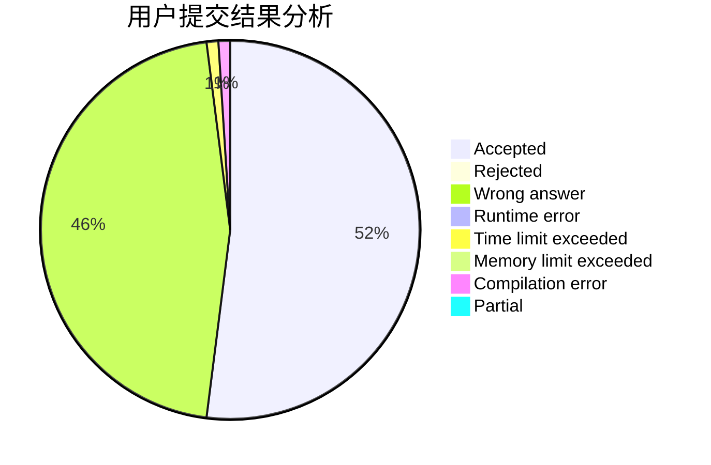
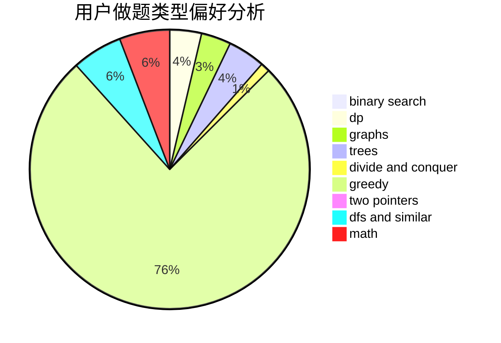

# LightAc

<!-- tabs:start -->

#### **用户提交结果分析**

#### **用户做题类型偏好分析**

<!-- tabs:end -->
# 推荐题目
[1497B](https://codeforces.com/contest/1497/problem/B)
[1254E](https://codeforces.com/contest/1254/problem/E)
[593D](https://codeforces.com/contest/593/problem/D)
[1322E](https://codeforces.com/contest/1322/problem/E)
[626F](https://codeforces.com/contest/626/problem/F)
[1109E](https://codeforces.com/contest/1109/problem/E)
[839E](https://codeforces.com/contest/839/problem/E)
[592D](https://codeforces.com/contest/592/problem/D)
[291B](https://codeforces.com/contest/291/problem/B)
[461B](https://codeforces.com/contest/461/problem/B)
