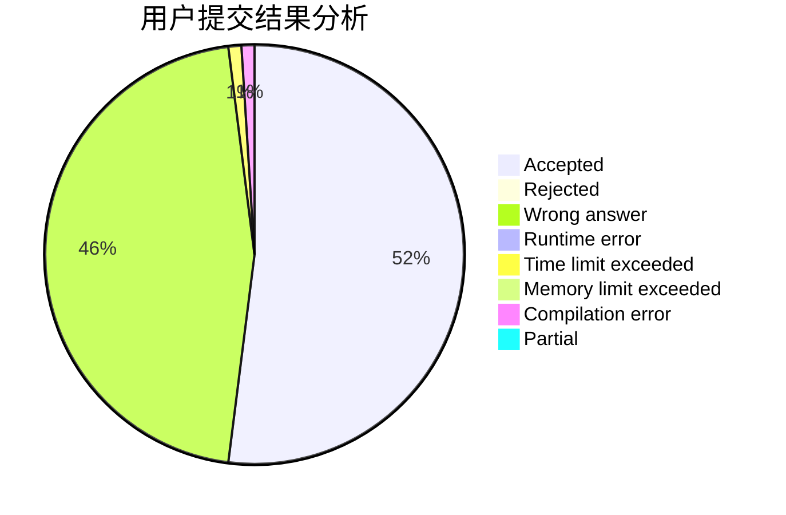
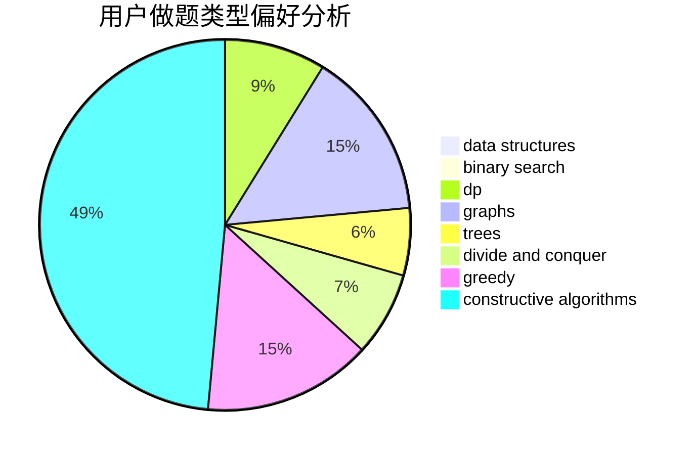
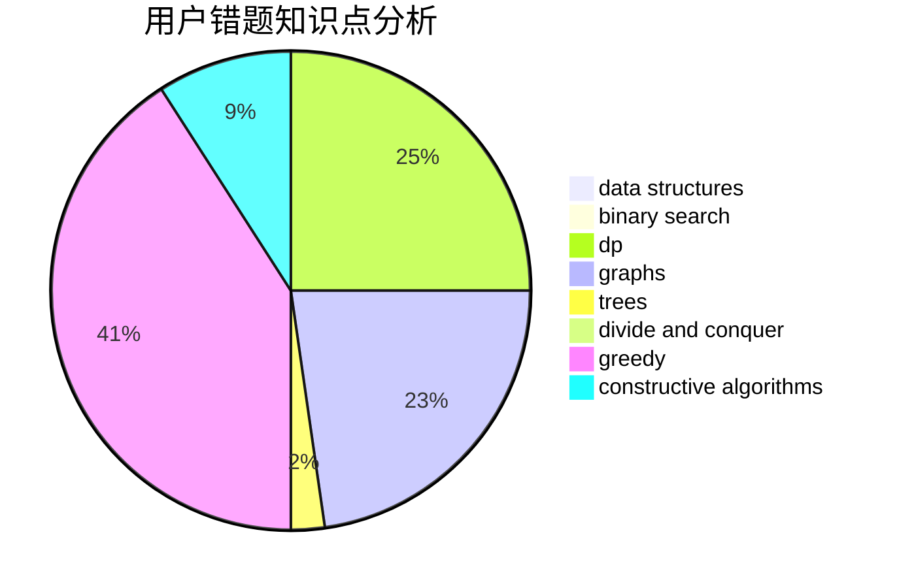

# LightAc

<!-- tabs:start -->

#### **用户提交结果分析**

#### **用户做题类型偏好分析**

#### **用户错题知识点分析**

<!-- tabs:end -->
# 推荐题目
[1497B](https://codeforces.com/contest/1497/problem/B)		constructive algorithms,
                        greedy,
                        math		  
[1254E](https://codeforces.com/contest/1254/problem/E)		combinatorics,
                        dfs and similar,
                        dsu,
                        trees		  
[593D](https://codeforces.com/contest/593/problem/D)		data structures,
                        dfs and similar,
                        graphs,
                        math,
                        trees		  
[1322E](https://codeforces.com/contest/1322/problem/E)		data structures		  
[626F](https://codeforces.com/contest/626/problem/F)		dp		  
[1109E](https://codeforces.com/contest/1109/problem/E)		data structures,
                        number theory		  
[839E](https://codeforces.com/contest/839/problem/E)		brute force,
                        graphs,
                        math,
                        meet-in-the-middle		  
[592D](https://codeforces.com/contest/592/problem/D)		dfs and similar,
                        dp,
                        graphs,
                        trees		  
[291B](https://codeforces.com/contest/291/problem/B)		*special problem,
                        implementation,
                        strings		  
[461B](https://codeforces.com/contest/461/problem/B)		dfs and similar,
                        dp,
                        trees		  
