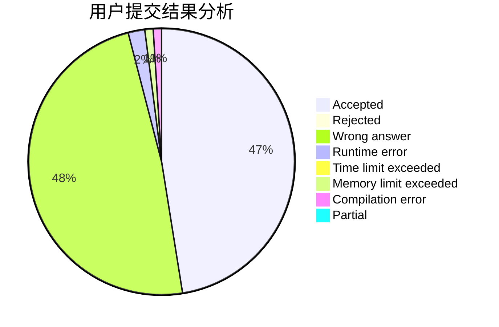
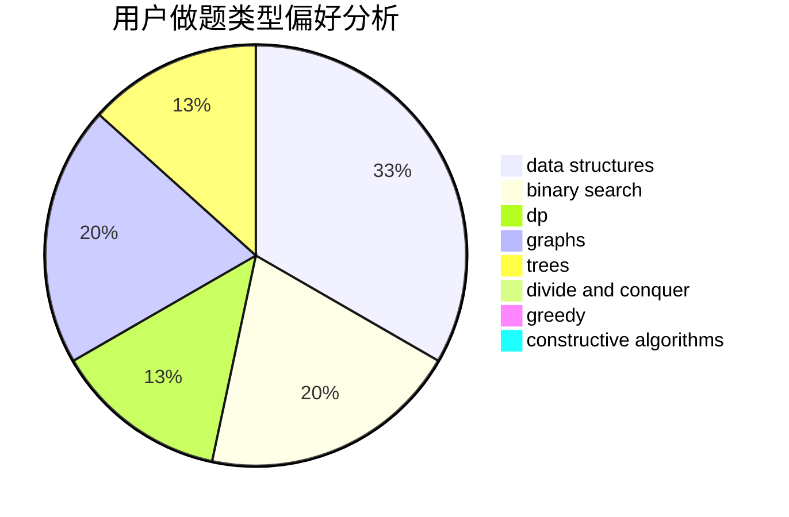
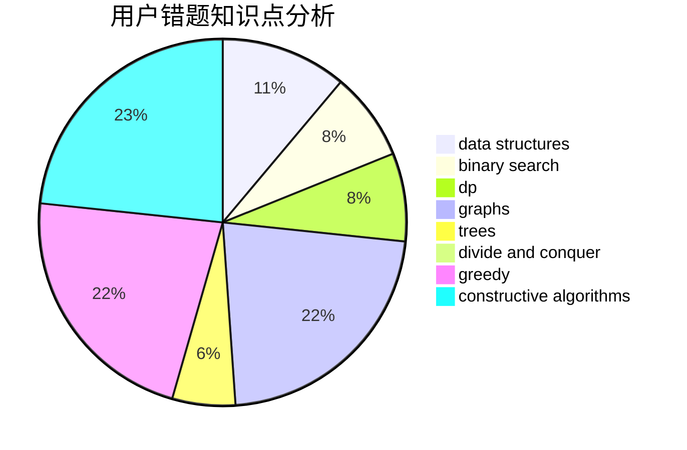

# LightningUZ

<!-- tabs:start -->

#### **用户提交结果分析**

#### **用户做题类型偏好分析**

#### **用户错题知识点分析**

<!-- tabs:end -->
# 推荐题目
[393C](https://codeforces.com/contest/393/problem/C)		dsu,graphs,sortings,trees		  
[760B](https://codeforces.com/contest/760/problem/B)		binary search,
                        greedy		  
[545B](https://codeforces.com/contest/545/problem/B)		greedy		  
[1102A](https://codeforces.com/contest/1102/problem/A)		math		  
[1470E](https://codeforces.com/contest/1470/problem/E)		binary search,
                        combinatorics,
                        data structures,
                        dp,
                        graphs,
                        implementation,
                        two pointers		  
[618E](https://codeforces.com/contest/618/problem/E)		data structures,
                        geometry		  
[877D](https://codeforces.com/contest/877/problem/D)		data structures,
                        dfs and similar,
                        graphs,
                        shortest paths		  
[1409A](https://codeforces.com/contest/1409/problem/A)		greedy,
                        math		  
[1490C](https://codeforces.com/contest/1490/problem/C)		binary search,
                        brute force,
                        brute force,
                        math		  
[1497B](https://codeforces.com/contest/1497/problem/B)		constructive algorithms,
                        greedy,
                        math		  
