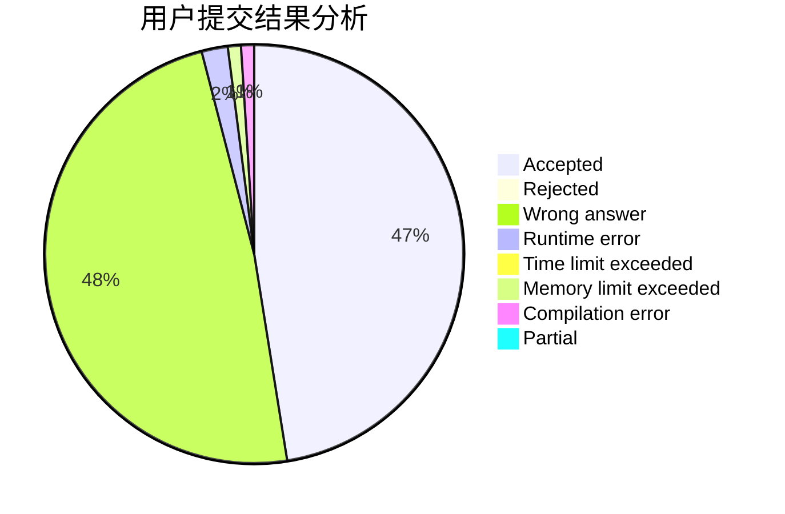
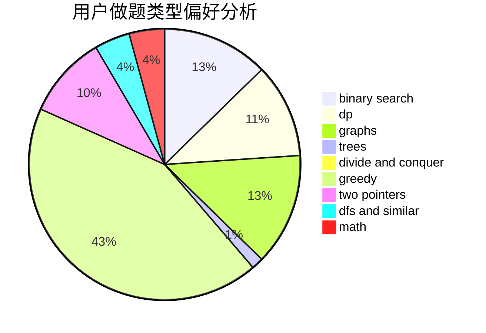

# LightningUZ

<!-- tabs:start -->

#### **用户提交结果分析**

#### **用户做题类型偏好分析**

<!-- tabs:end -->
# 推荐题目
[393C](https://codeforces.com/contest/393/problem/C)
[760B](https://codeforces.com/contest/760/problem/B)
[545B](https://codeforces.com/contest/545/problem/B)
[1102A](https://codeforces.com/contest/1102/problem/A)
[1470E](https://codeforces.com/contest/1470/problem/E)
[618E](https://codeforces.com/contest/618/problem/E)
[877D](https://codeforces.com/contest/877/problem/D)
[1409A](https://codeforces.com/contest/1409/problem/A)
[1490C](https://codeforces.com/contest/1490/problem/C)
[1497B](https://codeforces.com/contest/1497/problem/B)
