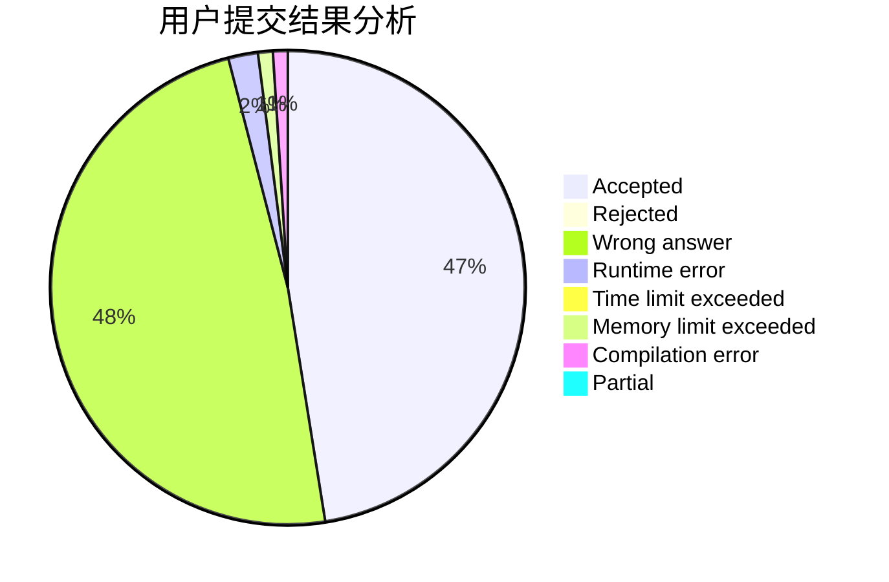
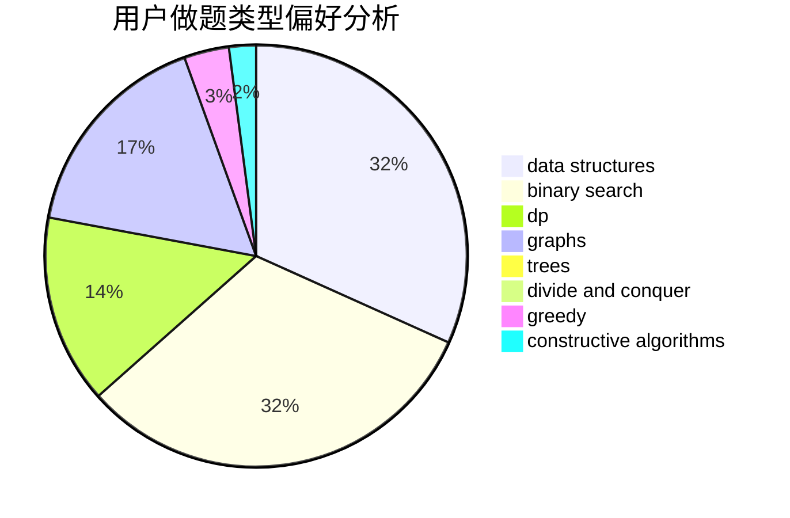
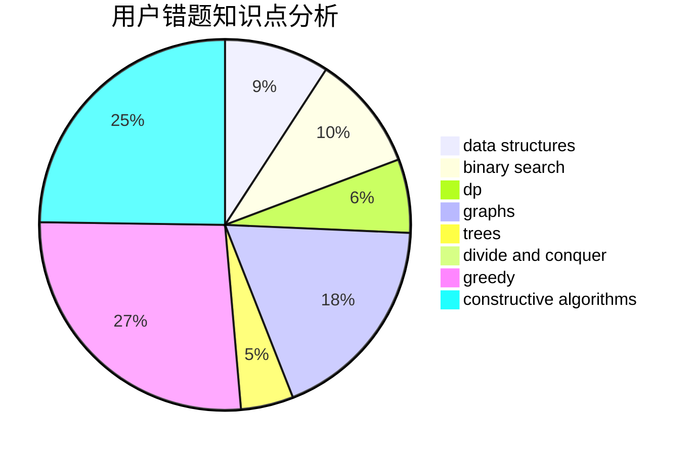

# LightningUZ

<!-- tabs:start -->

#### **用户提交结果分析**

#### **用户做题类型偏好分析**

#### **用户错题知识点分析**

<!-- tabs:end -->
# 推荐题目
[365A](https://codeforces.com/contest/365/problem/A)		implementation		  
[73B](https://codeforces.com/contest/73/problem/B)		binary search,
                        greedy,
                        sortings		  
[51A](https://codeforces.com/contest/51/problem/A)		implementation		  
[1101E](https://codeforces.com/contest/1101/problem/E)		implementation		  
[1463D](https://codeforces.com/contest/1463/problem/D)		binary search,
                        constructive algorithms,
                        greedy,
                        two pointers		  
[5C](https://codeforces.com/contest/5/problem/C)		constructive algorithms,
                        data structures,
                        dp,
                        greedy,
                        sortings,
                        strings		  
[85A](https://codeforces.com/contest/85/problem/A)		constructive algorithms,
                        implementation		  
[13A](https://codeforces.com/contest/13/problem/A)		implementation,
                        math		  
[1482E](https://codeforces.com/contest/1482/problem/E)		data structures,
                        divide and conquer,
                        dp		  
[1489D](https://codeforces.com/contest/1489/problem/D)		dsu,graphs,sortings,trees		  
