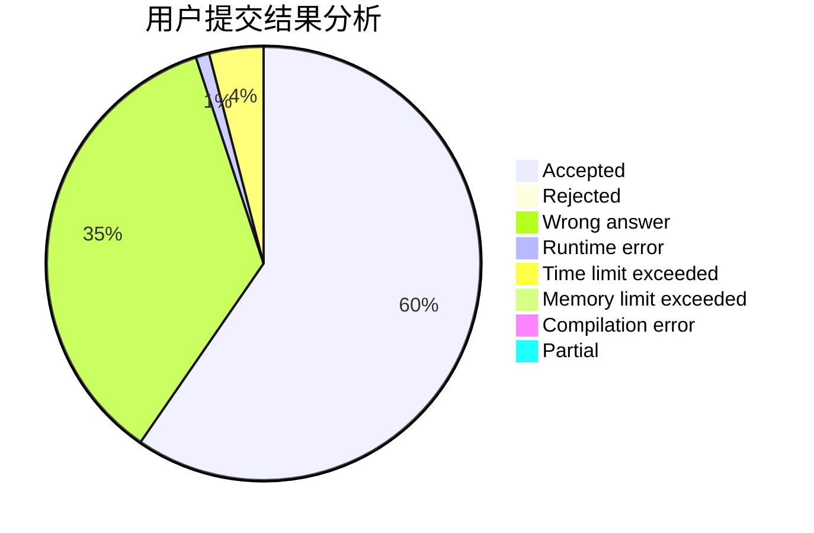
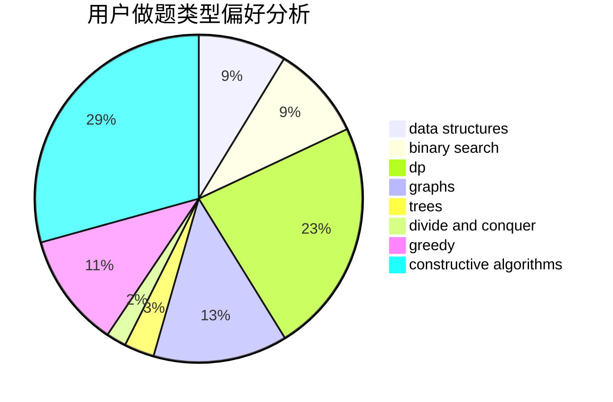

# Linqi05

<!-- tabs:start -->

#### **用户提交结果分析**

#### **用户做题类型偏好分析**

#### **用户错题知识点分析**

<!-- tabs:end -->
# 推荐题目
[1428D](https://codeforces.com/contest/1428/problem/D)		constructive algorithms,
                        greedy,
                        implementation		  
[1434D](https://codeforces.com/contest/1434/problem/D)		dsu,graphs,sortings,trees		  
[1401C](https://codeforces.com/contest/1401/problem/C)		constructive algorithms,
                        math,
                        number theory,
                        sortings		  
[1108A](https://codeforces.com/contest/1108/problem/A)		implementation		  
[763D](https://codeforces.com/contest/763/problem/D)		data structures,
                        graphs,
                        hashing,
                        shortest paths,
                        trees		  
[455D](https://codeforces.com/contest/455/problem/D)		data structures		  
[912C](https://codeforces.com/contest/912/problem/C)		brute force,
                        greedy,
                        sortings		  
[903B](https://codeforces.com/contest/903/problem/B)		greedy,
                        implementation		  
[1082F](https://codeforces.com/contest/1082/problem/F)		dp,
                        strings,
                        trees		  
[1007A](https://codeforces.com/contest/1007/problem/A)		combinatorics,
                        data structures,
                        math,
                        sortings,
                        two pointers		  
