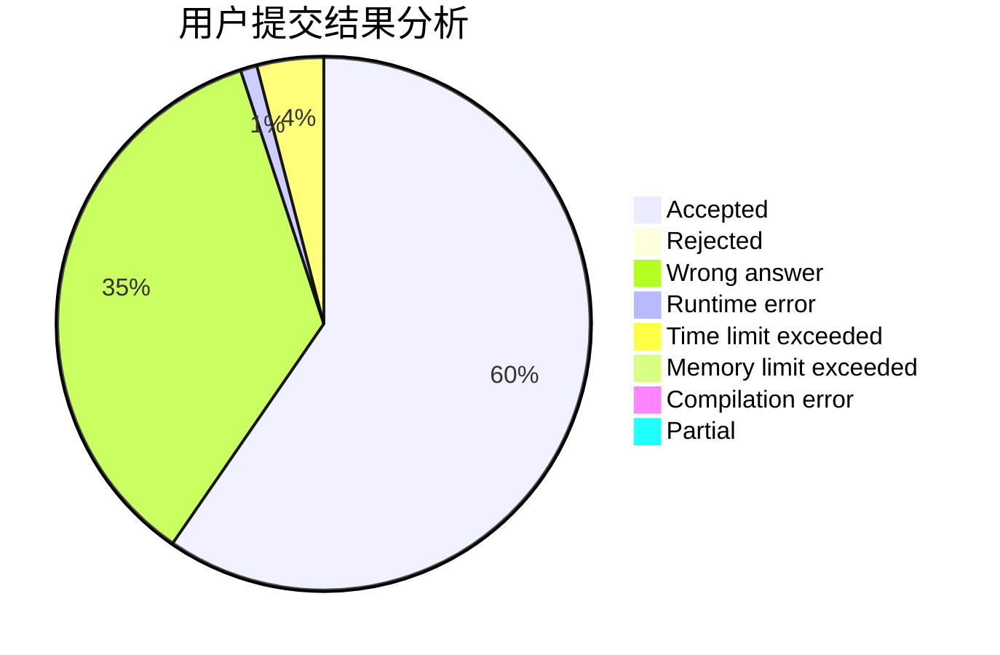
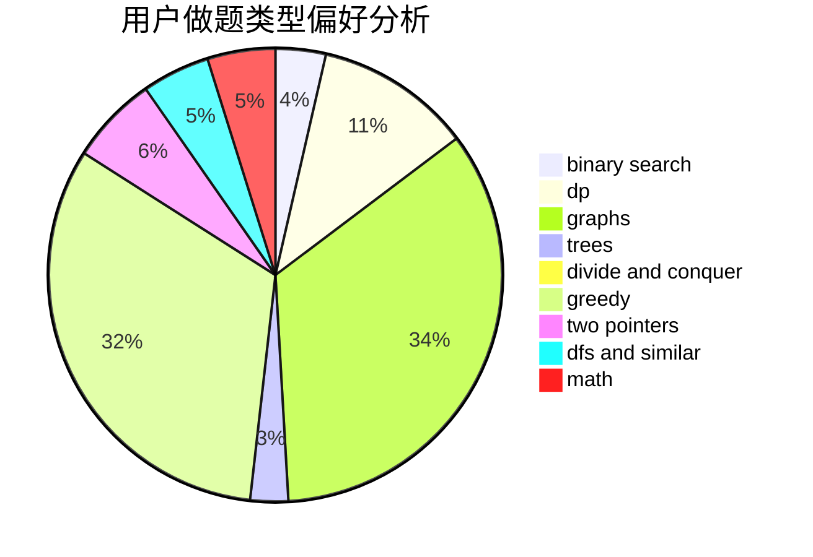

# Linqi05

<!-- tabs:start -->

#### **用户提交结果分析**

#### **用户做题类型偏好分析**

<!-- tabs:end -->
# 推荐题目
[1428D](https://codeforces.com/contest/1428/problem/D)
[1434D](https://codeforces.com/contest/1434/problem/D)
[1401C](https://codeforces.com/contest/1401/problem/C)
[1108A](https://codeforces.com/contest/1108/problem/A)
[763D](https://codeforces.com/contest/763/problem/D)
[455D](https://codeforces.com/contest/455/problem/D)
[912C](https://codeforces.com/contest/912/problem/C)
[903B](https://codeforces.com/contest/903/problem/B)
[1082F](https://codeforces.com/contest/1082/problem/F)
[1007A](https://codeforces.com/contest/1007/problem/A)
