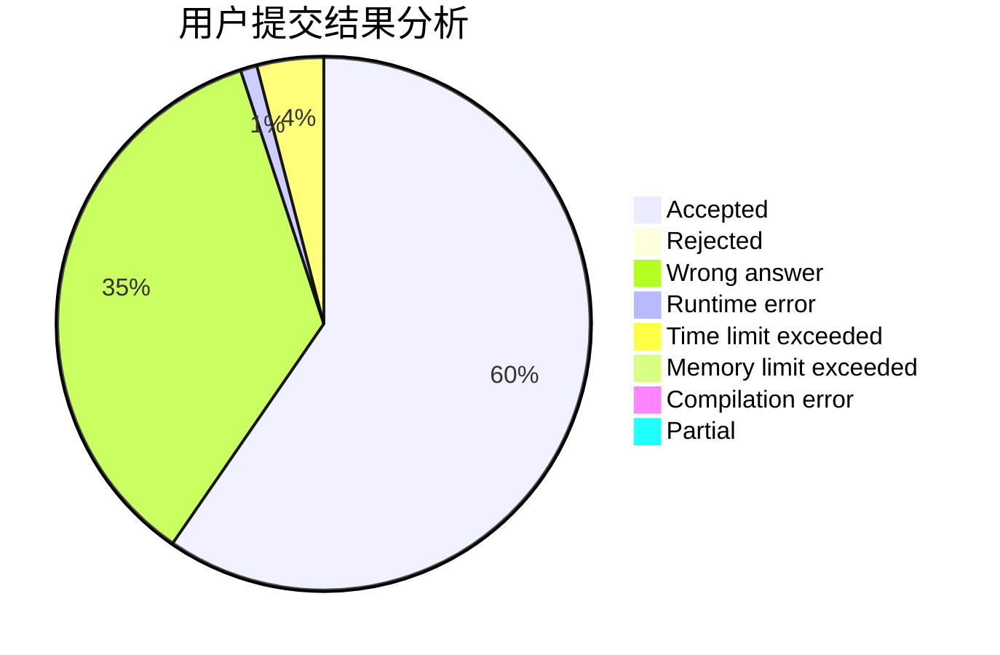
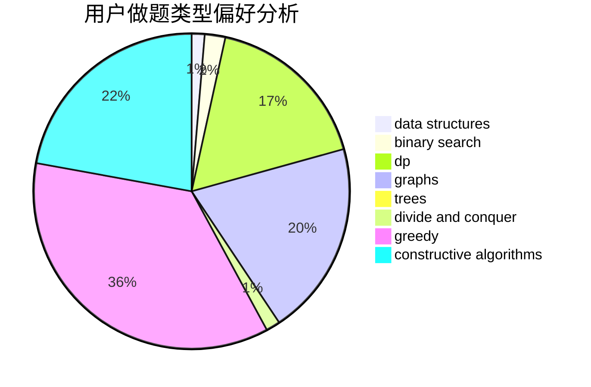

# Linqi05
<!-- tabs:start -->
#### **用户提交结果分析**

#### **用户做题类型偏好分析**

#### **用户错题知识点分析**

<!-- tabs:end -->
# 推荐题目
[XORwice](http://codeforces.com/problemset/problem/1421/A)		bitmasks,
                        greedy,
                        math		  
[Average Height](http://codeforces.com/problemset/problem/1509/A)		constructive algorithms		  
[Calendar Ambiguity](http://codeforces.com/problemset/problem/1389/E)		math,
                        number theory		  
[Canine poetry](http://codeforces.com/problemset/problem/1466/C)		dp,
                        greedy,
                        strings		  
[Furukawa Nagisa's Tree](http://codeforces.com/problemset/problem/434/E)		binary search,
                        divide and conquer,
                        sortings,
                        trees		  
[Powered Addition](https://codeforces.com/contest/1339/problem/C)		greedy,
                        math		  
[Vladik and fractions](http://codeforces.com/problemset/problem/743/C)		brute force,
                        constructive algorithms,
                        math,
                        number theory		  
[Vasya and Endless Credits](http://codeforces.com/problemset/problem/1107/F)		dp,
                        flows,
                        graph matchings,
                        graphs,
                        sortings		  
[Ralph And His Tour in Binary Country](http://codeforces.com/problemset/problem/894/D)		brute force,
                        data structures,
                        trees		  
[Rarity and New Dress](http://codeforces.com/problemset/problem/1393/D)		dfs and similar,
                        dp,
                        implementation,
                        shortest paths		  
<!-- tabs:start -->
#### **data structures**
[XORwice](http://codeforces.com/problemset/problem/894/D)		brute force,
                        data structures,
                        trees		  
[Average Height](http://codeforces.com/problemset/problem/198/E)		binary search,
                        data structures,
                        sortings		  
[Calendar Ambiguity](http://codeforces.com/problemset/problem/338/E)		data structures		  
[Canine poetry](https://codeforces.com/contest/1143/problem/E)		data structures,
                        dfs and similar,
                        dp,
                        math,
                        trees		  
[Furukawa Nagisa's Tree](http://codeforces.com/problemset/problem/323/C)		data structures		  
[Powered Addition](http://codeforces.com/problemset/problem/1468/B)		data structures,
                        dsu		  
[Vladik and fractions](http://codeforces.com/problemset/problem/1500/E)		binary search,
                        data structures		  
[Vasya and Endless Credits](http://codeforces.com/problemset/problem/283/A)		constructive algorithms,
                        data structures,
                        implementation		  
[Ralph And His Tour in Binary Country](http://codeforces.com/problemset/problem/1396/D)		data structures,
                        sortings,
                        two pointers		  
[Rarity and New Dress](http://codeforces.com/problemset/problem/1476/F)		binary search,
                        data structures,
                        dp		  
#### **binary search**
[XORwice](http://codeforces.com/problemset/problem/434/E)		binary search,
                        divide and conquer,
                        sortings,
                        trees		  
[Average Height](http://codeforces.com/problemset/problem/198/E)		binary search,
                        data structures,
                        sortings		  
[Calendar Ambiguity](http://codeforces.com/problemset/problem/702/C)		binary search,
                        implementation,
                        two pointers		  
[Canine poetry](http://codeforces.com/problemset/problem/1354/C1)		binary search,
                        geometry,
                        math,
                        ternary search		  
[Furukawa Nagisa's Tree](http://codeforces.com/problemset/problem/126/B)		binary search,
                        dp,
                        hashing,
                        string suffix structures,
                        strings		  
[Powered Addition](http://codeforces.com/problemset/problem/1486/E)		binary search,
                        brute force,
                        constructive algorithms,
                        dp,
                        flows,
                        graphs,
                        shortest paths		  
[Vladik and fractions](http://codeforces.com/problemset/problem/1500/E)		binary search,
                        data structures		  
[Vasya and Endless Credits](https://codeforces.com/contest/1011/problem/D)		binary search,
                        interactive		  
[Ralph And His Tour in Binary Country](http://codeforces.com/problemset/problem/1476/F)		binary search,
                        data structures,
                        dp		  
[Rarity and New Dress](http://codeforces.com/problemset/problem/1409/E)		binary search,
                        dp,
                        sortings,
                        two pointers		  
#### **dp**
[XORwice](http://codeforces.com/problemset/problem/1466/C)		dp,
                        greedy,
                        strings		  
[Average Height](http://codeforces.com/problemset/problem/1107/F)		dp,
                        flows,
                        graph matchings,
                        graphs,
                        sortings		  
[Calendar Ambiguity](http://codeforces.com/problemset/problem/1393/D)		dfs and similar,
                        dp,
                        implementation,
                        shortest paths		  
[Canine poetry](http://codeforces.com/problemset/problem/1268/E)		dp		  
[Furukawa Nagisa's Tree](http://codeforces.com/problemset/problem/859/C)		dp,
                        games		  
[Powered Addition](http://codeforces.com/problemset/problem/132/C)		dp		  
[Vladik and fractions](https://codeforces.com/contest/1143/problem/E)		data structures,
                        dfs and similar,
                        dp,
                        math,
                        trees		  
[Vasya and Endless Credits](http://codeforces.com/problemset/problem/126/B)		binary search,
                        dp,
                        hashing,
                        string suffix structures,
                        strings		  
[Ralph And His Tour in Binary Country](http://codeforces.com/problemset/problem/1223/E)		dp,
                        sortings,
                        trees		  
[Rarity and New Dress](http://codeforces.com/problemset/problem/1486/E)		binary search,
                        brute force,
                        constructive algorithms,
                        dp,
                        flows,
                        graphs,
                        shortest paths		  
#### **graph**
[XORwice](http://codeforces.com/problemset/problem/1107/F)		dp,
                        flows,
                        graph matchings,
                        graphs,
                        sortings		  
[Average Height](http://codeforces.com/problemset/problem/28/B)		dfs and similar,
                        dsu,
                        graphs		  
[Calendar Ambiguity](http://codeforces.com/problemset/problem/884/F)		flows,
                        graphs,
                        greedy		  
[Canine poetry](http://codeforces.com/problemset/problem/1486/E)		binary search,
                        brute force,
                        constructive algorithms,
                        dp,
                        flows,
                        graphs,
                        shortest paths		  
[Furukawa Nagisa's Tree](http://codeforces.com/problemset/problem/1463/E)		constructive algorithms,
                        dfs and similar,
                        dsu,
                        graphs,
                        implementation,
                        sortings,
                        trees		  
[Powered Addition](http://codeforces.com/problemset/problem/1095/F)		dsu,
                        graphs,
                        greedy		  
[Vladik and fractions](http://codeforces.com/problemset/problem/1487/C)		brute force,
                        constructive algorithms,
                        dfs and similar,
                        graphs,
                        greedy,
                        implementation,
                        math		  
[Vasya and Endless Credits](http://codeforces.com/problemset/problem/1437/C)		dp,
                        flows,
                        graph matchings,
                        greedy,
                        math,
                        sortings		  
[Ralph And His Tour in Binary Country](http://codeforces.com/problemset/problem/1470/D)		constructive algorithms,
                        dfs and similar,
                        graph matchings,
                        graphs,
                        greedy		  
[Rarity and New Dress](http://codeforces.com/problemset/problem/1476/C)		dp,
                        graphs,
                        greedy		  
#### **trees**
[XORwice](http://codeforces.com/problemset/problem/434/E)		binary search,
                        divide and conquer,
                        sortings,
                        trees		  
[Average Height](http://codeforces.com/problemset/problem/894/D)		brute force,
                        data structures,
                        trees		  
[Calendar Ambiguity](https://codeforces.com/contest/1143/problem/E)		data structures,
                        dfs and similar,
                        dp,
                        math,
                        trees		  
[Canine poetry](http://codeforces.com/problemset/problem/1223/E)		dp,
                        sortings,
                        trees		  
[Furukawa Nagisa's Tree](http://codeforces.com/problemset/problem/1463/E)		constructive algorithms,
                        dfs and similar,
                        dsu,
                        graphs,
                        implementation,
                        sortings,
                        trees		  
[Powered Addition](http://codeforces.com/problemset/problem/1479/D)		binary search,
                        bitmasks,
                        brute force,
                        data structures,
                        probabilities,
                        trees		  
[Vladik and fractions](http://codeforces.com/problemset/problem/1511/C)		brute force,
                        data structures,
                        implementation,
                        trees		  
[Vasya and Endless Credits](http://codeforces.com/problemset/problem/1499/F)		combinatorics,
                        dfs and similar,
                        dp,
                        trees		  
[Ralph And His Tour in Binary Country](http://codeforces.com/problemset/problem/1491/E)		brute force,
                        dfs and similar,
                        divide and conquer,
                        number theory,
                        trees		  
[Rarity and New Dress](http://codeforces.com/problemset/problem/1466/D)		data structures,
                        greedy,
                        sortings,
                        trees		  
#### **divide and conquer**
[XORwice](http://codeforces.com/problemset/problem/434/E)		binary search,
                        divide and conquer,
                        sortings,
                        trees		  
[Average Height](http://codeforces.com/problemset/problem/1250/M)		constructive algorithms,
                        divide and conquer		  
[Calendar Ambiguity](http://codeforces.com/problemset/problem/1461/D)		binary search,
                        brute force,
                        data structures,
                        divide and conquer,
                        implementation,
                        sortings		  
[Canine poetry](http://codeforces.com/problemset/problem/1466/G)		combinatorics,
                        divide and conquer,
                        hashing,
                        math,
                        string suffix structures,
                        strings		  
[Furukawa Nagisa's Tree](http://codeforces.com/problemset/problem/1490/D)		dfs and similar,
                        divide and conquer,
                        implementation		  
[Powered Addition](https://codeforces.com/contest/1483/problem/C)		data structures,
                        divide and conquer,
                        dp		  
[Vladik and fractions](http://codeforces.com/problemset/problem/1491/E)		brute force,
                        dfs and similar,
                        divide and conquer,
                        number theory,
                        trees		  
[Vasya and Endless Credits](http://codeforces.com/problemset/problem/1303/G)		data structures,
                        divide and conquer,
                        geometry,
                        trees		  
[Ralph And His Tour in Binary Country](http://codeforces.com/problemset/problem/1494/D)		constructive algorithms,
                        data structures,
                        dfs and similar,
                        divide and conquer,
                        dsu,
                        greedy,
                        sortings,
                        trees		  
[Rarity and New Dress](http://codeforces.com/problemset/problem/1482/E)		data structures,
                        divide and conquer,
                        dp		  
#### **greedy**
[XORwice](http://codeforces.com/problemset/problem/1421/A)		bitmasks,
                        greedy,
                        math		  
[Average Height](http://codeforces.com/problemset/problem/1466/C)		dp,
                        greedy,
                        strings		  
[Calendar Ambiguity](https://codeforces.com/contest/1339/problem/C)		greedy,
                        math		  
[Canine poetry](http://codeforces.com/problemset/problem/1082/C)		greedy,
                        sortings		  
[Furukawa Nagisa's Tree](http://codeforces.com/problemset/problem/884/F)		flows,
                        graphs,
                        greedy		  
[Powered Addition](http://codeforces.com/problemset/problem/405/D)		greedy,
                        implementation,
                        math		  
[Vladik and fractions](http://codeforces.com/problemset/problem/732/E)		greedy,
                        sortings		  
[Vasya and Endless Credits](https://codeforces.com/contest/956/problem/A)		greedy,
                        implementation		  
[Ralph And His Tour in Binary Country](http://codeforces.com/problemset/problem/286/C)		greedy,
                        implementation		  
[Rarity and New Dress](http://codeforces.com/problemset/problem/1285/B)		dp,
                        greedy,
                        implementation		  
#### **constructive algorithms**
[XORwice](http://codeforces.com/problemset/problem/1509/A)		constructive algorithms		  
[Average Height](http://codeforces.com/problemset/problem/743/C)		brute force,
                        constructive algorithms,
                        math,
                        number theory		  
[Calendar Ambiguity](http://codeforces.com/problemset/problem/1250/M)		constructive algorithms,
                        divide and conquer		  
[Canine poetry](http://codeforces.com/problemset/problem/912/B)		bitmasks,
                        constructive algorithms,
                        number theory		  
[Furukawa Nagisa's Tree](https://codeforces.com/contest/287/problem/C)		constructive algorithms,
                        math		  
[Powered Addition](https://codeforces.com/contest/1262/problem/C)		constructive algorithms		  
[Vladik and fractions](http://codeforces.com/problemset/problem/1486/E)		binary search,
                        brute force,
                        constructive algorithms,
                        dp,
                        flows,
                        graphs,
                        shortest paths		  
[Vasya and Endless Credits](http://codeforces.com/problemset/problem/283/A)		constructive algorithms,
                        data structures,
                        implementation		  
[Ralph And His Tour in Binary Country](http://codeforces.com/problemset/problem/1463/E)		constructive algorithms,
                        dfs and similar,
                        dsu,
                        graphs,
                        implementation,
                        sortings,
                        trees		  
[Rarity and New Dress](http://codeforces.com/problemset/problem/1329/A)		constructive algorithms,
                        greedy,
                        implementation,
                        math		  
#### **sortings**
[XORwice](http://codeforces.com/problemset/problem/434/E)		binary search,
                        divide and conquer,
                        sortings,
                        trees		  
[Average Height](http://codeforces.com/problemset/problem/1107/F)		dp,
                        flows,
                        graph matchings,
                        graphs,
                        sortings		  
[Calendar Ambiguity](http://codeforces.com/problemset/problem/1082/C)		greedy,
                        sortings		  
[Canine poetry](http://codeforces.com/problemset/problem/198/E)		binary search,
                        data structures,
                        sortings		  
[Furukawa Nagisa's Tree](http://codeforces.com/problemset/problem/732/E)		greedy,
                        sortings		  
[Powered Addition](http://codeforces.com/problemset/problem/1223/E)		dp,
                        sortings,
                        trees		  
[Vladik and fractions](http://codeforces.com/problemset/problem/1463/E)		constructive algorithms,
                        dfs and similar,
                        dsu,
                        graphs,
                        implementation,
                        sortings,
                        trees		  
[Vasya and Endless Credits](http://codeforces.com/problemset/problem/1396/D)		data structures,
                        sortings,
                        two pointers		  
[Ralph And His Tour in Binary Country](http://codeforces.com/problemset/problem/1409/E)		binary search,
                        dp,
                        sortings,
                        two pointers		  
[Rarity and New Dress](https://codeforces.com/contest/1496/problem/C)		geometry,
                        greedy,
                        math,
                        sortings		  
<!-- tabs:end -->
