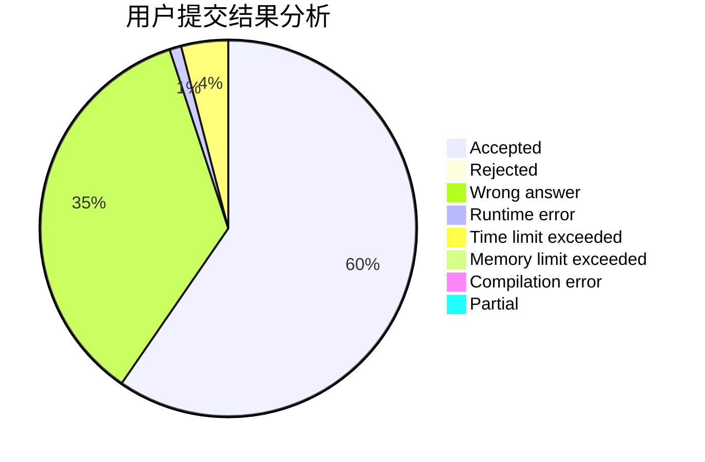
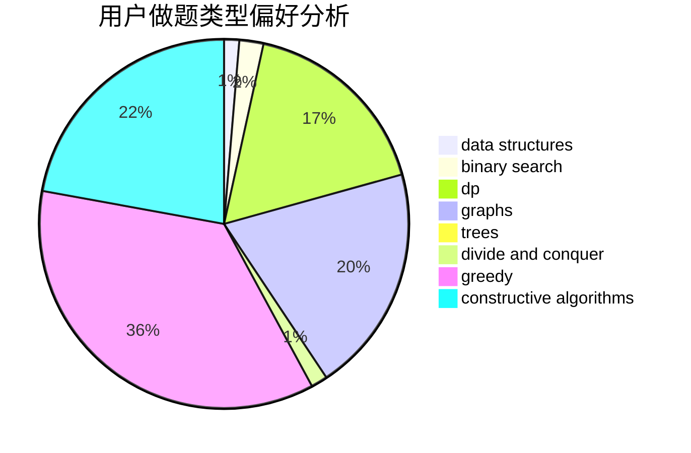

# Linqi05

<!-- tabs:start -->

#### **用户提交结果分析**

#### **用户做题类型偏好分析**

#### **用户错题知识点分析**

<!-- tabs:end -->
# 推荐题目
[1421A](https://codeforces.com/contest/1421/problem/A)		bitmasks,
                        greedy,
                        math		  
[1426B](https://codeforces.com/contest/1426/problem/B)		implementation		  
[1393D](https://codeforces.com/contest/1393/problem/D)		dfs and similar,
                        dp,
                        implementation,
                        shortest paths		  
[1107F](https://codeforces.com/contest/1107/problem/F)		dp,
                        flows,
                        graph matchings,
                        graphs,
                        sortings		  
[743C](https://codeforces.com/contest/743/problem/C)		brute force,
                        constructive algorithms,
                        math,
                        number theory		  
[434E](https://codeforces.com/contest/434/problem/E)		binary search,
                        divide and conquer,
                        sortings,
                        trees		  
[894D](https://codeforces.com/contest/894/problem/D)		brute force,
                        data structures,
                        trees		  
[884F](https://codeforces.com/contest/884/problem/F)		flows,
                        graphs,
                        greedy		  
[1082C](https://codeforces.com/contest/1082/problem/C)		greedy,
                        sortings		  
[1006D](https://codeforces.com/contest/1006/problem/D)		implementation		  
