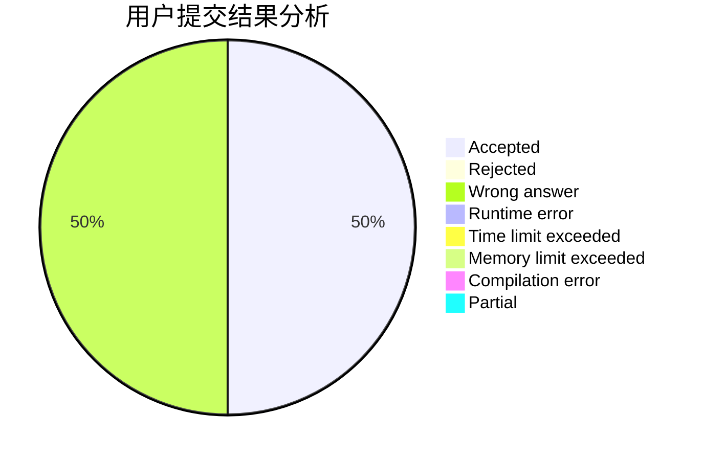
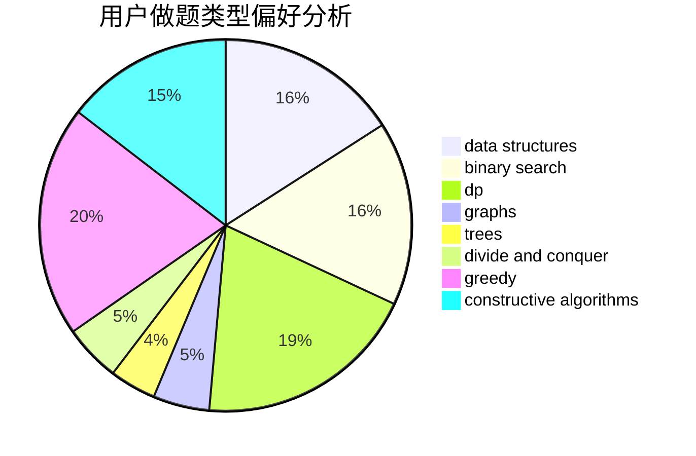
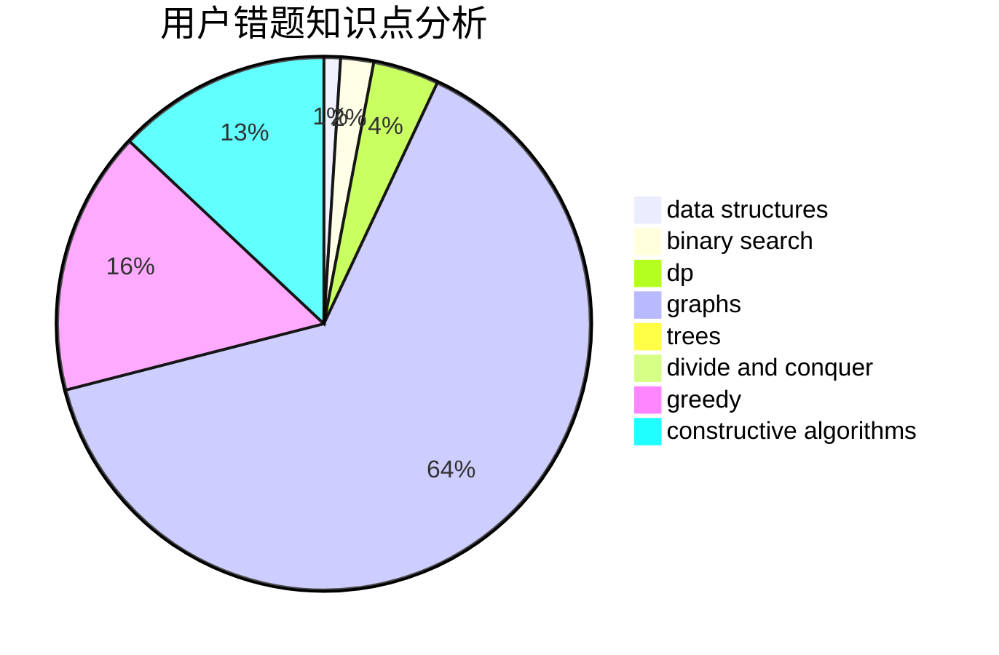

# 700YKSEULB
<!-- tabs:start -->
#### **用户提交结果分析**

#### **用户做题类型偏好分析**

#### **用户错题知识点分析**

<!-- tabs:end -->
# 推荐题目
[Distance and Axis](http://codeforces.com/problemset/problem/1401/A)		constructive algorithms,
                        math		  
[Bricks](http://codeforces.com/problemset/problem/1404/E)		flows,
                        graph matchings,
                        graphs		  
[String Similarity](http://codeforces.com/problemset/problem/1400/A)		constructive algorithms,
                        strings		  
[Diverse Substring](http://codeforces.com/problemset/problem/1073/A)		implementation,
                        strings		  
[Letter A](http://codeforces.com/problemset/problem/13/B)		geometry,
                        implementation		  
[Benches](http://codeforces.com/problemset/problem/1042/A)		binary search,
                        implementation		  
[K for the Price of One (Easy Version)](http://codeforces.com/problemset/problem/1282/B1)		dp,
                        greedy,
                        sortings		  
[The Cake Is a Lie](http://codeforces.com/problemset/problem/1282/E)		constructive algorithms,
                        data structures,
                        dfs and similar,
                        graphs		  
[Roads](http://codeforces.com/problemset/problem/1402/B)		*special problem,
                        geometry,
                        sortings		  
[Yet Another Partiton Problem](http://codeforces.com/problemset/problem/1175/G)		data structures,
                        divide and conquer,
                        dp,
                        geometry,
                        two pointers		  
<!-- tabs:start -->
#### **data structures**
[Distance and Axis](http://codeforces.com/problemset/problem/1282/E)		constructive algorithms,
                        data structures,
                        dfs and similar,
                        graphs		  
[Bricks](http://codeforces.com/problemset/problem/1175/G)		data structures,
                        divide and conquer,
                        dp,
                        geometry,
                        two pointers		  
[String Similarity](http://codeforces.com/problemset/problem/1403/B)		*special problem,
                        data structures,
                        dfs and similar,
                        graphs,
                        trees		  
[Diverse Substring](http://codeforces.com/problemset/problem/1216/F)		data structures,
                        dp,
                        greedy		  
[Letter A](http://codeforces.com/problemset/problem/1402/A)		*special problem,
                        data structures,
                        dsu,
                        implementation,
                        math,
                        sortings		  
[Benches](http://codeforces.com/problemset/problem/1403/A)		*special problem,
                        2-sat,
                        binary search,
                        data structures,
                        graphs,
                        interactive,
                        sortings,
                        two pointers		  
[K for the Price of One (Easy Version)](http://codeforces.com/problemset/problem/1400/D)		brute force,
                        combinatorics,
                        data structures,
                        math,
                        two pointers		  
[The Cake Is a Lie](http://codeforces.com/problemset/problem/13/E)		data structures,
                        dsu		  
[Roads](http://codeforces.com/problemset/problem/1401/F)		binary search,
                        bitmasks,
                        data structures		  
[Yet Another Partiton Problem](http://codeforces.com/problemset/problem/1017/G)		data structures		  
#### **binary search**
[Distance and Axis](http://codeforces.com/problemset/problem/1042/A)		binary search,
                        implementation		  
[Bricks](http://codeforces.com/problemset/problem/1055/E)		binary search,
                        dp		  
[String Similarity](http://codeforces.com/problemset/problem/1403/A)		*special problem,
                        2-sat,
                        binary search,
                        data structures,
                        graphs,
                        interactive,
                        sortings,
                        two pointers		  
[Diverse Substring](http://codeforces.com/problemset/problem/1195/B)		binary search,
                        brute force,
                        math		  
[Letter A](http://codeforces.com/problemset/problem/1401/F)		binary search,
                        bitmasks,
                        data structures		  
[Benches](http://codeforces.com/problemset/problem/1183/C)		binary search,
                        math		  
[K for the Price of One (Easy Version)](http://codeforces.com/problemset/problem/1404/C)		binary search,
                        constructive algorithms,
                        data structures,
                        greedy,
                        two pointers		  
[The Cake Is a Lie](http://codeforces.com/problemset/problem/125/E)		binary search,
                        graphs		  
[Roads](http://codeforces.com/problemset/problem/1158/A)		binary search,
                        constructive algorithms,
                        greedy,
                        implementation,
                        math,
                        sortings,
                        two pointers		  
[Yet Another Partiton Problem](http://codeforces.com/problemset/problem/1492/C)		binary search,
                        data structures,
                        dp,
                        greedy,
                        two pointers		  
#### **dp**
[Distance and Axis](http://codeforces.com/problemset/problem/1282/B1)		dp,
                        greedy,
                        sortings		  
[Bricks](http://codeforces.com/problemset/problem/1175/G)		data structures,
                        divide and conquer,
                        dp,
                        geometry,
                        two pointers		  
[String Similarity](http://codeforces.com/problemset/problem/1113/A)		dp,
                        greedy,
                        math		  
[Diverse Substring](http://codeforces.com/problemset/problem/1400/F)		brute force,
                        dfs and similar,
                        dp,
                        string suffix structures,
                        strings		  
[Letter A](http://codeforces.com/problemset/problem/1216/F)		data structures,
                        dp,
                        greedy		  
[Benches](http://codeforces.com/problemset/problem/1403/C)		*special problem,
                        combinatorics,
                        dp,
                        implementation,
                        math		  
[K for the Price of One (Easy Version)](http://codeforces.com/problemset/problem/13/D)		dp,
                        geometry		  
[The Cake Is a Lie](http://codeforces.com/problemset/problem/1055/E)		binary search,
                        dp		  
[Roads](http://codeforces.com/problemset/problem/1400/G)		bitmasks,
                        brute force,
                        combinatorics,
                        dp,
                        dsu,
                        math,
                        two pointers		  
[Yet Another Partiton Problem](http://codeforces.com/problemset/problem/1402/C)		*special problem,
                        combinatorics,
                        dfs and similar,
                        dp,
                        games,
                        graphs,
                        matrices,
                        trees		  
#### **graph**
[Distance and Axis](http://codeforces.com/problemset/problem/1404/E)		flows,
                        graph matchings,
                        graphs		  
[Bricks](http://codeforces.com/problemset/problem/1282/E)		constructive algorithms,
                        data structures,
                        dfs and similar,
                        graphs		  
[String Similarity](http://codeforces.com/problemset/problem/1403/B)		*special problem,
                        data structures,
                        dfs and similar,
                        graphs,
                        trees		  
[Diverse Substring](http://codeforces.com/problemset/problem/1403/A)		*special problem,
                        2-sat,
                        binary search,
                        data structures,
                        graphs,
                        interactive,
                        sortings,
                        two pointers		  
[Letter A](http://codeforces.com/problemset/problem/1402/C)		*special problem,
                        combinatorics,
                        dfs and similar,
                        dp,
                        games,
                        graphs,
                        matrices,
                        trees		  
[Benches](http://codeforces.com/problemset/problem/1167/C)		dfs and similar,
                        dsu,
                        graphs		  
[K for the Price of One (Easy Version)](http://codeforces.com/problemset/problem/11/D)		bitmasks,
                        dp,
                        graphs		  
[The Cake Is a Lie](http://codeforces.com/problemset/problem/125/E)		binary search,
                        graphs		  
[Roads](http://codeforces.com/problemset/problem/1391/E)		constructive algorithms,
                        dfs and similar,
                        graphs,
                        greedy,
                        trees		  
[Yet Another Partiton Problem](http://codeforces.com/problemset/problem/1487/C)		brute force,
                        constructive algorithms,
                        dfs and similar,
                        graphs,
                        greedy,
                        implementation,
                        math		  
#### **trees**
[Distance and Axis](http://codeforces.com/problemset/problem/1403/B)		*special problem,
                        data structures,
                        dfs and similar,
                        graphs,
                        trees		  
[Bricks](https://codeforces.com/contest/1230/problem/E)		math,
                        number theory,
                        trees		  
[String Similarity](http://codeforces.com/problemset/problem/1402/C)		*special problem,
                        combinatorics,
                        dfs and similar,
                        dp,
                        games,
                        graphs,
                        matrices,
                        trees		  
[Diverse Substring](http://codeforces.com/problemset/problem/1401/D)		dfs and similar,
                        dp,
                        greedy,
                        implementation,
                        math,
                        number theory,
                        sortings,
                        trees		  
[Letter A](http://codeforces.com/problemset/problem/1391/E)		constructive algorithms,
                        dfs and similar,
                        graphs,
                        greedy,
                        trees		  
[Benches](http://codeforces.com/problemset/problem/1404/B)		dfs and similar,
                        dp,
                        games,
                        trees		  
[K for the Price of One (Easy Version)](http://codeforces.com/problemset/problem/1479/D)		binary search,
                        bitmasks,
                        brute force,
                        data structures,
                        probabilities,
                        trees		  
[The Cake Is a Lie](http://codeforces.com/problemset/problem/1511/C)		brute force,
                        data structures,
                        implementation,
                        trees		  
[Roads](http://codeforces.com/problemset/problem/1499/F)		combinatorics,
                        dfs and similar,
                        dp,
                        trees		  
[Yet Another Partiton Problem](http://codeforces.com/problemset/problem/1491/E)		brute force,
                        dfs and similar,
                        divide and conquer,
                        number theory,
                        trees		  
#### **divide and conquer**
[Distance and Axis](http://codeforces.com/problemset/problem/1175/G)		data structures,
                        divide and conquer,
                        dp,
                        geometry,
                        two pointers		  
[Bricks](http://codeforces.com/problemset/problem/1400/E)		data structures,
                        divide and conquer,
                        dp,
                        greedy		  
[String Similarity](http://codeforces.com/problemset/problem/1461/D)		binary search,
                        brute force,
                        data structures,
                        divide and conquer,
                        implementation,
                        sortings		  
[Diverse Substring](http://codeforces.com/problemset/problem/1466/G)		combinatorics,
                        divide and conquer,
                        hashing,
                        math,
                        string suffix structures,
                        strings		  
[Letter A](http://codeforces.com/problemset/problem/1490/D)		dfs and similar,
                        divide and conquer,
                        implementation		  
[Benches](https://codeforces.com/contest/1483/problem/C)		data structures,
                        divide and conquer,
                        dp		  
[K for the Price of One (Easy Version)](http://codeforces.com/problemset/problem/1491/E)		brute force,
                        dfs and similar,
                        divide and conquer,
                        number theory,
                        trees		  
[The Cake Is a Lie](http://codeforces.com/problemset/problem/1303/G)		data structures,
                        divide and conquer,
                        geometry,
                        trees		  
[Roads](http://codeforces.com/problemset/problem/1494/D)		constructive algorithms,
                        data structures,
                        dfs and similar,
                        divide and conquer,
                        dsu,
                        greedy,
                        sortings,
                        trees		  
[Yet Another Partiton Problem](http://codeforces.com/problemset/problem/1482/E)		data structures,
                        divide and conquer,
                        dp		  
#### **greedy**
[Distance and Axis](http://codeforces.com/problemset/problem/1282/B1)		dp,
                        greedy,
                        sortings		  
[Bricks](http://codeforces.com/problemset/problem/1113/A)		dp,
                        greedy,
                        math		  
[String Similarity](http://codeforces.com/problemset/problem/1216/F)		data structures,
                        dp,
                        greedy		  
[Diverse Substring](http://codeforces.com/problemset/problem/1401/D)		dfs and similar,
                        dp,
                        greedy,
                        implementation,
                        math,
                        number theory,
                        sortings,
                        trees		  
[Letter A](http://codeforces.com/problemset/problem/1400/E)		data structures,
                        divide and conquer,
                        dp,
                        greedy		  
[Benches](http://codeforces.com/problemset/problem/1400/B)		brute force,
                        greedy,
                        math		  
[K for the Price of One (Easy Version)](http://codeforces.com/problemset/problem/1404/C)		binary search,
                        constructive algorithms,
                        data structures,
                        greedy,
                        two pointers		  
[The Cake Is a Lie](http://codeforces.com/problemset/problem/1391/E)		constructive algorithms,
                        dfs and similar,
                        graphs,
                        greedy,
                        trees		  
[Roads](http://codeforces.com/problemset/problem/1401/B)		constructive algorithms,
                        greedy,
                        math		  
[Yet Another Partiton Problem](http://codeforces.com/problemset/problem/1158/A)		binary search,
                        constructive algorithms,
                        greedy,
                        implementation,
                        math,
                        sortings,
                        two pointers		  
#### **constructive algorithms**
[Distance and Axis](http://codeforces.com/problemset/problem/1401/A)		constructive algorithms,
                        math		  
[Bricks](http://codeforces.com/problemset/problem/1400/A)		constructive algorithms,
                        strings		  
[String Similarity](http://codeforces.com/problemset/problem/1282/E)		constructive algorithms,
                        data structures,
                        dfs and similar,
                        graphs		  
[Diverse Substring](http://codeforces.com/problemset/problem/1405/A)		constructive algorithms		  
[Letter A](http://codeforces.com/problemset/problem/1404/C)		binary search,
                        constructive algorithms,
                        data structures,
                        greedy,
                        two pointers		  
[Benches](http://codeforces.com/problemset/problem/1391/E)		constructive algorithms,
                        dfs and similar,
                        graphs,
                        greedy,
                        trees		  
[K for the Price of One (Easy Version)](http://codeforces.com/problemset/problem/1401/B)		constructive algorithms,
                        greedy,
                        math		  
[The Cake Is a Lie](http://codeforces.com/problemset/problem/1158/A)		binary search,
                        constructive algorithms,
                        greedy,
                        implementation,
                        math,
                        sortings,
                        two pointers		  
[Roads](http://codeforces.com/problemset/problem/1400/C)		2-sat,
                        brute force,
                        constructive algorithms,
                        greedy		  
[Yet Another Partiton Problem](http://codeforces.com/problemset/problem/1405/B)		constructive algorithms,
                        implementation		  
#### **sortings**
[Distance and Axis](http://codeforces.com/problemset/problem/1282/B1)		dp,
                        greedy,
                        sortings		  
[Bricks](http://codeforces.com/problemset/problem/1402/B)		*special problem,
                        geometry,
                        sortings		  
[String Similarity](http://codeforces.com/problemset/problem/1402/A)		*special problem,
                        data structures,
                        dsu,
                        implementation,
                        math,
                        sortings		  
[Diverse Substring](http://codeforces.com/problemset/problem/1403/A)		*special problem,
                        2-sat,
                        binary search,
                        data structures,
                        graphs,
                        interactive,
                        sortings,
                        two pointers		  
[Letter A](http://codeforces.com/problemset/problem/1401/D)		dfs and similar,
                        dp,
                        greedy,
                        implementation,
                        math,
                        number theory,
                        sortings,
                        trees		  
[Benches](http://codeforces.com/problemset/problem/1401/E)		data structures,
                        geometry,
                        implementation,
                        sortings		  
[K for the Price of One (Easy Version)](http://codeforces.com/problemset/problem/13/C)		dp,
                        sortings		  
[The Cake Is a Lie](http://codeforces.com/problemset/problem/1158/A)		binary search,
                        constructive algorithms,
                        greedy,
                        implementation,
                        math,
                        sortings,
                        two pointers		  
[Roads](http://codeforces.com/problemset/problem/1401/C)		constructive algorithms,
                        math,
                        number theory,
                        sortings		  
[Yet Another Partiton Problem](https://codeforces.com/contest/1496/problem/C)		geometry,
                        greedy,
                        math,
                        sortings		  
<!-- tabs:end -->
