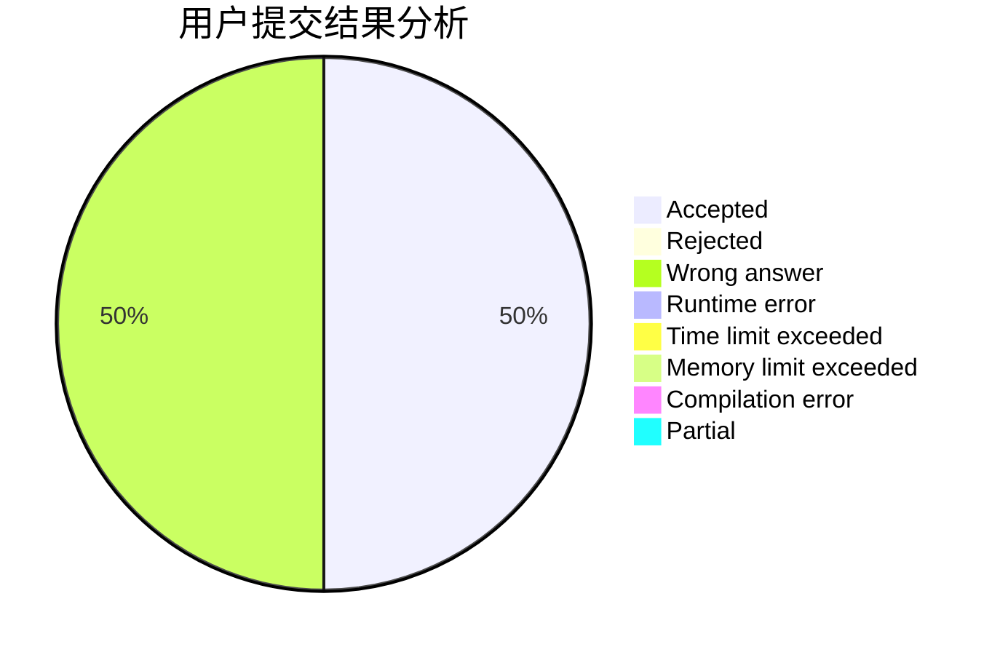
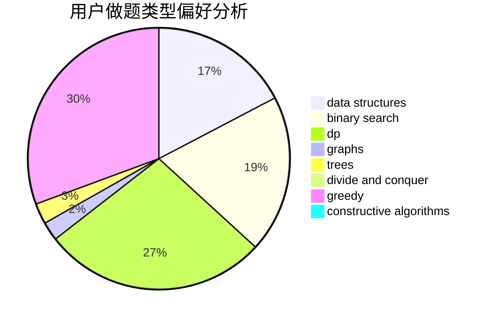
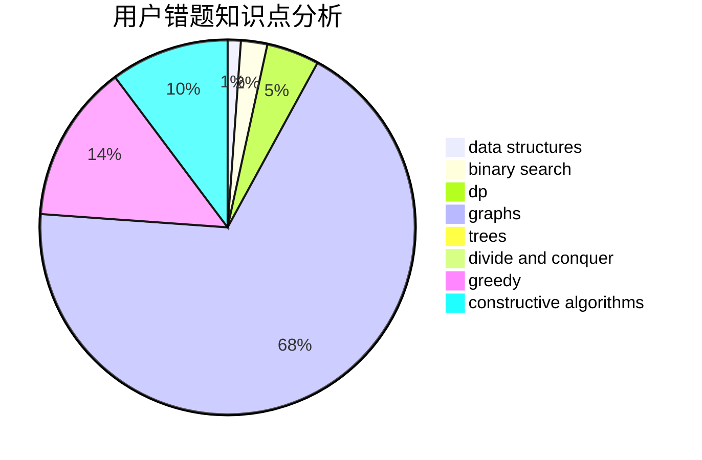

# 700YKSEULB

<!-- tabs:start -->

#### **用户提交结果分析**

#### **用户做题类型偏好分析**

#### **用户错题知识点分析**

<!-- tabs:end -->
# 推荐题目
[1416A](https://codeforces.com/contest/1416/problem/A)		binary search,
                        data structures,
                        implementation,
                        two pointers		  
[1413D](https://codeforces.com/contest/1413/problem/D)		data structures,
                        greedy,
                        implementation		  
[1113D](https://codeforces.com/contest/1113/problem/D)		dsu,graphs,sortings,trees		  
[1073D](https://codeforces.com/contest/1073/problem/D)		binary search,
                        brute force,
                        data structures,
                        greedy		  
[13B](https://codeforces.com/contest/13/problem/B)		geometry,
                        implementation		  
[11722](https://codeforces.com/contest/1172/problem/2)		dsu,graphs,sortings,trees		  
[1411G](https://codeforces.com/contest/1411/problem/G)		bitmasks,
                        games,
                        math,
                        matrices		  
[1411A](https://codeforces.com/contest/1411/problem/A)		implementation		  
[1411F](https://codeforces.com/contest/1411/problem/F)		greedy,
                        math		  
[1415C](https://codeforces.com/contest/1415/problem/C)		brute force,
                        dp,
                        implementation		  
