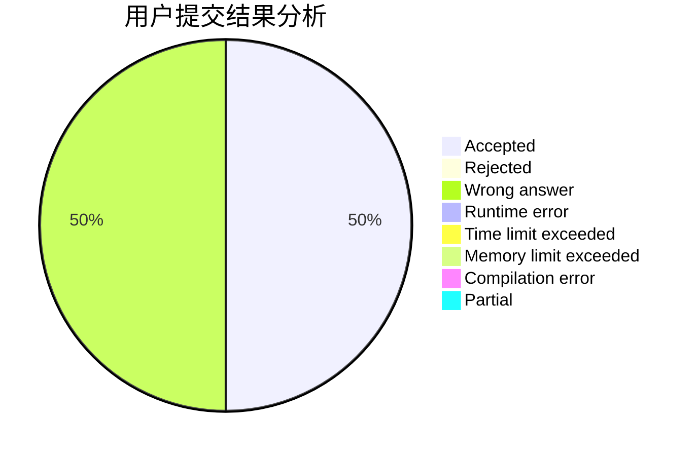
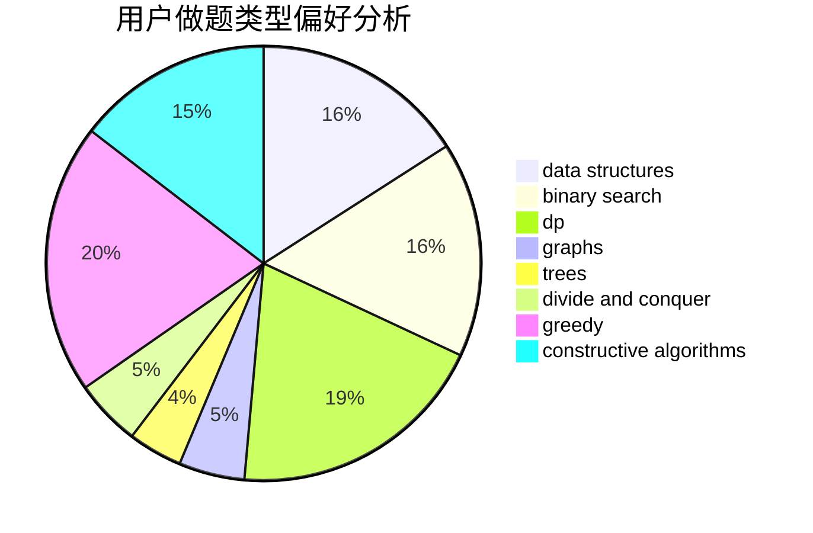
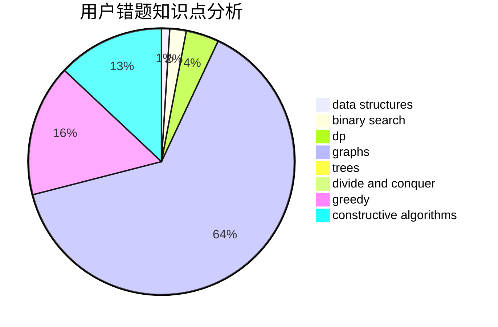

# 700YKSEULB

<!-- tabs:start -->

#### **用户提交结果分析**

#### **用户做题类型偏好分析**

#### **用户错题知识点分析**

<!-- tabs:end -->
# 推荐题目
[1404E](https://codeforces.com/contest/1404/problem/E)		flows,
                        graph matchings,
                        graphs		  
[1402B](https://codeforces.com/contest/1402/problem/B)		*special problem,
                        geometry,
                        sortings		  
[1113A](https://codeforces.com/contest/1113/problem/A)		dp,
                        greedy,
                        math		  
[1073A](https://codeforces.com/contest/1073/problem/A)		implementation,
                        strings		  
[1391E](https://codeforces.com/contest/1391/problem/E)		constructive algorithms,
                        dfs and similar,
                        graphs,
                        greedy,
                        trees		  
[1167C](https://codeforces.com/contest/1167/problem/C)		dfs and similar,
                        dsu,
                        graphs		  
[1401D](https://codeforces.com/contest/1401/problem/D)		dfs and similar,
                        dp,
                        greedy,
                        implementation,
                        math,
                        number theory,
                        sortings,
                        trees		  
[1400F](https://codeforces.com/contest/1400/problem/F)		brute force,
                        dfs and similar,
                        dp,
                        string suffix structures,
                        strings		  
[1401C](https://codeforces.com/contest/1401/problem/C)		constructive algorithms,
                        math,
                        number theory,
                        sortings		  
[1404A](https://codeforces.com/contest/1404/problem/A)		implementation,
                        strings		  
