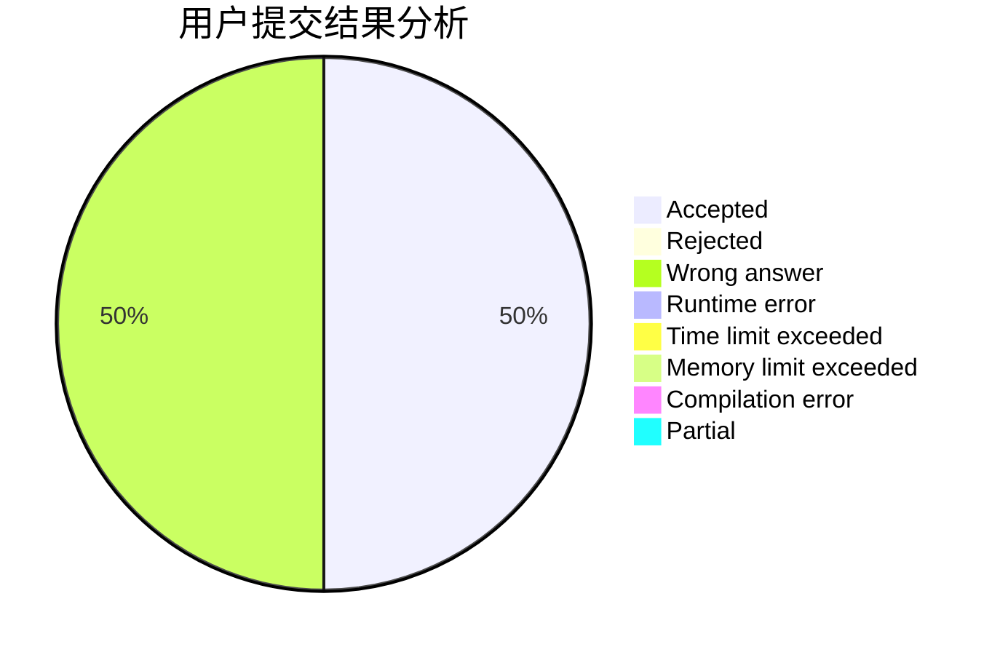
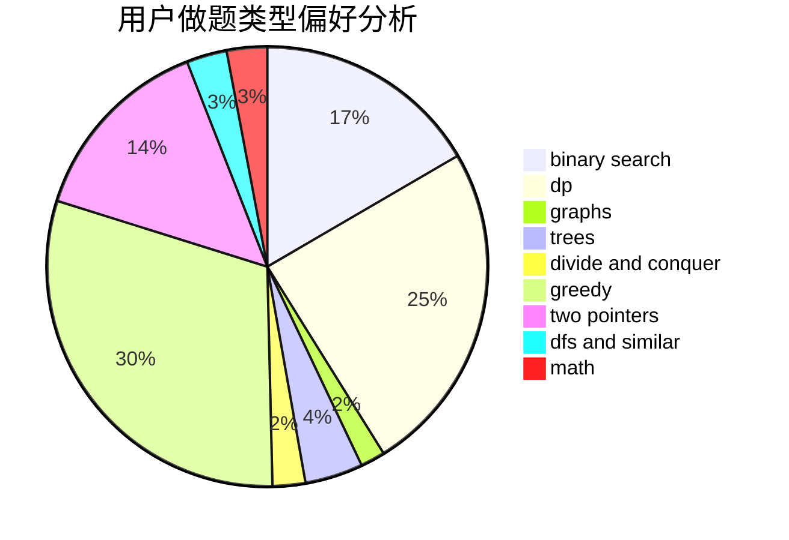

# 700YKSEULB

<!-- tabs:start -->

#### **用户提交结果分析**

#### **用户做题类型偏好分析**

<!-- tabs:end -->
# 推荐题目
[1416A](https://codeforces.com/contest/1416/problem/A)
[1413D](https://codeforces.com/contest/1413/problem/D)
[1113D](https://codeforces.com/contest/1113/problem/D)
[1073D](https://codeforces.com/contest/1073/problem/D)
[13B](https://codeforces.com/contest/13/problem/B)
[11722](https://codeforces.com/contest/1172/problem/2)
[1411G](https://codeforces.com/contest/1411/problem/G)
[1411A](https://codeforces.com/contest/1411/problem/A)
[1411F](https://codeforces.com/contest/1411/problem/F)
[1415C](https://codeforces.com/contest/1415/problem/C)
