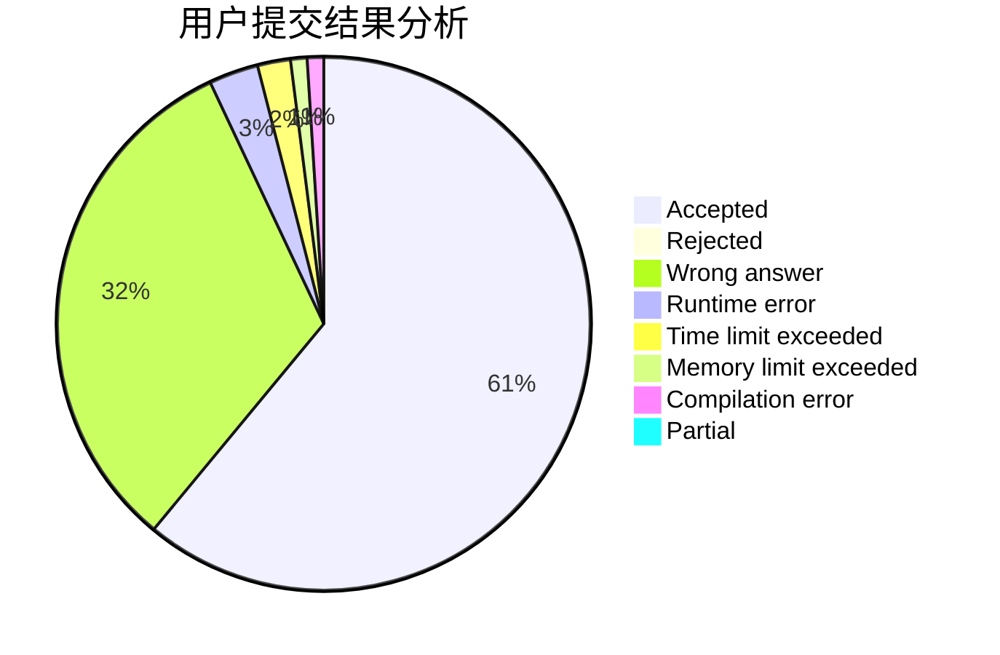
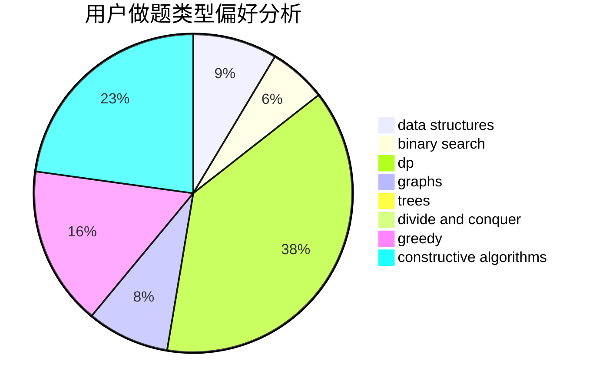
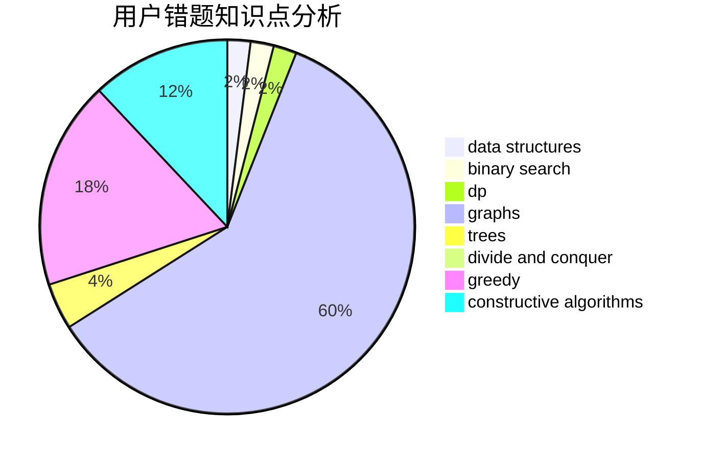

# LittleFall

<!-- tabs:start -->

#### **用户提交结果分析**

#### **用户做题类型偏好分析**

#### **用户错题知识点分析**

<!-- tabs:end -->
# 推荐题目
[1479D](https://codeforces.com/contest/1479/problem/D)		binary search,
                        bitmasks,
                        brute force,
                        data structures,
                        probabilities,
                        trees		  
[1436F](https://codeforces.com/contest/1436/problem/F)		combinatorics,
                        math,
                        number theory		  
[171C](https://codeforces.com/contest/171/problem/C)		*special problem,
                        implementation		  
[747A](https://codeforces.com/contest/747/problem/A)		brute force,
                        math		  
[364C](https://codeforces.com/contest/364/problem/C)		brute force,
                        number theory		  
[1251E1](https://codeforces.com/contest/1251E/problem/1)		data structures,
                        dp,
                        greedy		  
[789C](https://codeforces.com/contest/789/problem/C)		dsu,graphs,sortings,trees		  
[560A](https://codeforces.com/contest/560/problem/A)		implementation,
                        sortings		  
[497A](https://codeforces.com/contest/497/problem/A)		dsu,graphs,sortings,trees		  
[533F](https://codeforces.com/contest/533/problem/F)		hashing,
                        string suffix structures,
                        strings		  
