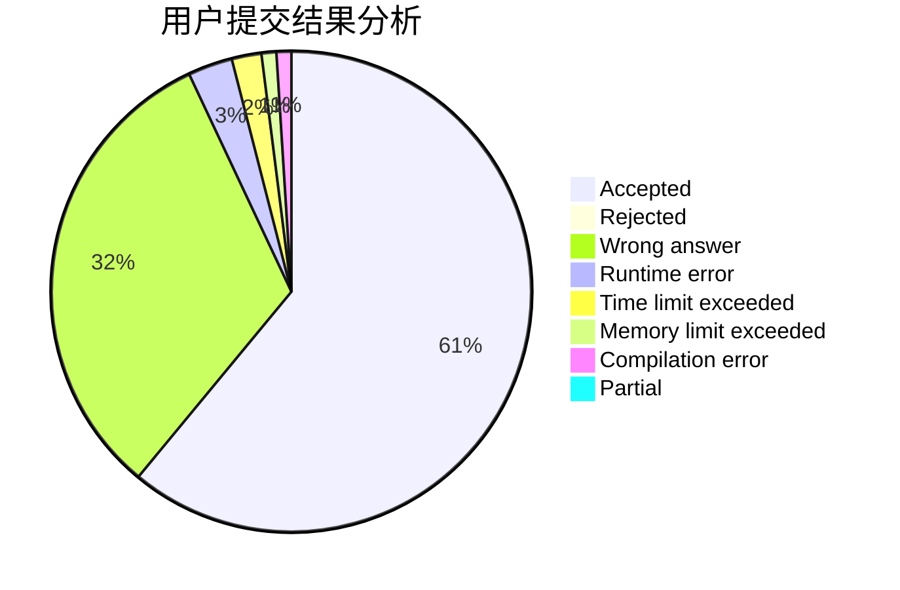
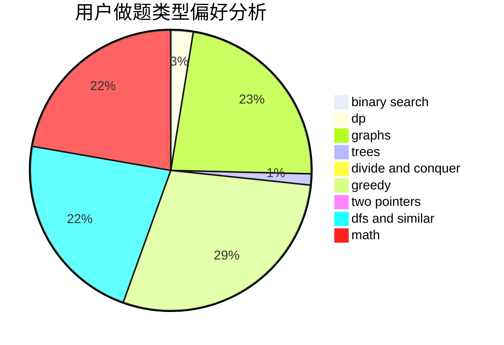

# LittleFall

<!-- tabs:start -->

#### **用户提交结果分析**

#### **用户做题类型偏好分析**

<!-- tabs:end -->
# 推荐题目
[1488B](https://codeforces.com/contest/1488/problem/B)
[1446E](https://codeforces.com/contest/1446/problem/E)
[198C](https://codeforces.com/contest/198/problem/C)
[766D](https://codeforces.com/contest/766/problem/D)
[3912](https://codeforces.com/contest/391/problem/2)
[1256F](https://codeforces.com/contest/1256/problem/F)
[804E](https://codeforces.com/contest/804/problem/E)
[584C](https://codeforces.com/contest/584/problem/C)
[516B](https://codeforces.com/contest/516/problem/B)
[555D](https://codeforces.com/contest/555/problem/D)
