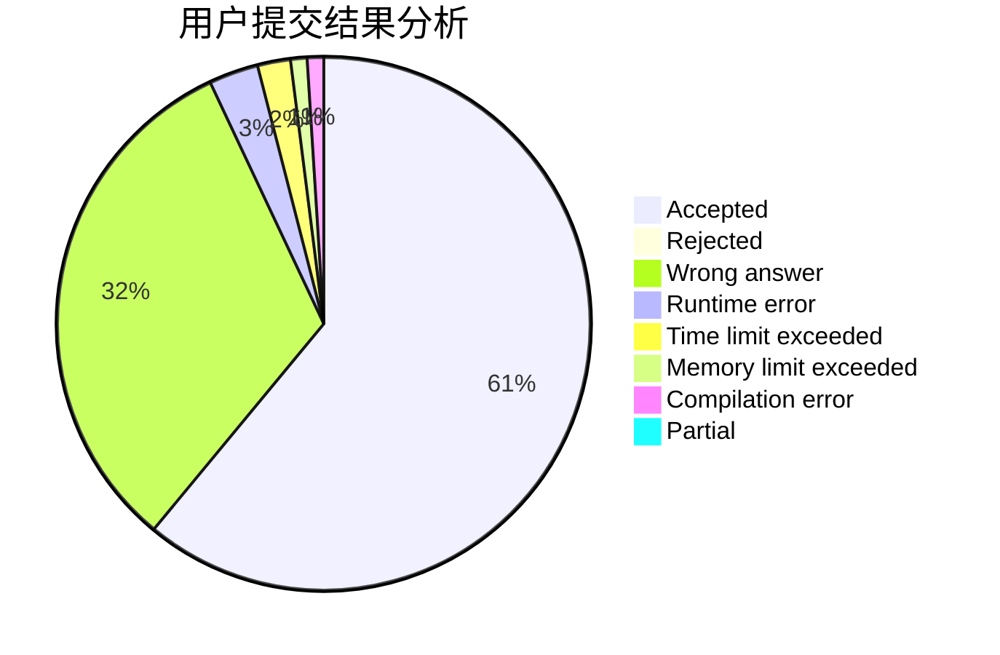
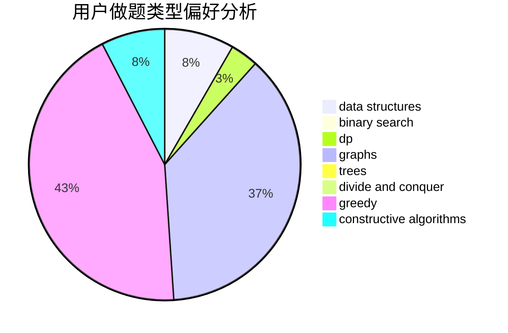
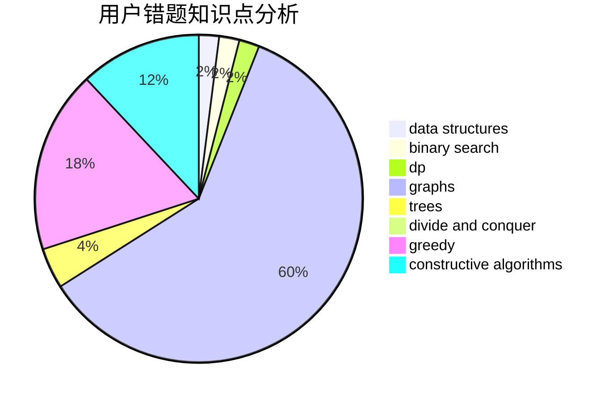

# LittleFall

<!-- tabs:start -->

#### **用户提交结果分析**

#### **用户做题类型偏好分析**

#### **用户错题知识点分析**

<!-- tabs:end -->
# 推荐题目
[1488B](https://codeforces.com/contest/1488/problem/B)		*special problem,
                        greedy		  
[1446E](https://codeforces.com/contest/1446/problem/E)		constructive algorithms,
                        dfs and similar		  
[198C](https://codeforces.com/contest/198/problem/C)		binary search,
                        geometry		  
[766D](https://codeforces.com/contest/766/problem/D)		data structures,
                        dfs and similar,
                        dp,
                        dsu,
                        graphs		  
[3912](https://codeforces.com/contest/391/problem/2)		dsu,graphs,sortings,trees		  
[1256F](https://codeforces.com/contest/1256/problem/F)		constructive algorithms,
                        sortings,
                        strings		  
[804E](https://codeforces.com/contest/804/problem/E)		constructive algorithms		  
[584C](https://codeforces.com/contest/584/problem/C)		constructive algorithms,
                        greedy,
                        strings		  
[516B](https://codeforces.com/contest/516/problem/B)		dsu,graphs,sortings,trees		  
[555D](https://codeforces.com/contest/555/problem/D)		binary search,
                        implementation,
                        math		  
