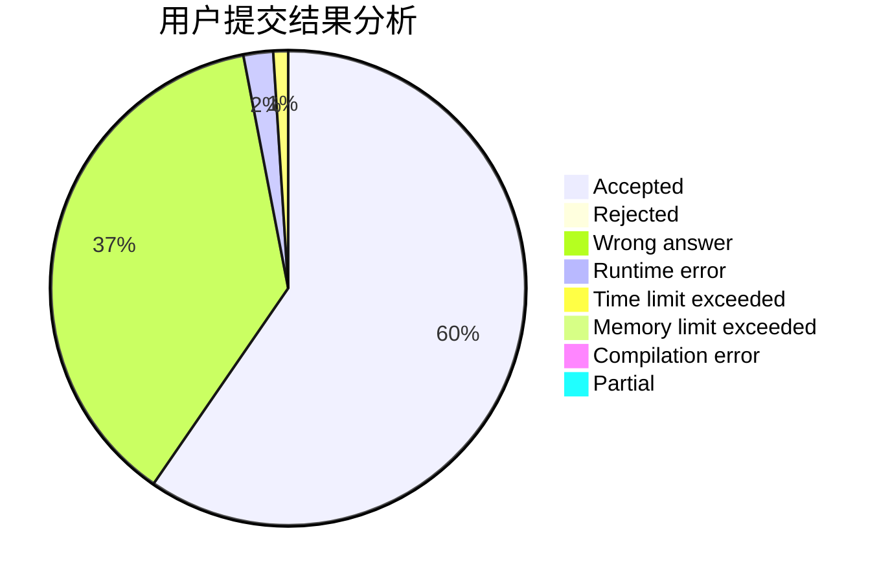
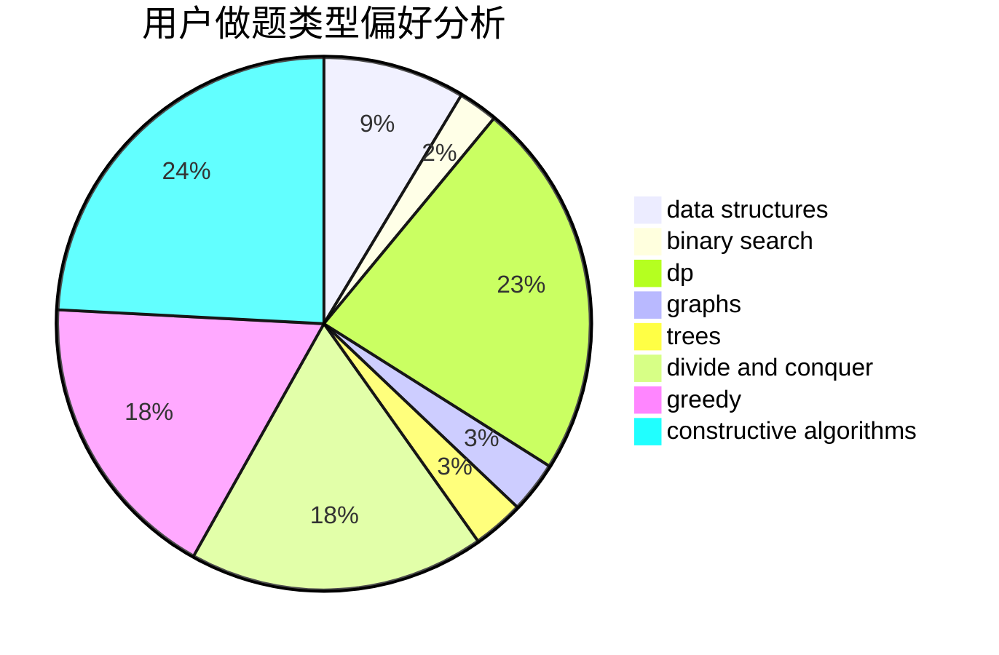
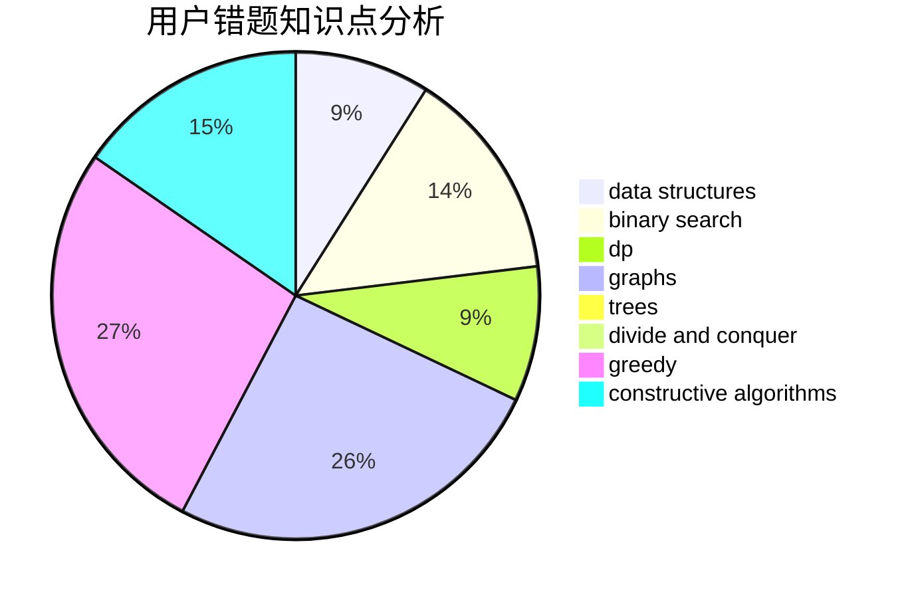

# LittleFisher79

<!-- tabs:start -->

#### **用户提交结果分析**

#### **用户做题类型偏好分析**

#### **用户错题知识点分析**

<!-- tabs:end -->
# 推荐题目
[228D](https://codeforces.com/contest/228/problem/D)		data structures		  
[827E](https://codeforces.com/contest/827/problem/E)		fft,
                        math,
                        strings		  
[809E](https://codeforces.com/contest/809/problem/E)		divide and conquer,
                        math,
                        number theory,
                        trees		  
[559C](https://codeforces.com/contest/559/problem/C)		combinatorics,
                        dp,
                        math,
                        number theory		  
[650A](https://codeforces.com/contest/650/problem/A)		data structures,
                        geometry,
                        math		  
[208C](https://codeforces.com/contest/208/problem/C)		dp,
                        graphs,
                        shortest paths		  
[1166C](https://codeforces.com/contest/1166/problem/C)		binary search,
                        sortings,
                        two pointers		  
[622F](https://codeforces.com/contest/622/problem/F)		math		  
[590D](https://codeforces.com/contest/590/problem/D)		dp		  
[1246A](https://codeforces.com/contest/1246/problem/A)		dsu,graphs,sortings,trees		  
