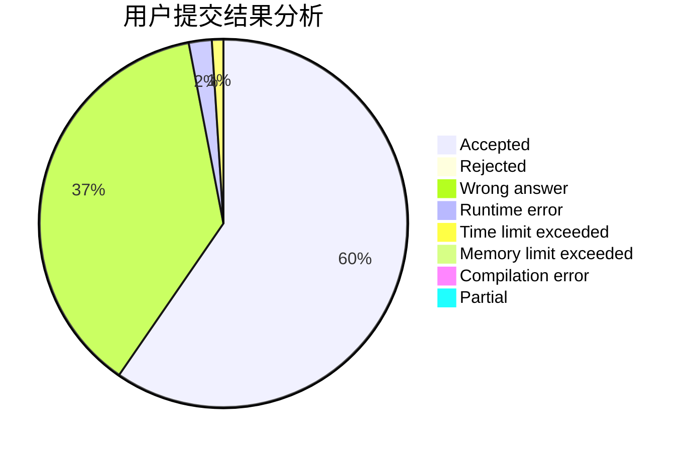
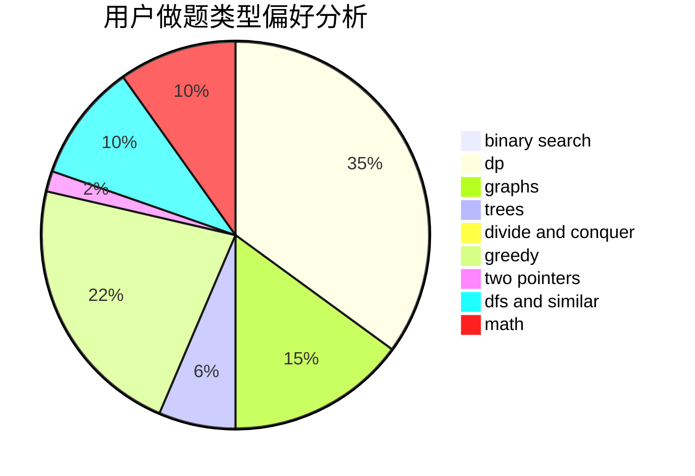

# LittleFisher79

<!-- tabs:start -->

#### **用户提交结果分析**

#### **用户做题类型偏好分析**

<!-- tabs:end -->
# 推荐题目
[246D](https://codeforces.com/contest/246/problem/D)
[846A](https://codeforces.com/contest/846/problem/A)
[827D](https://codeforces.com/contest/827/problem/D)
[582A](https://codeforces.com/contest/582/problem/A)
[672D](https://codeforces.com/contest/672/problem/D)
[22E](https://codeforces.com/contest/22/problem/E)
[1169B](https://codeforces.com/contest/1169/problem/B)
[650E](https://codeforces.com/contest/650/problem/E)
[610B](https://codeforces.com/contest/610/problem/B)
[1250I](https://codeforces.com/contest/1250/problem/I)
