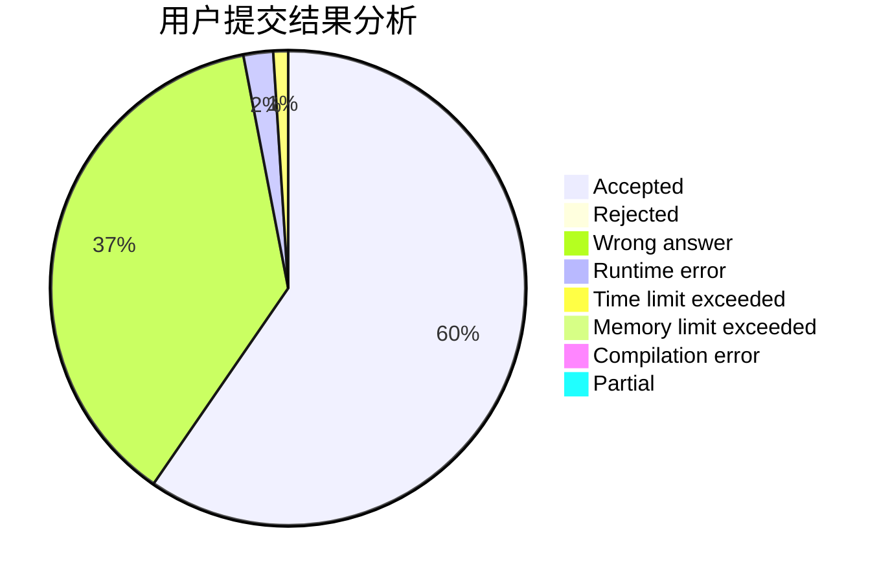
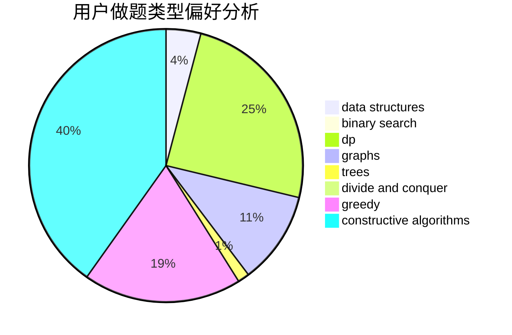
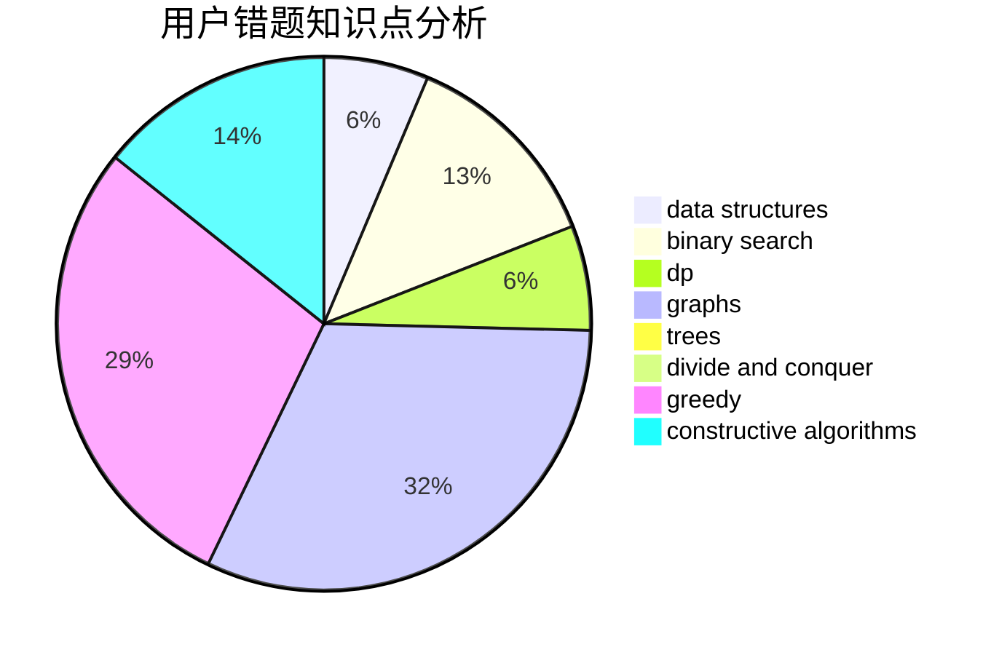

# LittleFisher79

<!-- tabs:start -->

#### **用户提交结果分析**

#### **用户做题类型偏好分析**

#### **用户错题知识点分析**

<!-- tabs:end -->
# 推荐题目
[246D](https://codeforces.com/contest/246/problem/D)		brute force,
                        dfs and similar,
                        graphs		  
[846A](https://codeforces.com/contest/846/problem/A)		brute force,
                        implementation		  
[827D](https://codeforces.com/contest/827/problem/D)		data structures,
                        dfs and similar,
                        graphs,
                        trees		  
[582A](https://codeforces.com/contest/582/problem/A)		constructive algorithms,
                        greedy,
                        number theory		  
[672D](https://codeforces.com/contest/672/problem/D)		dsu,graphs,sortings,trees		  
[22E](https://codeforces.com/contest/22/problem/E)		dfs and similar,
                        graphs,
                        trees		  
[1169B](https://codeforces.com/contest/1169/problem/B)		graphs,
                        implementation		  
[650E](https://codeforces.com/contest/650/problem/E)		data structures,
                        dfs and similar,
                        dsu,
                        greedy,
                        trees		  
[610B](https://codeforces.com/contest/610/problem/B)		constructive algorithms,
                        implementation		  
[1250I](https://codeforces.com/contest/1250/problem/I)		binary search,
                        brute force,
                        greedy,
                        shortest paths		  
