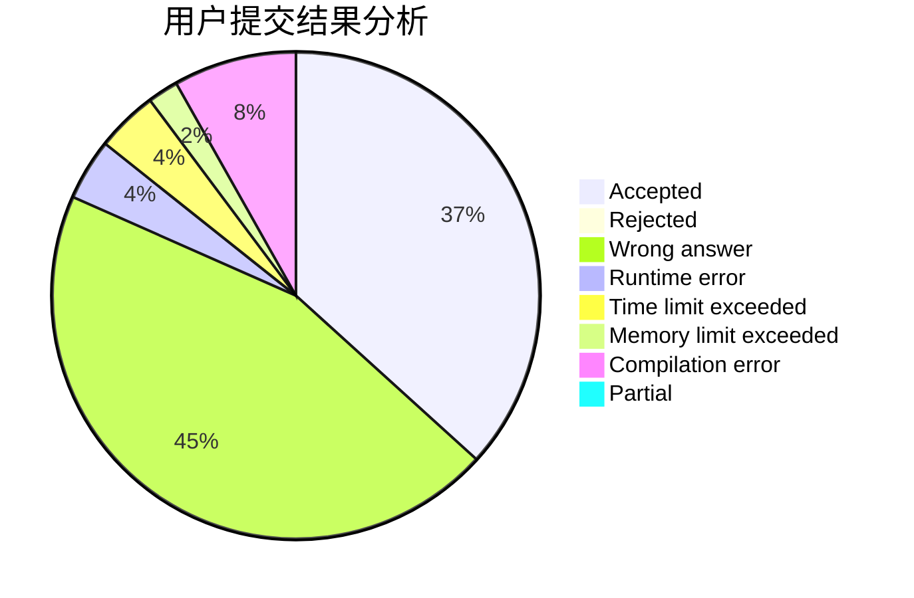
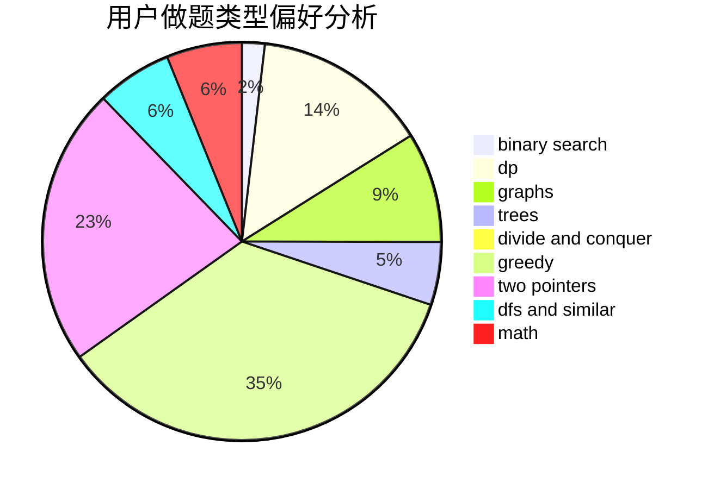

# Littleherozzzx

<!-- tabs:start -->

#### **用户提交结果分析**

#### **用户做题类型偏好分析**

<!-- tabs:end -->
# 推荐题目
[1043D](https://codeforces.com/contest/1043/problem/D)
[883D](https://codeforces.com/contest/883/problem/D)
[656A](https://codeforces.com/contest/656/problem/A)
[474E](https://codeforces.com/contest/474/problem/E)
[10C](https://codeforces.com/contest/10/problem/C)
[172A](https://codeforces.com/contest/172/problem/A)
[152E](https://codeforces.com/contest/152/problem/E)
[1207F](https://codeforces.com/contest/1207/problem/F)
[507B](https://codeforces.com/contest/507/problem/B)
[599B](https://codeforces.com/contest/599/problem/B)
