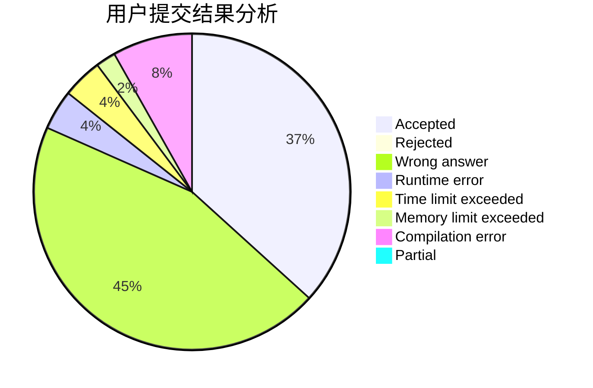
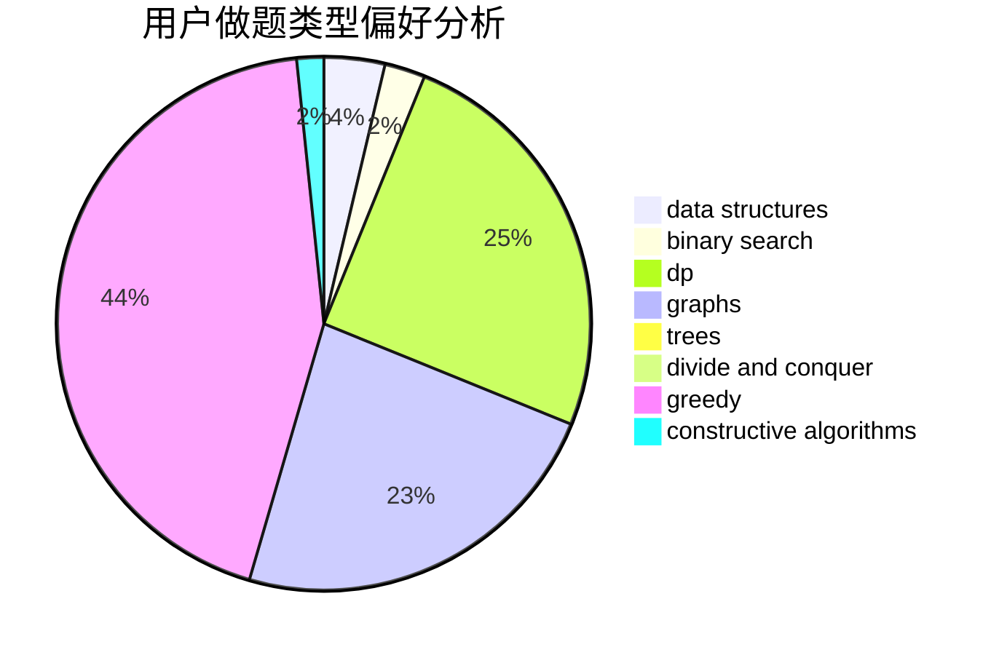
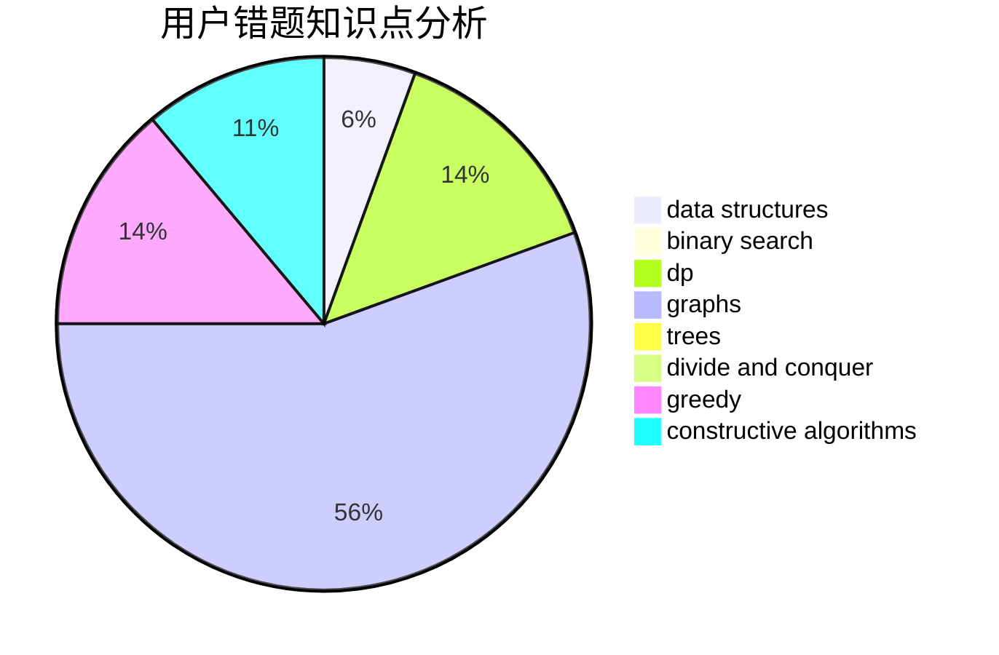

# Littleherozzzx

<!-- tabs:start -->

#### **用户提交结果分析**

#### **用户做题类型偏好分析**

#### **用户错题知识点分析**

<!-- tabs:end -->
# 推荐题目
[1043D](https://codeforces.com/contest/1043/problem/D)		brute force,
                        combinatorics,
                        math,
                        meet-in-the-middle,
                        two pointers		  
[883D](https://codeforces.com/contest/883/problem/D)		binary search,
                        dp,
                        math		  
[656A](https://codeforces.com/contest/656/problem/A)		*special problem		  
[474E](https://codeforces.com/contest/474/problem/E)		binary search,
                        data structures,
                        dp,
                        sortings,
                        trees		  
[10C](https://codeforces.com/contest/10/problem/C)		number theory		  
[172A](https://codeforces.com/contest/172/problem/A)		*special problem,
                        brute force,
                        implementation		  
[152E](https://codeforces.com/contest/152/problem/E)		bitmasks,
                        dp,
                        graphs,
                        trees		  
[1207F](https://codeforces.com/contest/1207/problem/F)		brute force,
                        data structures,
                        implementation		  
[507B](https://codeforces.com/contest/507/problem/B)		geometry,
                        math		  
[599B](https://codeforces.com/contest/599/problem/B)		implementation		  
