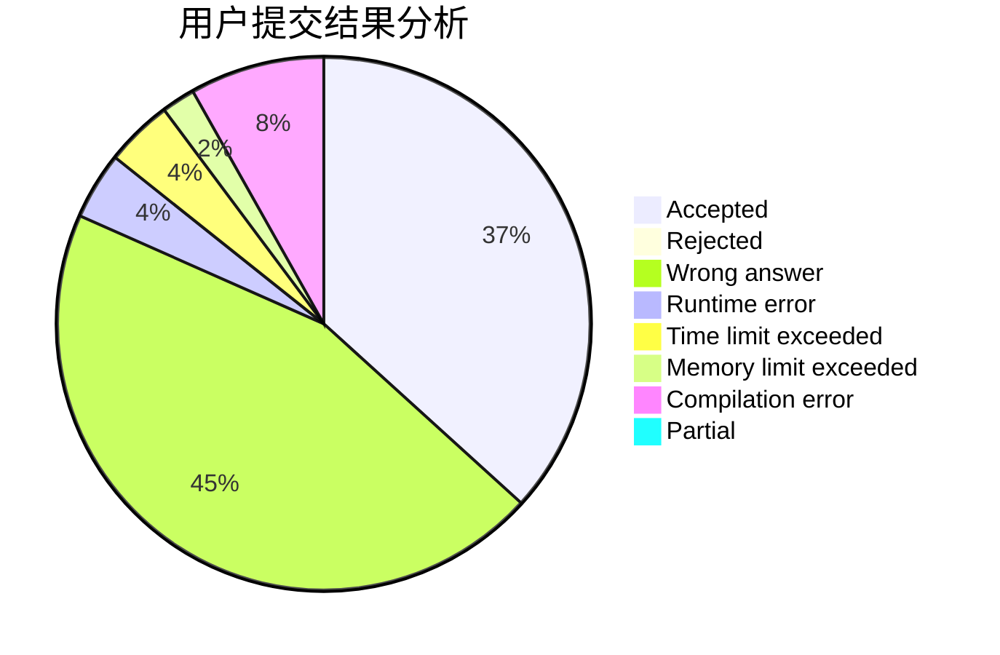
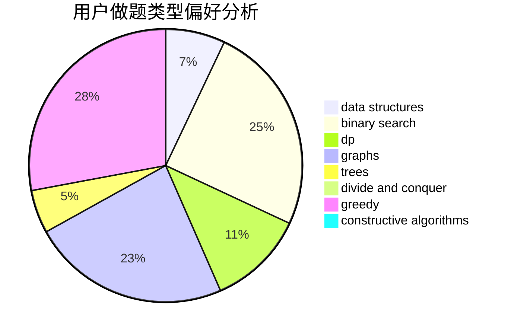
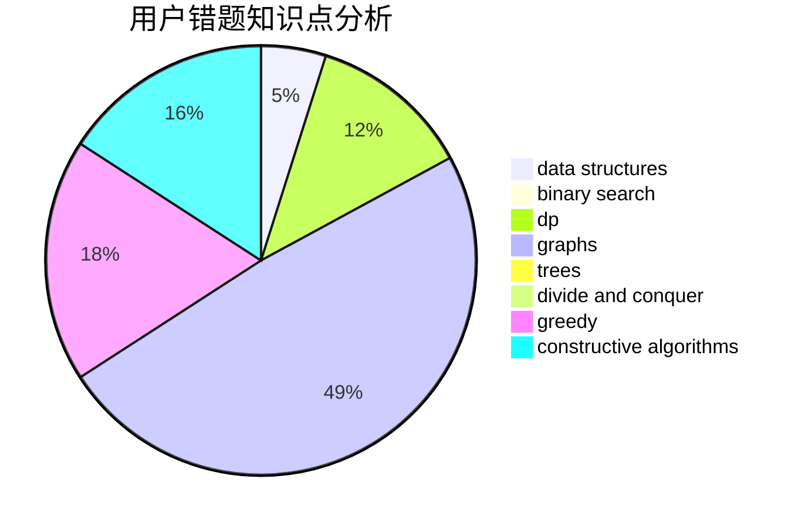

# Littleherozzzx

<!-- tabs:start -->

#### **用户提交结果分析**

#### **用户做题类型偏好分析**

#### **用户错题知识点分析**

<!-- tabs:end -->
# 推荐题目
[1043A](https://codeforces.com/contest/1043/problem/A)		implementation,
                        math		  
[863B](https://codeforces.com/contest/863/problem/B)		brute force,
                        greedy,
                        sortings		  
[628B](https://codeforces.com/contest/628/problem/B)		dp		  
[452F](https://codeforces.com/contest/452/problem/F)		data structures,
                        divide and conquer,
                        hashing		  
[109A](https://codeforces.com/contest/109/problem/A)		brute force,
                        implementation		  
[1513B](https://codeforces.com/contest/1513/problem/B)		bitmasks,
                        combinatorics,
                        constructive algorithms,
                        math		  
[1505D](https://codeforces.com/contest/1505/problem/D)		number theory		  
[1203B](https://codeforces.com/contest/1203/problem/B)		greedy,
                        math		  
[486C](https://codeforces.com/contest/486/problem/C)		brute force,
                        greedy,
                        implementation		  
[577E](https://codeforces.com/contest/577/problem/E)		dsu,graphs,sortings,trees		  
