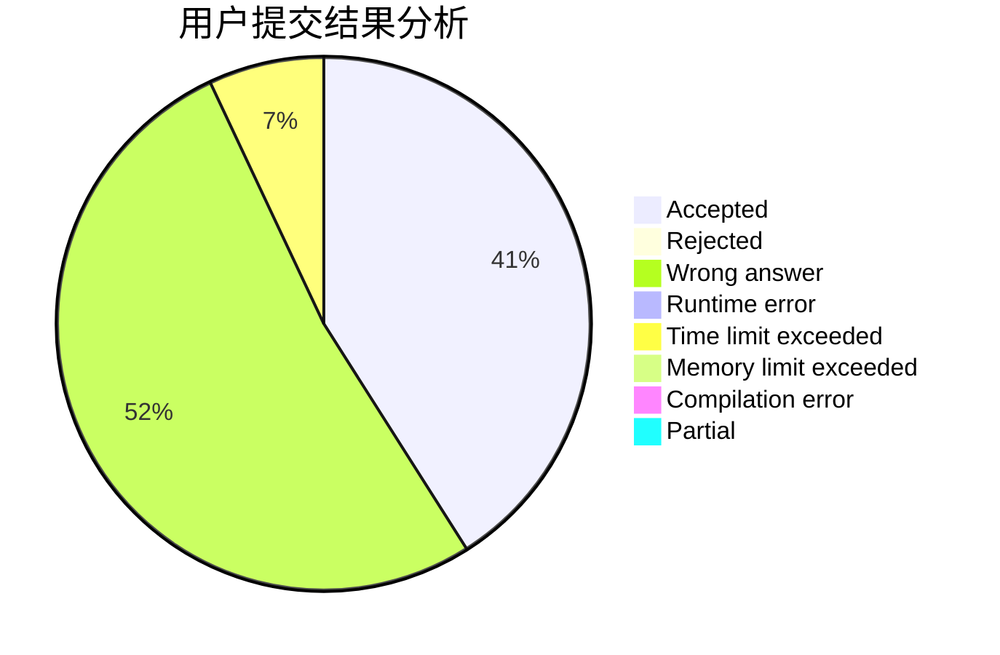
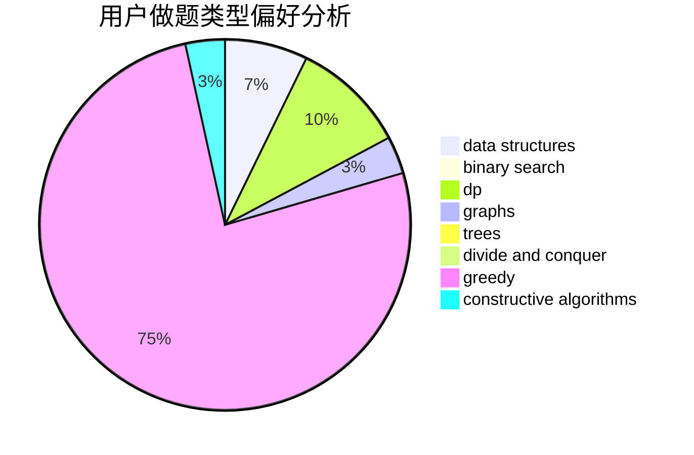
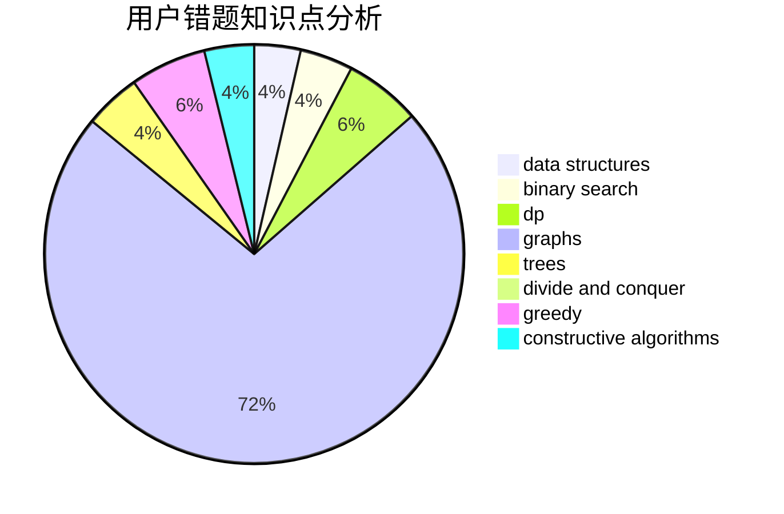

# LiuRunkY

<!-- tabs:start -->

#### **用户提交结果分析**

#### **用户做题类型偏好分析**

#### **用户错题知识点分析**

<!-- tabs:end -->
# 推荐题目
[913C](https://codeforces.com/contest/913/problem/C)		bitmasks,
                        dp,
                        greedy		  
[1430B](https://codeforces.com/contest/1430/problem/B)		greedy,
                        implementation,
                        sortings		  
[766D](https://codeforces.com/contest/766/problem/D)		data structures,
                        dfs and similar,
                        dp,
                        dsu,
                        graphs		  
[567E](https://codeforces.com/contest/567/problem/E)		dfs and similar,
                        graphs,
                        hashing,
                        shortest paths		  
[1165A](https://codeforces.com/contest/1165/problem/A)		implementation,
                        math		  
[730B](https://codeforces.com/contest/730/problem/B)		constructive algorithms,
                        interactive		  
[1463E](https://codeforces.com/contest/1463/problem/E)		constructive algorithms,
                        dfs and similar,
                        dsu,
                        graphs,
                        implementation,
                        sortings,
                        trees		  
[1144F](https://codeforces.com/contest/1144/problem/F)		dfs and similar,
                        graphs		  
[740A](https://codeforces.com/contest/740/problem/A)		brute force,
                        implementation		  
[11631](https://codeforces.com/contest/1163/problem/1)		dsu,graphs,sortings,trees		  
