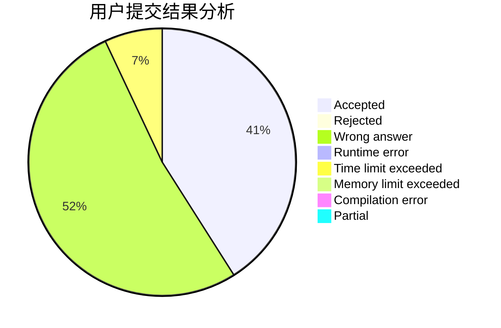
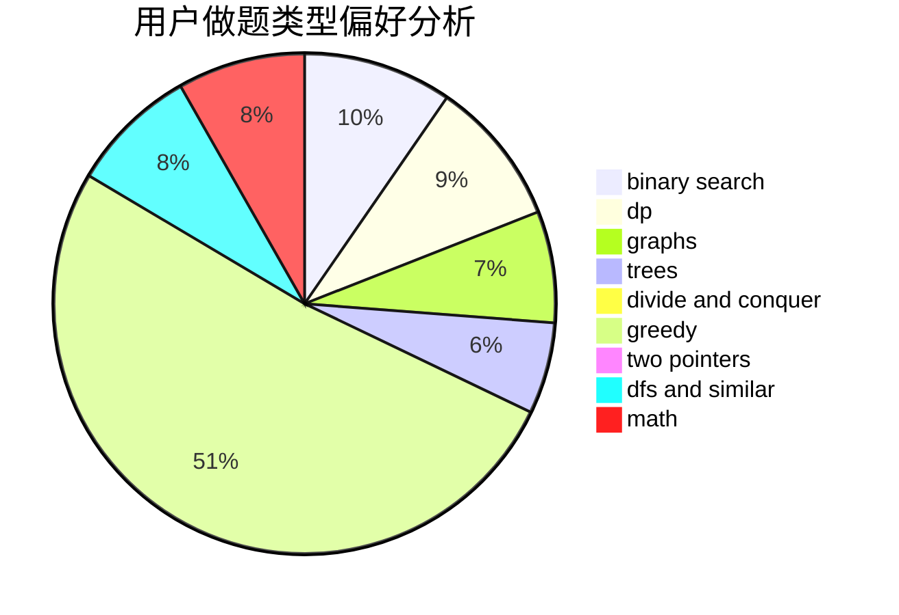

# LiuRunkY

<!-- tabs:start -->

#### **用户提交结果分析**

#### **用户做题类型偏好分析**

<!-- tabs:end -->
# 推荐题目
[913C](https://codeforces.com/contest/913/problem/C)
[1430B](https://codeforces.com/contest/1430/problem/B)
[766D](https://codeforces.com/contest/766/problem/D)
[567E](https://codeforces.com/contest/567/problem/E)
[1165A](https://codeforces.com/contest/1165/problem/A)
[730B](https://codeforces.com/contest/730/problem/B)
[1463E](https://codeforces.com/contest/1463/problem/E)
[1144F](https://codeforces.com/contest/1144/problem/F)
[740A](https://codeforces.com/contest/740/problem/A)
[11631](https://codeforces.com/contest/1163/problem/1)
