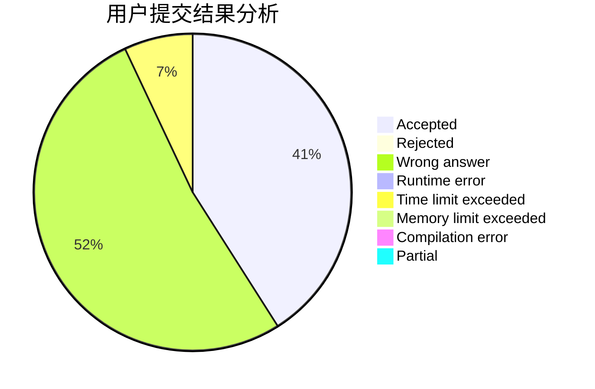
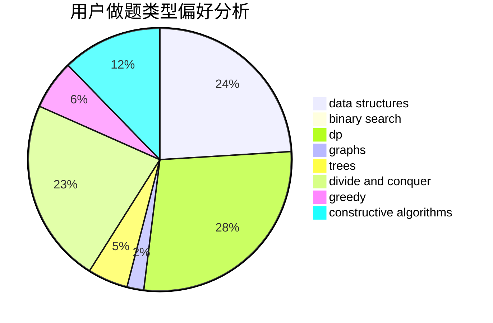
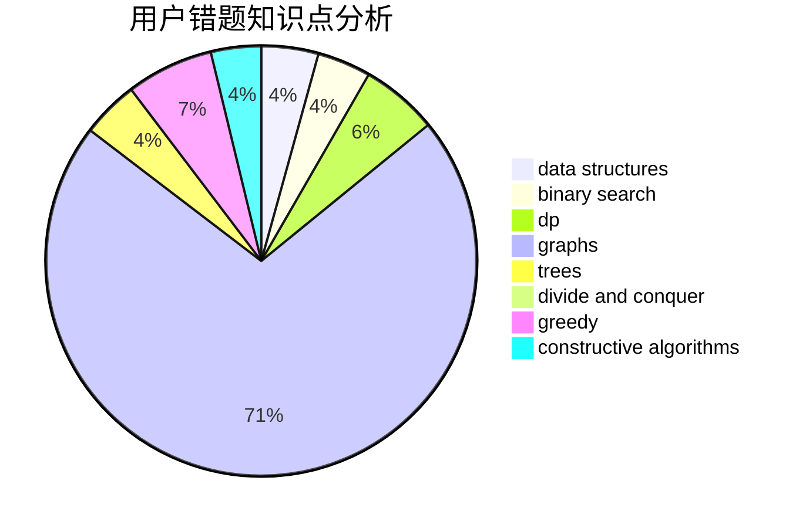

# LiuRunkY

<!-- tabs:start -->

#### **用户提交结果分析**

#### **用户做题类型偏好分析**

#### **用户错题知识点分析**

<!-- tabs:end -->
# 推荐题目
[895E](https://codeforces.com/contest/895/problem/E)		data structures,
                        probabilities		  
[1422D](https://codeforces.com/contest/1422/problem/D)		graphs,
                        shortest paths,
                        sortings		  
[747A](https://codeforces.com/contest/747/problem/A)		brute force,
                        math		  
[543C](https://codeforces.com/contest/543/problem/C)		bitmasks,
                        dp		  
[1163E](https://codeforces.com/contest/1163/problem/E)		bitmasks,
                        brute force,
                        constructive algorithms,
                        data structures,
                        graphs,
                        math		  
[70D](https://codeforces.com/contest/70/problem/D)		data structures,
                        geometry		  
[1454B](https://codeforces.com/contest/1454/problem/B)		implementation		  
[1142D](https://codeforces.com/contest/1142/problem/D)		dp		  
[723B](https://codeforces.com/contest/723/problem/B)		expression parsing,
                        implementation,
                        strings		  
[115B](https://codeforces.com/contest/115/problem/B)		greedy,
                        sortings		  
